# Lec-1: Accounting for Managers
>Dr.Maha Ramdan (email: maha.ramdan@eslsca.edu.eg)

## Main Equation for Any Business

```
Assets = Liabilities + Equity
```

* **Equity**: could be means that capital as someone offer initial capitals in the beginning
  * The ownership of the business is identified by how much I spent money (i.e, Capital) on the business
  * The provided capital can be anything not just money, ex: Trucks, building ...etc.
  * Sometimes you can think about *Equity* as" `Equity = Assets - Liabilities`
    * This is the simplest form to evaluate a business 😉
  * Usually, Owners like to have a report called *Changes-in-Equity* based on all the transactions within the business.
* **Liabilities الإلتزامات**:
  * simply how to finance the company in the first place.
  * Ex: Some Universities/Service providers get money from the client in the first place as a financing option for the service and later to provide the service.
  * Another example is bank loan
* **Assets**:
  * All the resources within the business is considered as *Assets*. In case Business Failure, then all of those *Assets* will be distributed across owners based on Shares.
* Considering the **"Koshari Shop"** example that needs 5M as starting point:
  * Liabilities: 
    * Bank loan: 1M
    * inventory: 2M
    * Asset: Machines...etc.
  * Equity:
    * Shareholder#1: 1M
    * Shareholder#2: 1M
* Each company shall provide its **Balance-sheet**. This **Balance-sheet** provides the details of this Basic equation.
  * `Assets > Liabilities + Equity` ➡️ Stealing
    * the implication is that the business appears to own more resources than can be explained by:
      * money owed to outsiders (`Liabilities`), or money belonging to the owners (`Equity`).
  * `Liabilities > Assets - Equity` ➡️ Money Laundering
    * This means: `Liabilities>Liabilities`
    * Accordingly it means: [`records are wrong`, `one or more accounts are misstated, omitted, duplicated, or manipulated.`]
* **Profit**
  * `Profit = Revenues - Expenses`
  * `Retained Capital/Earnings = Profit - Capital-Withdrawals`
* **Business Inputs**: 
  * Liabilities: Loans, Payable-items...etc.
  * Equity-Capital: Owner investments
  * Retained-Capital/Earnings
* Next step: the daily business transactions: (Slide.8)
   > Transaction: is each *Moneten-Event حدث مالي*
   > Bills, Water/electricity, Labour Salary...etc.
   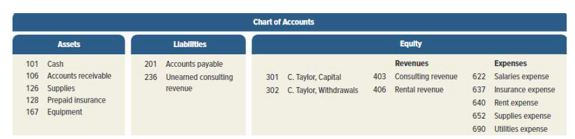
  * Transactions shall be recorded in a way that keeps the **Balance-sheet** correctly balanced.
  * So operational cost shall not affect the balance between the `Assest = Liabilities + Equity`
  * Therefore this accounting system called "2-sides" input system ➡️ even if you want to steal 😉
  * Each *transaction* shall be supported by doc (invoice)
  * Consider that recording all Transactions are must, simply because missing one may add in *Revenues* that can be seen as inflated-revenues and this doesn't reflect the real performance of the business
    * This apply one Accounting-Golden-Rule: **Matching** ➡️ `Match: Match Revenues with Expenses`
  * Example: we discover that we need to buy a new machine that costs 20K ➡️ Buy cash
    * So, *Assets-Cash* shall decrease by 20K and *Assets-Equipments* shall increase by 20k
    * Considering that *Assets-Cash* is calculated from *Liabilities + Equity*
  * Example: we discover that we need to buy another new machine that costs 10K ➡️ pay later
    * So, **`??????????? Can't understand this part`**
    * There is something called *Account-payable* and *Notice-Payable* ➡️ almost the same and both are Liability. However, the *Notice-Payable* are kind of signed guarantee (cheque) that you signed for the service provider
  * Exmaple: sold 50K Koshari
    * *Assets-Cash* ⬆️ 50K ➡️ This is the value of the business that is called **"Revenues"** ➡️ This shall increase the **Equity** of the owners
    * *Assets-Cash* ⬆️ = *Equity-Revenues* ⬆️
  * Exmaple: Got a deal to provide Koshari with 100K but client will pay one month later
    * This is a *revenue* and this transaction shall be documented under *Equity-Revenues*
    * But we can't add this to the *cash* Balance because we don't receive it yet.
    * However we can document this under a balance called *"Assets-Account_Receivable(AR)"*➡️ `Account_Receivable: Account that will be received later on`
  * **Revenue-Transaction** is related to service delivery however it is not related to *Cash-collection*; simply because *Revenue* is earned once service delivered. In other words, you can see *Revenue* as reflection to the exported invoices 😉.
    * The "Account System" is based on "Accrual basis - أساس الاستحقاق" 
    * Sometimes, we call *Revenues* as "Magnitude of Work done - حجم العمل المنجز"
    * This ensure that we can have a good basis to check Monthly-performance
  * Resources Consumption:
    * Labour Salary by 60K
      * *Assets-Cash* ⬇️ = *Equity-Expenses-Salaries* ⬇️ ➡️ Therefore Owner won't be happy to increase the salary simply because you take part of his *Equity*
    * Utilities invoices (ex. Water, Electricity..etc) = 20K but I will pay it later
      * *Liabilities-Account_payable* ⬆️ = *Equity-Expenses_Utilities_expenses* ⬇️ ➡️ Balance is maintained 👍
      * However, never confused that *Account-payable* is a kind of reflection to *Expenses*. They are not related. *Account-Payable* is a liability for something that you shall pay. However *Expenses* is something that u must consume to deliver your business/service.
      * Till now, we can calculate that owner have equity = 2.003M = 2M + 30K (Revenue) ➡️ considering that current available cash doesn't reflect that but invoices and transactions prove that.
    * Owner decided to get 10K for his private reasons: 
      * *Equity-Withdrawals* ⬇️ = *Assets-Cash* ⬇️
      * There are taxes that shall be included in the *Equity-Withdrawals*
      * The remaining 20K is considered as *Retained-Captial/Retained-Earnings الأرباح المحتجزة* within the business.
    * Pay Internet-Package for 3-months = 60K
      * *Assets-Cash-60K* ⬇️ = *Assets-Prepaid-60K* ⬆️ ➡️ At payment moment
      * *Assets-Prepaid-20K* ⬇️ = *Equity-Expenses-20K* ⬆️ by end of the month which already expired.
      * Now, you can see it as a resource.
    * A customer Paid 200K to deliver for the next 4-Months
      * *Assets-Cash-200K* ⬆️ = *Liabilities-Unearned_Revenue-200k* ⬆️
      * Because the service is not delivered, therefore we see it as Liability not yet a revenue.
      * One Month Later: *Liabilities-Unearned_Revenue-150k* ⬇️ = *Equity-Revenues-50k* ⬆️

## Accounting Cycle

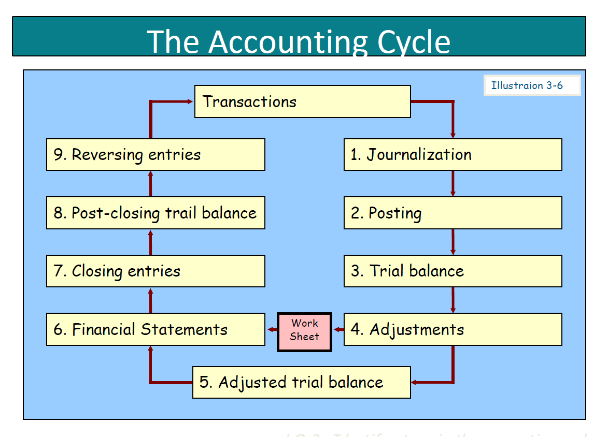

### Accounting Cycle steps details

* *Journalization*
  * Get the transaction inside the system: Data-entry
* *Posting*
  * Update the accounts which are affected by this transaction
* *Trail-Balance ميزان المراجعة*
  * This is the way to ensure that Transaction data-entry done correctly and posted as **Double-Entry** system and it is balanced.
  * Usually, it is used by End of Month.
* *Adjustment*
  * This is used to ensure that Transaction is adjusted to reflect the real fact. Example the *Pre-Paid* invoices for internet, this shall be reflected as *Assets-Prepaid* and *Equity-Expenses*
  * Maybe warehouse inventory leads to unmatched Goods-amount to those mentioned in the system, therefore we need to do this Adjustment.
  * Usually we call this operation as *Settlement تسوية*  ➡️to ensure it reflects the facts
* *Adjusted Trail balance*
  * This is done after any *Adjustment* to ensure that everything is ok ✅
* *Financial-Statments*
  * This step performed once *Adjusted Trail balance* is confirmed to be ok
  * This is kind of Hub that it is used to different financial destinations.

### Accounting Cycle system details

* Each transaction recorded in the system is done as part of **Account**. So Cash is *account*, Pre-paid is *account*, each client has *account* ...etc.
  * 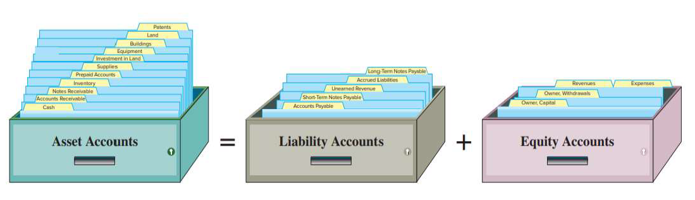
  * The Accounting-Manager is the authorized person to open accounts
* Initially we need to create a kind of Accounting Tree
  * 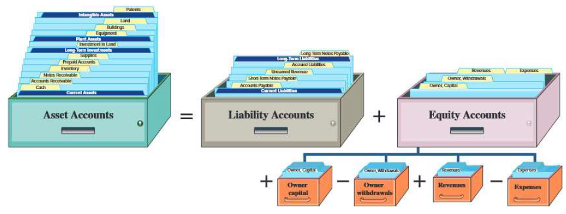
  * For simplicity, we give a root value per each main branch: Assets=1xxx, Liabilities=2xxx...etc.➡️ Coding system
* The Account shape :
  * Usually it is called *T-Account*
  * For **Assets**
    * `Left= Debit مدين` & `Right=Credit رصيد دائن`
    * 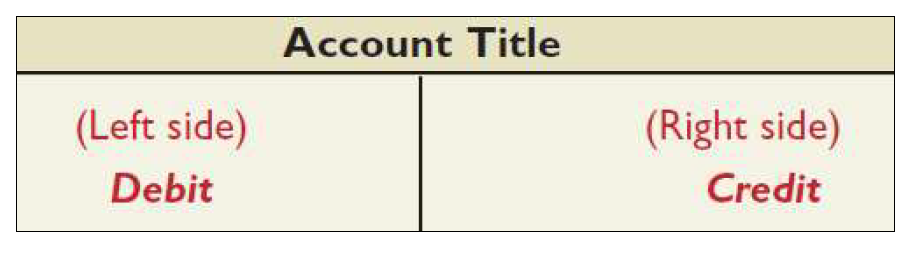
    * Each increase shall be added as part of *Credit (Cr)*
    * Each decrease shall be added as part of *Debit (Dr)*
  * For **Liabilities** & **Equity**
    * 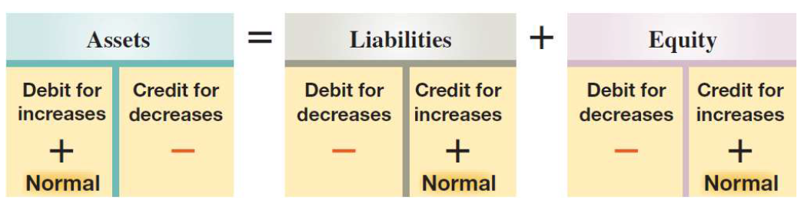
    * It is clear the *Debit* and *Credit* is reversed in the **Liability & Equity** Families
    * So for example, **Equity-Credit** by: {*Capital*, *Revenues*}. **Equity-Debit** by: {*Withdrawals*, *Expenses*}
      * 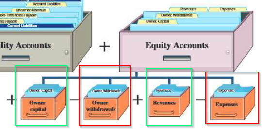
      * 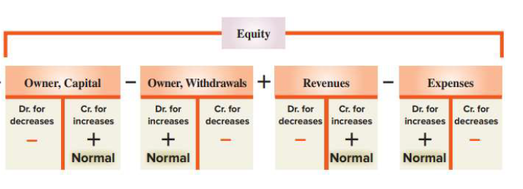
  * Assest = Liabilities + Equity ➡️ Debit / Credit view:
    * 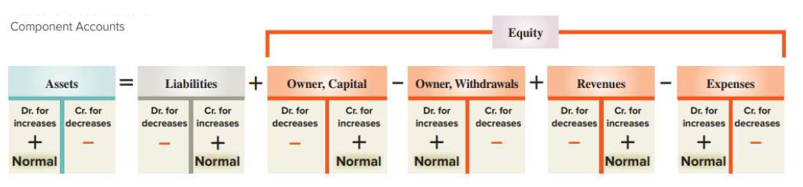
    * *Owner-Equity* decreases by *Dr* in Equity side
    * *Owner-Equity* increases by *Cr* in Equity Side
* Usually we see that each Accounts as families. One responsible per Account. Each transactions is recorded in 2 places by default.
* Accordingly, each Transactions shall affect in both of *Credit* & *Debit* 😉
  * Accordingly, you can see that each debit shall be mapped to a credit. Total debits = Total Credits
* Exmaples:
  * Owner adds 1M as cash follow:
    * *Assets-Debit (Assets-Dr)* = 1M
    * *Equity-Credit (Equity-Cr)* = 1M
    * Usually, you look from the **money giver prespective**, so he give 1M, so he has rights of 1M, so he credits his balance by 1M. Accordingly, the Assets is debit by 1M.
    * 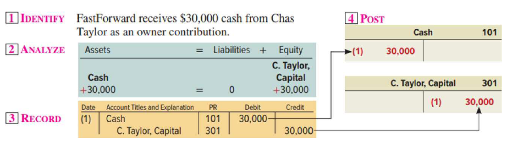
      * we recorded the *Owner-Cr* by 30K, however the *System* automatically **Posted** the transaction in the *Assets-Cash* Account.
  * Recived 2M as Bank loan.
    * *Assets-Cash_Debit* = 2M
    * *Liabilities-Credit* = 2M  ➡️Bank have a credit in this business
  * Business Delivered and cash collected = 10M
    * *Assets-Cash_Debit* = 10M
    * *Equity-Revenues-Credit* = 10M
  * Buy a new machine = 2M
    * *Assets-Cash_Cr* = 2M
    * *Assets-Equipment_Dr* = 2M
  * Pay Electricity invoice = 5K
    * *Assets-Cash_Cr* = 5K
    * *Equity-Expenses_Dr* = 5K
  * PUrchase Supplies (in cash) = 2.5K
    * *Assets-Cash_Dr* = 2.5K
    * *Assets-Supplies_Cr* = 2.5K
    * 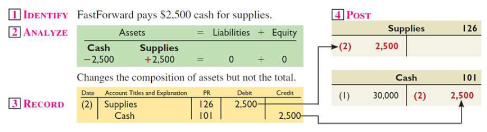
