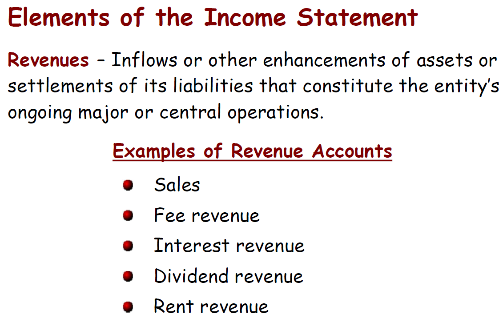
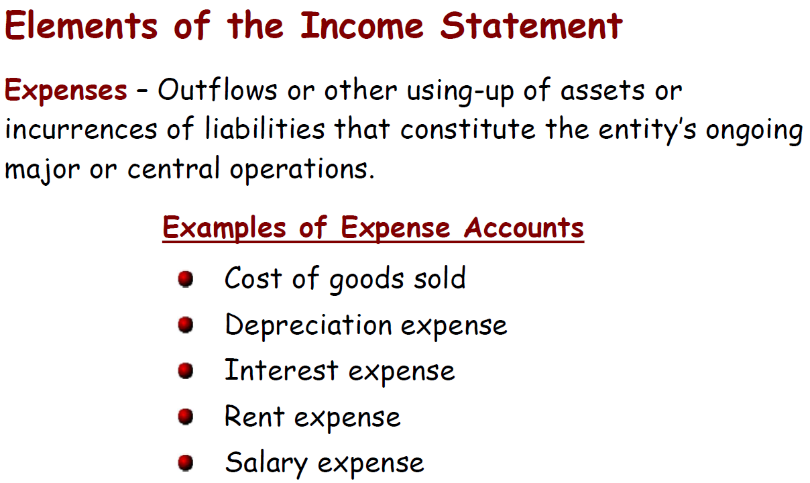
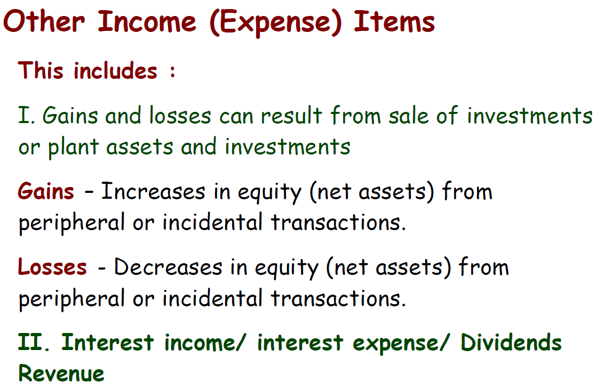

# Lecture-3: Accounting for Managers
>Dr.Maha Ramdan (email: maha.ramdan@eslsca.edu.eg)

### Exercise Review

- **Journalize the following transactions to journal**
    1. Owner invested $100,000 cash in the business
    2. The Co. borrowed a bank loan for $200,000 in cash
    3. The Co. provided cash services to clients for $50,000 cash
    4. The Co. provided credit services to a client for $20000 (on account)
    5. The client in transaction 4 paid $5000 of her balance
    6. The Co. purchased equipment for $70,000 in cash
    7. The Co. purchased inventory for $ 40,000 on credit from suppliers
    8. The Co. Sold the inventory purchased in previous transaction for $50,000 in cash
    9. The Co. purchased equipment for $2000 on credit
    10. The Co. received and paid the advertising bill for the month for $10,000 in cash
    11. The Co. received the utilities bill for $5000
    12. The Co. paid the above utilities bill
    13. The owner withdrew $5000 in cash from the company for his personal use
    14. The Co. purchased a one-year insurance policy for $60000 cash
    15. The Co. received $10,000 cash deposits from clients for services to be provided in the coming period   
 

  - **Journal**
    - The main goal is to define **what** (as a company) we got and **who** gave us!
    - Consider that the daily posting is done in the following sequence (**Debit** then **Credit**) ➡️ considering that each transaction has a double-effects (*Debit* & *Credit*)
   

  

  
Table with colors

    | Date | Transaction | Debit | Credit | Comments |
    | --- | --- | --- | --- |---|
    | 1| Cash | $100,000 | | |
    | | Equity-Capital  | | $100,000| In case of multiple owners, then we shall have multiple accounts per owner |
    | 2 | Cash | $200,000 | | |
    | | Liability-Bank_Loan | | $200,000| In case of multiple Bank-loans from different banks, then it shall be different Accounts per bank |
    | 3 | Cash | $50,000 | | |
    | | Revenues | | $50,000| |
    | 4 | Account-Receivable | $20,000| | Credit-Service (On-account) means cash not collected by service is delivered so it is calculated as Revenue.|
    | | Revenues | | $20,000||
    | 5 | Cash | $5,000 | | Get from Cash: `Credit Cash`  Collect Cash (increase Cash): `Debit Cash`|
    | | Account-Receivable | | $5,000| provide invoices means *Account-Receivable(AR)* increases (`debit`). However, collecting cash decreases *AR* (`credit`)|
    | 6 | Equipement | $70,000 | | This is what we received so we `Debit` it. Equipments is **Assets-CapEx**|
    | | Cash | | $70,000 ||
    | 7 | Inventory `Assets`  | | $40,000 | When purchasing Goods that you will sell it *later*, then it is called *Inventory* not *Supplies*, but still Assets However, Once the Goods is used in Business operations, then it is called *Expenses*|
    | | Accounts-Payable | | $40,000 | |
    | 8 | Revenue | | $50,000 | selling means you generate invoice. ***Any-invoice*** is recorded as ***Revenue***.|
    | | Cash | 10,000 |  | **Cash** is only $10,000 because the remaining is added as Depit for **Expenses_Inventory** |
    | | Inventory (COGS) `Expenses` | $40,000|  | ***Cost-of-Goods-Sold (COGS)*** Here `Inventory` is converted to  **Expenses** Consider that ***Taxes*** will be introduced from this step because  ***Profit*** will be seen here (Profit = Revenue - Cost)|
    |9 | Equipment | $2,000 | | |
    | | Accounts-Payable | | $2,000 | |
    |10| Supplier-Expenses (Ads Bill) | $10,000 | | Again, whatever we receive is `Debit` (i.e, cash, services, ads, invoices..etc.) **Expenses** are always **Depit**|
    | | Cash | | $10,000|  |
    |11| Expenses - Utilities | $5,0000 | | |
    | | Account-Payable | | $5,000| Becuase it is not clear that we pay it |
    |12| Account-Payable | $5,000| | to clear this amount because I will pay it now |
    | | Cash | | $5,000| |
    |13| owner-withdrawals | $5,000 | | |
    | | Cash || $5,000| |
    |14|  Prepaid Insurance | $60,000| |✨ This is not expenses because it is considered as Assets as long as it isn't yet used. ✨ However, every-month the moderator shall update the system by reducing this Assets-Prepaid_insurance (Cr.) by 5k and increase the Expenses-Insurance (Dr.) by 5k till 60k finished ✨ Again, consider that it is highly recommended because adding them as **one shot expenses** in single month will **destroy our Profit** figure. ✨ What if you make **Insurance that you will get back after you leave** the place? ➡️ This shall be doc under ***Account-Receivable(Dr.)*** and ***Cash (Cr.)***|
    | | Cash | | $60,000| |
    |15| Cash | $10,000| | |
    | | Unearned-Revenue| | $10,000 | later when service is delivered, then we decrease the **Unearned-revenue by 10K (+Dr.)** and increase the **Revenue by 10K (Cr.)**|

  

| Date | Transaction | Debit | Credit | Comments |
| --- | --- | --- | --- | --- |
| 1 | Cash | $100,000 | | |
| | Equity-Capital | | $100,000 | In case of multiple owners, then we shall have multiple accounts per owner |
| 2 | Cash | $200,000 | | |
| | Liability-Bank_Loan | | $200,000 | In case of multiple bank loans from different banks, then it shall be different accounts per bank |
| 3 | Cash | $50,000 | | |
| | Revenues | | $50,000 | |
| 4 | Account-Receivable | $20,000 | | Credit-Service (On-account) means cash not collected, but service is delivered, so it is calculated as revenue. |
| | Revenues | | $20,000 | |
| 5 | Cash | $5,000 | | Get from Cash: `Credit Cash` Collect Cash increase: `Debit Cash` |
| | Account-Receivable | | $5,000 | Providing invoices means `Accounts-Receivable (AR)` increases by debit. Collecting cash decreases `AR` by credit. |
| 6 | Equipment | $70,000 | | This is what we received, so we debit it. Equipment is `Assets-CapEx` |
| | Cash | | $70,000 | |
| 7 | Inventory `Assets` | $40,000 | | When purchasing goods that you will sell later, it is called `Inventory`, not `Supplies`. |
| | Accounts-Payable | | $40,000 | |
| 8 | Revenue | | \$50,000 | Selling means you generate an invoice. Any invoice is recorded as revenue. |
| | Cash | 10,000 | | **Cash** is only \$10,000 because the remaining is added as Debit for **Expenses_Inventory** |
| | Inventory (COGS) `Expenses` | $40,000 | | `Cost of Goods Sold (COGS)` means inventory is converted to expense. Profit appears here because `Profit = Revenue - Cost`. |
|9 | Equipment | $2,000 | | |
| | Accounts-Payable | | $2,000 | |
|10| Supplier-Expenses (Ads Bill) | $10,000 | | Again, whatever we receive is `Debit` (i.e, cash, services, ads, invoices..etc.) **Expenses** are always **Depit**|
| | Cash | | $10,000| |
|11| Expenses - Utilities | $5,0000 | | |
| | Account-Payable | | $5,000| Becuase it is not clear that we pay it |
|12| Account-Payable | $5,000| | to clear this amount because I will pay it now |
| | Cash | | $5,000| |
|13| owner-withdrawals | $5,000 | | |
| | Cash || $5,000| |
|14|  Prepaid Insurance | $60,000| |✨ This is not expenses because it is considered as Assets as long as it isn't yet used. ✨ However, every-month the moderator shall update the system by reducing this Assets-Prepaid_insurance (Cr.) by 5k and increase the Expenses-Insurance (Dr.) by 5k till 60k finished ✨ Again, consider that it is highly recommended because adding them as **one shot expenses** in single month will **destroy our Profit** figure. ✨ What if you make **Insurance that you will get back after you leave** the place? ➡️ This shall be doc under ***Account-Receivable(Dr.)*** and ***Cash (Cr.)***|
| | Cash | | $60,000| |
|15| Cash | $10,000| | |
| | Unearned-Revenue| | $10,000 | later when service is delivered, then we decrease the **Unearned-revenue by 10K (+Dr.)** and increase the **Revenue by 10K (Cr.)**|

  - Open Questions
    - In Tx 7 & 8, the Inventory Transactions is not clear. Inventory in Tx.7 is in Assets. However Inventory in Tx.8 is part of Expenses. Later the Trial-balance shows Ok✅!. However, Inventory shall have Balance = 0, correct ?
  - Now I want to check that everything is <ins>**recorded correctly**</ins>, so I need to make the **Trail-Balance**
    - I need to make a balance per account to ensure that everything is ok. 
    - Also consider that : <ins>**Debit >= Credit**</ins>.
    - So, if All_Debit - All_Credit ➡️ it is the current Balance (i.e., Remainder)
    - **Cash** (Assets)

        | Tx | Debit | Tx | Credit |
        |---|---|---|---|
        | 1 | 100,000 | 6 | 70,000 |
        | 2 | 200,000 | 10 | 10,000 |
        | 3 | 50,000 | 12 | 5,000 |
        | 5 | 5,000 | 13 | 5,000 |
        | 8 | 10,000 | 14 | 60,000 |
        | 15 | 10,000 | | |
        | **Total** | **375,000** | **Total** | **150,000** |
        | **Balance** | **225,000 (Dr)** | | |

        ---

    - **Account-Receivable** (Assets)

        | Tx | Debit | Tx | Credit |
        |---|---|---|---|
        | 4 | 20,000 | 5 | 5,000 |
        | **Total** | **20,000** | **Total** | **5,000** |
        | **Balance** | **15,000 (Dr)** | | |

        ---

    - **Equipment** (Assets)

        | Tx | Debit | Tx | Credit |
        |---|---|---|---|
        | 6 | 70,000 | | |
        | 9 | 2,000 | | |
        | **Total** | **72,000** | **Total** | **0** |
        | **Balance** | **72,000 (Dr)** | | |

        ---

    - **Inventory** - (Assets)

        | Tx | Debit | Tx | Credit |
        |---|---|---|---|
        | 7 | 40,000 | | |
        | **Total** | **40,000** | **Total** | **0** |
        | **Balance** | **40,000 (Dr)** | | |

        ---

    - **Prepaid Insurance** (Assets)

        | Tx | Debit | Tx | Credit |
        |---|---|---|---|
        | 14 | 60,000 | | |
        | **Total** | **60,000** | **Total** | **0** |
        | **Balance** | **60,000 (Dr)** | | |

        ---

    - **Accounts-Payable** (Liability)

        | Tx | Debit | Tx | Credit |
        |---|---|---|---|
        | 12 | 5,000 | 7 | 40,000 |
        | | | 9 | 2,000 |
        | | | 11 | 5,000 |
        | **Total** | **5,000** | **Total** | **47,000** |
        | | | **Balance** | **42,000 (Cr)** |

        ---

    - **Liability-Bank_Loan**

        | Tx | Debit | Tx | Credit |
        |---|---|---|---|
        | | | 2 | 200,000 |
        | **Total** | **0** | **Total** | **200,000** |
        | | | **Balance** | **200,000 (Cr)** |

        ---

    - **Unearned-Revenue** (Liability)

        | Tx | Debit | Tx | Credit |
        |---|---|---|---|
        | | | 15 | 10,000 |
        | **Total** | **0** | **Total** | **10,000** |
        | | | **Balance** | **10,000 (Cr)** |

        ---

    - **Equity-Capital**

        | Tx | Debit | Tx | Credit |
        |---|---|---|---|
        | | | 1 | 100,000 |
        | **Total** | **0** | **Total** | **100,000** |
        | | | **Balance** | **100,000 (Cr)** |

        ---

    - **Owner-Withdrawals** (Equity)

        | Tx | Debit | Tx | Credit |
        |---|---|---|---|
        | 13 | 5,000 | | |
        | **Total** | **5,000** | **Total** | **0** |
        | **Balance** | **5,000 (Dr)** | | |

        ---

    - **Revenues** (Equity)

        | Tx | Debit | Tx | Credit |
        |---|---|---|---|
        | | | 3 | 50,000 |
        | | | 4 | 20,000 |
        | | | 8 | 50,000 |
        | **Total** | **0** | **Total** | **120,000** |
        | | | **Balance** | **120,000 (Cr)** |

        ---

    - **Inventory (COGS) - Expenses**

        | Tx | Debit | Tx | Credit |
        |---|---|---|---|
        | 8 | 40,000 | | |
        | **Total** | **40,000** | **Total** | **0** |
        | **Balance** | **40,000 (Dr)** | | |

        ---

    - **Supplier-Expenses (Ads Bill)**

        | Tx | Debit | Tx | Credit |
        |---|---|---|---|
        | 10 | 10,000 | | |
        | **Total** | **10,000** | **Total** | **0** |
        | **Balance** | **10,000 (Dr)** | | |

        ---

    - **Expenses-Utilities**

        | Tx | Debit | Tx | Credit |
        |---|---|---|---|
        | 11 | 5,000 | | |
        | **Total** | **5,000** | **Total** | **0** |
        | **Balance** | **5,000 (Dr)** | | |

        ---

    - **Trail Balance Summary**

        | Account | Debit Balance | Credit Balance |
        |---|---|---|
        | Cash | 225,000 | |
        | Account-Receivable | 15,000 | |
        | Equipment | 72,000 | |
        | Inventory (Assets) | 40,000 | |
        | Prepaid Insurance | 60,000 | |
        | Accounts-Payable | | 42,000 |
        | Liability-Bank_Loan | | 200,000 |
        | Unearned-Revenue | | 10,000 |
        | Equity-Capital | | 100,000 |
        | Owner-Withdrawals | 5,000 | |
        | Revenues | | 120,000 |
        | Inventory (COGS) Expenses | 40,000 | |
        | Supplier-Expenses (Ads) | 10,000 | |
        | Expenses-Utilities | 5,000 | |
        | **TOTAL** | **472,000** | **472,000** |

    - If everything is OK and correctly recorded, then **`Debit-Balance = Credit-Balance`**
      - Therefore, we need the ***Trail-Balance*** as internal doc to check that everything is <ins>**balanced** ✅</ins>.
      - However, Trail-Balance is not powerful enough to ensure that all Accounts are correctly recorded, it ensures only the Balance is achieved (ex. In Tx.4, you add $20K in **Cash** instead of **Account-Receivable**➡️ **Trail-Balance** would be ok, however this won't reflect the reality because **Cash** end up with 225k however **Trail-Balance** will show 245K)
  
        > [!IMPORTANT] Common Notice : The following Accounts shall be usually (Debit)
        > Asset    ➡️ Debit
        > Expense  ➡️ Debit
        > Drawls   ➡️ Debit
        > So Balance usually are in ***Debit*** side.
        > They are Known as <ins>***AED-Accounts***</ins> (Assets, Expenses, Drawl) Accounts

        > [!IMPORTANT] Common Notice : The following Accounts shall be usually (Credit)
        > Revenue   ➡️ Credit
        > Capital   ➡️ Credit
        > Liability ➡️ Credit
        > So Balance usually are in ***Credit*** side.
        > They are Known as <ins>***RCL-Accounts***</ins> (Revenue, Capital, Liability) Accounts

    - Finally, in many cases, you need to make **Adjustments-تسويات**. **Adjustments** is essential to ensure that system records are reflecting the reality (ex. **Inventory** is reflecting the real amount in our warehouse, *Prepaid_Insurance*, *Internet-Subscriptions*, *Utilities-Long-Subscription* is decreased in monthly basis, **flight-tickets** usually recorded as *Unearned-Revenue* and after trip it is adjusted to be recorded as *Revenue*, even **Car** is considered as *Assets* as if it is <ins>*in-advance long subscription*</ins> and in monthly basis it shall be recorded as *Expense_Depreciation* ..etc.)
    - After **Adjustments**: ✅, you good to go with Reports: 

        | Balances | Report |
        | --- | --- |
        |*Revenue* vs *Expenses* | **Income-Statement**|
        | *Equity-Accounts* | **Equity-Reports** for Owners |
        | *Balance Accounts* | **Balance Sheet** |

---

### Income-Statement

* It is required for:   
  * Evaluate Past Performance
  * Predicting future Performance
  * Help assess the risk or uncertainty of achieving future cash flows
* <ins>**Income-Statment**</ins> follows the <ins>***IFRS (International Financial Reporting Standards) standard***</ins>
  * This is an internal-Org that published a **Global set of rules** for Accounting. 
  * These rules are customized in away that fits with different type of Businesses (Agriculture, Industry, ...etc.)
  * It is not obligatory, however it is recommended to follow, So it can be usable/readable all over the world.
  * The Egyptian version is called <ins> ***EAS (Egyptian Accounting Standard) Standard***</ins> which is mandatory to be used for all Companies in EG.
    * It is used for Accounting-Audits for example across EGY.
    * Within **EAS**, it provides different calculation variety per account (Ex. Depreciation Calculations)
      * Var-1: Time_Based-Depreciation: Car costs 1M EGP, will be used for 5-Years, then it will recorded as 200K per year
      * Var-2: KM_Based-Depreciation: Depreciation is calculated based on Moved-KM, so every KM costs 10-EGP (Uber style).
    * However, once Var-x selected then it shall be continuously used for the complete Account-Year.
  * **General Standard Cons**:
    * The companies performance is variable based on the selected Var-x within the Standard (*IFRS* or *EAS*).
    * The <ins>*Depreciation*</ins> calculation is subjective to the company (ex. Co-A consider Car Depreciation within <ins>*5-Y*</ins> however Co-B considers it for <ins>*10-Y*</ins>). Such decisions is called as the <ins>***Company-Depreciation-Policy/Fixed-Assets-Policy***</ins> ➡️ Could be assignment or Questions 😉.
      * for Var-1: you can find something like: <ins>**Stright-line**</ins> ➡️ *equal-payment-installment* and  *Assets-Useful-Lifetime*
      * Then the Authority-Audit checks that such defined-Policies are reasonable (Car-Depreciations > 1-Y and correctly replaced). Such policies shall follow *technical-reasons* + *Best-practices*.

* <ins>**Elements of Income Statment**</ins>

  | Income-Statment Element | Comment |
  | --- | --- |
  |  | * *Sales*: *Sales-Revenue* ➡️ when selling product. * *Fee-Revenue*: when providing Services (ex. Uni MBA Program service, Lawyer). * *Interest-Revenue*: ex. Bank-Deposit has returns. * *Dividend-Revenue إيراد توزيعات الأرباح*: when having a daughter company and it made profits. So Co-A invested in Co-B, then Co-B makes profit, it shall be added as *Dividend-Revenue* for Co-A. This applies if it is sister-Co. * *Rent-Revenue*: Ex Uni rent <ins>food-court space for restaurants</ins>, then rents are considered as *Rent-Revenue* |
  |  | * *Cost of goods sold (COGS)*: The biggest part of Expense. Purchase Goods to re-sell😉. * *Interest-Expense*: in case of Loan, then interest value is expense. However the Loan main part itself is recorded as **Liability**.|
  |  | * *Gain/Loses مكسب ارباح رأسمالية*: of other investment  &emsp;(ex. sell my *shares* in another Co., so in case of profit (buy with 1M and sell for 1.2M) then it ***Gain***, else it is ***Lose***, <ins>**or**</ins>  &emsp; selling piece of land <ins>**or**</ins> &emsp; Currency-exchange profit ...etc.) * It is not recorded as *Revenue* to differentiate it from the main Business-income. * Such gains are not daily-business Operations, however it is incidental |

  * **Single-Step Format** ➡️ Not Frequently used
    

    * Collect all Revenues (**Core-Business** Related + **Non-Core-Business** Related) - Expenses.
      * Theoretically, Taxes shall not be part of this
      * It is easy.
      * However, it is not accurate, so it is not giving details and differentiate between the **Core-Business-Operations** & **Non-Core-Business-Operations**

  * **Multiple-Step Format** ➡️  <ins>Frequently</ins> used

     >[!IMPORTANT] Mutliple-Step Report 
     > Multiple-Step Report is Reporting **Facts** with Min details possible. 

    |  |  |
    | --- | --- |
    |    |* You can see each item here as ***Cost-Center*** * **Sales (Sales-Revenue)**: Considering the **COGS** is the most important elements that affects *Sales* and will include different items which all related to prepare product for selling (Ex Real-Goods or Raw-Materials, Salaries for Production-team, Plant, Electricity, Labour-Salaries, Production-Machine Depreciation...etc.), so you can consider that **COGS** is <ins>***Cost-Center for Production***</ins> &emsp;* **Gross-Profit / مجمل الربح**: This is not **Net-Profit** because other **Expense** to be dedicated (ex. salaries, taxes, rents..etc.). * **Expenses**:There are two major expenses (*Operating Expense*) that affect the Expenses &emsp;* **Selling-Expense**: Ex. Ads, Rents (Shops or Shelves), Websites, Subscriptions, Salaries for sell-team, Phones-Depreciations, Bonus. &emsp;* **Admin-Expense**: Ex Salaries of Management, Their Car-Depreciation, Internet ..etc. * **Non-Core-Business Related (Other Revenue)** |
  
    * One conclusion: There are duplication between **CODS**, **Selling-Expense** and **Admin-Expense** ➡️ However it is listed under different categories based on Core-Business order.
    * However, we don't mention in details of each category, so it is easier for Top-Management to read and understand or even ensure the control and Performance-Comparisons.
    * Each Num between Brackets (ex. Interest-Expense: (21,000)) means that it is (-ve).
    * Income Before Taxes (IBT) or Earning Before Taxes (EBT) 

    | | |
    | --- | --- |
    |  |* **Net_Sales_Revenues**: This value shall <ins>***EXCLUDE***</ins> sales-discounts, Sales-returns,..etc. &emsp;* **Cash-Discount**: When Co. offer discount in case of Cash-Payment. &emsp;* **Sales-Rebat**: When buying large amount then I get a discount on large amounts (for distributors) * **SGA (Selling, General, Admin)**: Are Operating-Expenses. * **Other-Income: Non-operating Gains & Loses**: &emsp;* ***Book-Value***: Ex. Buy Car 1M EGP. Car-Depreciation is 10-years based on Co.-Policy (100K/year). After 8-Years, we decided to sell it. Now <ins>***Accumulated-Depreciation*** ➡️ Depreciatiion from Day-0 = 800K EGP</ins>, then the <ins>***remaining car-value (Book-value / القيمة الدفترية)*** = 200K EGP</ins>. Then found the current *car-market-price = 250k EGP*, then we have *Gain = 50K EGP*, else if *car-market-price = 180k EGP*, then we have *Lose = 20K EGP*. Once Car is sold, then it is removed from system (**Cost + Expense_Depreciation**), so each Asset-item has 2-accounts sides (**Cost + Expense_Depreciation**)  |

    * To remove Asset from System, then you can **Cr. the Asset with its value** (Cr. is decrease in Assets & Expense sides). Considering that the Asset itself is not physically available in the company anymore. The following table shows the Lifetime of and Asset (ex. Car) on the company ➡️  **To check if the Table is correctly settled!** 
      * In case we Sell the Asset-Car after 8-Years 
    
        | Date | Transaction | Debit | Credit | Comments |
        | --- | --- | --- | --- |--- |
        | Jan-2018 | Equipments-Car | 1M | | * Buy new car for the company * Based on Co.-Policy the car depreciation is 10-Years.|
        | | Cash | | 1M | Cash Cr. because it is ⬇️|
        |Jan-2019 | Accumulated-Depreciation_Car | | 100K | * This is the twin-Account for the Equipement-Car account to record its accumulated-depreciations for the Car. * it is Credit account because it decrease the Asset value 😉 * We can't decrease the value in the <ins>**Equipments-Car**</ins> because it is recorded with evidences and will be problems with Audits.|
        | | Expense_Car_Depreciation | 100K | | |
        |Jan-2020 | Accumulated-Depreciation_Car | | 200K  | |
        | | Expense_Car_Depreciation | 100K | | |
        |Jan-2021 | Accumulated-Depreciation_Car | | 200K  | |
        | | Expense_Car_Depreciation | 100K | | |
        |Jan-2022 | Accumulated-Depreciation_Car | | 300K | |
        | | Expense_Car_Depreciation | 100K | | |
        |Jan-2023 | Accumulated-Depreciation_Car | | 400K  | |
        | | Expense_Car_Depreciation | 100K | | |
        |Jan-2024 | Accumulated-Depreciation_Car | | 500K | |
        | | Expense_Car_Depreciation | 100K | | |
        |Jan-2025 | Accumulated-Depreciation_Car | | 600K | |
        | | Expense_Car_Depreciation | 100K | | |
        |Jan-2026 | Accumulated-Depreciation_Car | | 800K  | |
        | | Expense_Car_Depreciation | 100K | | |
        |Feb-2026 | Cash | 50K| | After 8-Years, we decided to sell the car (Booked-Value = 200K). However Market-Value = 250K |
        | | Revenue-Gain | | 50K| This is Non-Core-Business operation gain however Asset selling |
        | | Equipment-Car | | 1M | Credit the <ins>**Equipment-Car**</ins> account with 1M to Delete the account from the system. |
        | | Expense_Car_Depreciation | 800K | | Debit the <ins>**Expense_Car_Depreciation**</ins> with 800K to Delete it as well from the system.|

      * In case we continue Using the Asset-Car after 10-Years
    
        | Date | Transaction | Debit | Credit | Comments |
        | --- | --- | --- | --- |--- |
        | Jan-2018 | Equipments-Car | 1M | | * Buy new car for the company * Based on Co.-Policy the car depreciation is 10-Years.|
        | | Cash | | 1M | Cash Cr. because it is ⬇️|
        |Jan-2019 | Accumulated-Depreciation_Car | | 100K | * This is the twin-Account for the Equipement-Car account to record its accumulated-depreciations for the Car. * it is Credit account because it decrease the Asset value 😉 * We can't decrease the value in the <ins>**Equipments-Car**</ins> because it is recorded with evidences and will be problems with Audits.|
        | | Expense_Car_Depreciation | 100K | | |
        |Jan-2020 | Accumulated-Depreciation_Car | | 200K  | |
        | | Expense_Car_Depreciation | 100K | | |
        |Jan-2021 | Accumulated-Depreciation_Car | | 200K  | |
        | | Expense_Car_Depreciation | 100K | | |
        |Jan-2022 | Accumulated-Depreciation_Car | | 300K | |
        | | Expense_Car_Depreciation | 100K | | |
        |Jan-2023 | Accumulated-Depreciation_Car | | 400K  | |
        | | Expense_Car_Depreciation | 100K | | |
        |Jan-2024 | Accumulated-Depreciation_Car | | 500K | |
        | | Expense_Car_Depreciation | 100K | | |
        |Jan-2025 | Accumulated-Depreciation_Car | | 600K | |
        | | Expense_Car_Depreciation | 100K | | |
        |Jan-2026 | Accumulated-Depreciation_Car | | 800K  | |
        | | Expense_Car_Depreciation | 100K | | |
        |Jan-2027 | Accumulated-Depreciation_Car | | 900K  | |
        | | Expense_Car_Depreciation | 100K | | |
        |Jan-2028 | Accumulated-Depreciation_Car | | 99,999  | * This is the last time we Credit this account. from 2029, we will use the Assets-Car as if it is for free. *  Accordingly, this will reflect on our Profits because no Expenses will be added on this Asset starting from 2029|
        | | Expense_Car_Depreciation | 99,999 | | |

    * **Summary**
        >[!IMPORTANT] Rules Summary
        > **Cost-of-Goods-Sells (COGS)** = All costs regarding the Production activities (ex. Raw-Material, Production-related-Expense)
        > **Net_Sales_Revenue** = Gross_Sales - (Trade_Discounts + Sales_Returns + Cash_Discounts + Sales_Rebates)
        > **Gross_Profit** = Net_Sales_Revenue - COGS
        > **Operating_Expenses** = Selling_Expenses + General_Expenses + Administrative_Expenses
        > **Operating_Income/Profit** = Gross_Profit - Operating_Expenses
        > **Other Income (gain) / Loss (Ga/Lo)** = Ga/Lo_FixedAssets + Ga/Lo_ForeignExchange + Ga/Lo_Stocks/Bonds + Interest_Income(gain) - Interest_Expense + Dividend_Income
        > **Earnings_before_Tax (EBT)** = Operating_Income +/- Other Income (gain) / Loss (Ga/Lo)
        > **Net_Profit_After_Tax** = EBT - Income_Tax_Expenses

        * Exam-Question: MCQ of each item based on some supplied values (Ex. *Gross-Profit* )

    * **Example-1**:
    
    
      
      * **Create Multiple-Step Income Statment**
      
        | Income Statments | |
        |--- |--- |
        | **Net_Sales_Revenue** | 1,947,000 |
        | COGS | 746,031 |
        | **Gross_Profit** | 1,200,969|
        | **Operating_Expenses** |
        | Selling_Expenses | 165,785 | 
        | General & Administrative_Expenses | 48,300 |
        | Total Operating Expenses | 214,085 |
        | **Income/Profit from Operations** | 986,884 |
        | **Other Income (gain) / Loss (Ga/Lo)**|
        | Interest Revenue | 38,000|
        | Gain on Sale of Investiment | 55,000 |
        | Interest Expense | 46,500 |
        | total Other Ga/Lo | 46,500 |
        | **Income/Earnings Before Tax (IBT/EBT)** | 1,033,384 |
        | **Income Tax Expense** | 134,400 |
        | **Net Profit After Tax** | 898,984 |

        
       