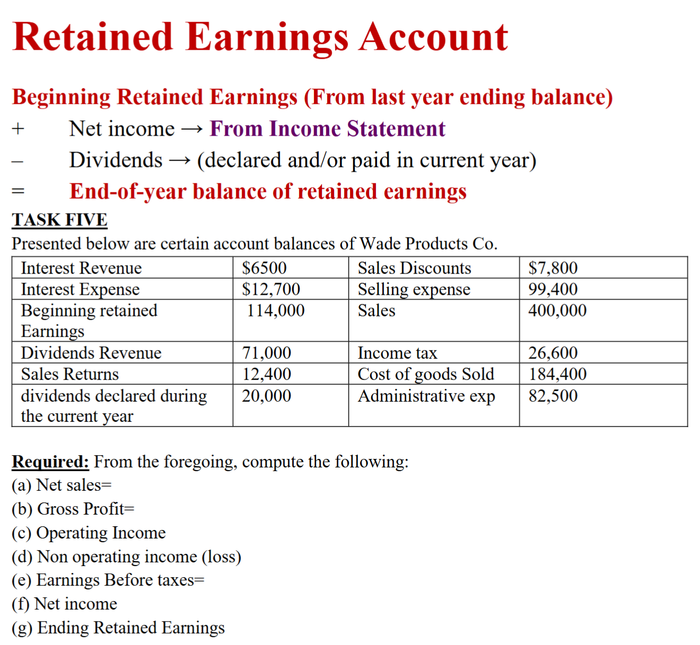
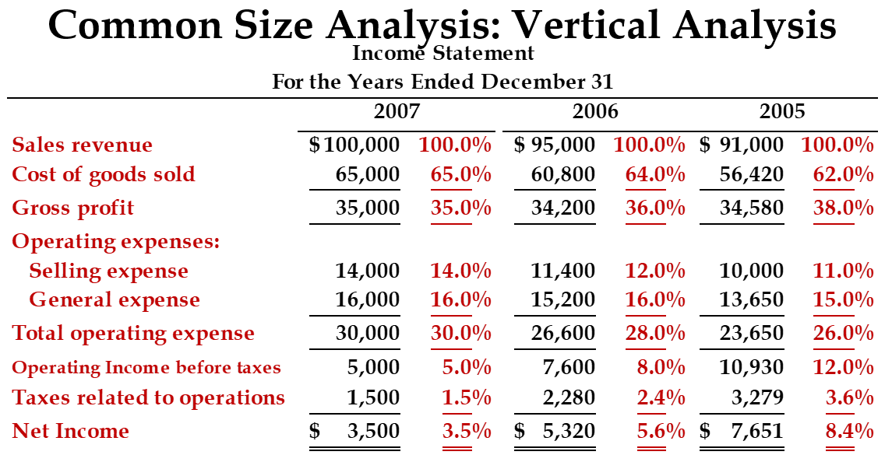
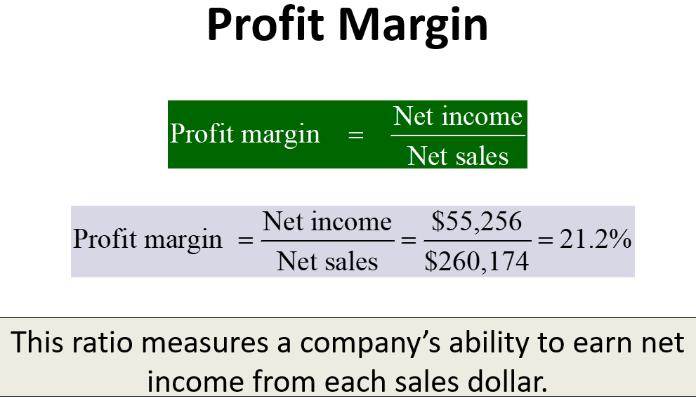
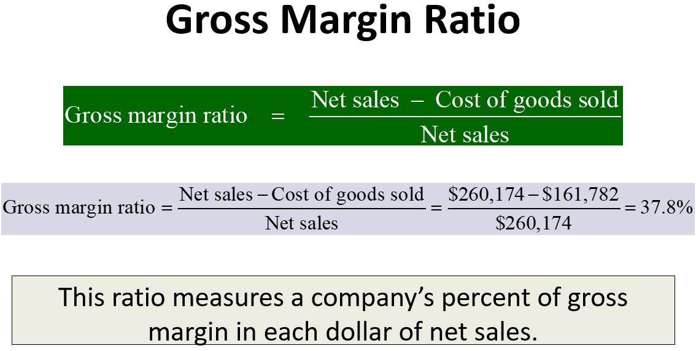
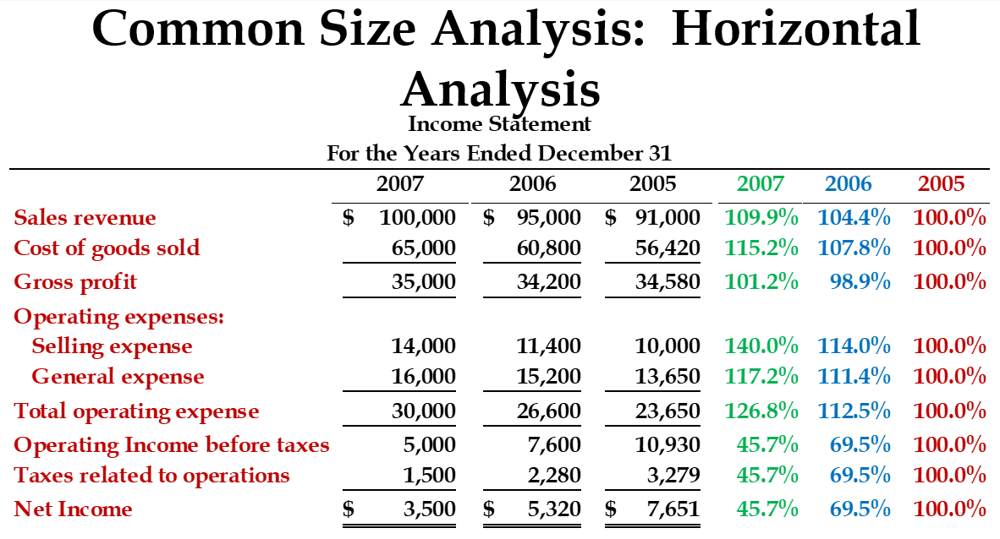
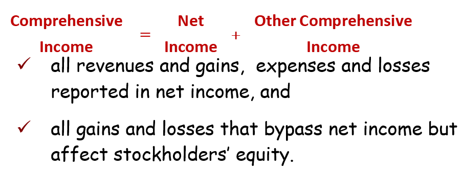

# Lecture-4: Accounting for Managers
>Dr.Maha Ramdan (email: maha.ramdan@eslsca.edu.eg)

### Income-Statement (PnL)

* Consider that we have *Income-Statement* for 2024 shows that we have `Profit = 10M`, so we need to check that the Owns/Shareholder **Dividends - توزيعات الأرباح**.
  * Decision: `Dividends = 3M`
  * This means that we keep `7M` within the Business as **`Retain-Earning =`** <span style="background-color:#58DA58;">**`7M`**</span>
  * This <ins>**Retain-Earning**</ins> is considered as ***Savings*** Account. Accordingly, it shall has a history of the account (Starting points, add-ons, ..etc.).
    * <ins>*2024*</ins><br>&emsp;**`Retain-Earning =`**<span style="background-color:#58DA58;">**`7M`**</span><br><ins>*2025*</ins><br>&emsp;`Profit = 10M`<br>&emsp;`Dividends = 3M`<br>&emsp;**`Retain-Earning =`**<span style="background-color:#58DA58;">**`14M`**</span>
  * So, the **Opening** of the **`Retain-Earning `** was 7M.
  * Accordingly, what is the <span style="background-color:#E77957;">difference between <ins>**Income**</ins> and <ins>**Retain-Earnings**</ins></span>?
    * <ins>**Income**</ins>: This is orianted towards a specific Acounting-Period (ex. 2025, 2026..etc)
    * <ins>**Retain-Earnings**</ins>: This is orianted towards all the savings profit from this Year and all the previous Periods.
  * <ins>**Ex-1**</ins>: 
  <br>

    


    * $\text{Net Sales} = \text{Sales} - (\text{Sales Discounts} + \text{Sales Returns})$ <br> $= \$400{,}000 - (\$7{,}800 + \$12{,}400) = \boxed{\$379{,}800}$
    * $\text{Gross Profit} = \text{Net Sales} - \text{COGS}$ <br> $= \$379{,}800 -  \$184{,}400 = \boxed{\$195{,}400}$
    * $\text{Operating Income} = \text{Gross Profit} - \text{Administrative Expenses} - \text{Selling Expenses}$ <br> $= \$195{,}400 - \$82{,}500 - \$99{,}400= \boxed{\$13{,}500}$
    * $\text{Non-Operating Income} = \text{Interest Revenue} - \text{Interest Expense} + \text{Dividends Revenue}$ <br> $= \$6{,}500 - \$12{,}700 + \$71{,}000 = \boxed{\$64{,}800}$
    * $\text{Earnings Before Taxes (EBT)} = \text{Operating Income} \pm \text{Non-Operating Income}$ <br> $= \$13{,}500 + \$64{,}800 = \boxed{\$78{,}300}$
    * $\text{Net Income} = \text{EBT} - \text{Income Taxes}$ <br> $= \$78{,}300 - \$26{,}600 = \boxed{\$51{,}700}$
    * $\text{Current Retained Earnings} = \text{Net Income} - \text{Dividends}$ <br> $= \$51{,}700 - \$20{,}000 = \boxed{\$31{,}700}$
      * The *Declared-Dividends* either to provided directly as Cash to owners or added to the Liabilities to be paid later.
    * $\text{Ending Retained Earnings} = \text{Beginning Retained Earnings} + \text{Current Retained Earnings}$ <br> $= \$114{,}000 + \$31{,}700 = \boxed{\$145{,}700}$
      * After this step, we consider that All the Revenues & Expenses Accounts are reset (0s). So any new Sales, Revenues, Expenses is considered from scratch  for the new Accounting cycle.

---
<div style="page-break-after: always;"></div>

#### Common Size Analysis

* The **Income-Statement** doesn't give us full view about the business unless we can compare it (benchmark) it with something else.
* **Common Size Analysis: <ins>Vertical Analysis</ins>** ➡️ ***✨Profitability-Analysis✨***
<br>
    

  * The **Reference Value** for everything is the Sales (Revenue).
  * The Generated <ins>**Net-Income (Net-Profit)**</ins> in the end of the report is called: <ins>***Margin***</ins>

    

    * We use this value to check where we are from the Target 😉.
  * Meanwhile, there is another value called ***<ins>Gorss-Margin-Ratio</ins>***
    
  * So, we use this **Ref-value** to show the portion of the other values from this **Ref-Value**.
    * EX:
      * <ins>*Sales*</ins> = 100k / 100k = 100% of <ins>*Sales-Revenue*</ins>.
      * <ins>*COGS*</ins> = 65K / 100K = 65.0% of <ins>*Sales-Revenue*</ins>.
    * What is the provided info from this ?
      * for 2007, for each 100$ <ins>*sales*</ins>, 65% of it is used for <ins>*COGS*</ins>, accordingly, the remaining <ins>*Gross-Profit*</ins> is 35%.
      * Also for 2007, for each 100$ <ins>*sales*</ins>, we use 14% of it for <ins>*Selling-Expenses*</ins>, and 16% for <ins>*General-Expenses*</ins>.
    * Accordingly, what can we conclude ?
      * There are some values (ex. *COGS*) is fixed (ex. in Pharmacy industry) because of regulations or whatever, so it is unified across the market.
      * Therefore, we need to deal with the *Gross-Profit* ratio within the given-value (i.e., in this Ex = 35%)
      * Apart from that, if we consider the ratio of <ins>*Selling-Expenses*</ins> across years (2005: 11%, 2006: 12%, 2007: 14%) ➡️ 📈‼️
        * This implicitly means that **Selling-Team** acquires more resources every-year (trends-up), when why ?!.
        * Finance-Team is not claiming if this is 👍 or 👎, however, we just put facts in front of Top-Managements so they ask correct questions, and the **Selling-Team** shall justify this increase 😉.
          * Maybe the **Sales-Team** has new product and they need to advertize it, or planning to penetrate a new market, or ...etc.
      * However, <ins>*General(admin)-Expenses*</ins> looks constant across years, which refer to kind-of ***stability***.
    * So, how can we understand the <ins>**Profitability-index - مؤشر الربحية**</ins>?
      * After deducting all expenses, we see that **Net-Income** ratio is Trending 📉 down‼️(2005: 8.4%, 2006: 5.6%, 2007: 3.5%) 😥😖
        * Then, we can finally conclude that we started the business with: for each 100 <ins>*sales*</ins>, we consume ***91.6% = 91.6 dollars*** as <ins>*Expenses*</ins> and got ***8.4% = 8.4 dollars*** as <ins>*Net-Profit*</ins>, and trends 📉 down the <ins>*Net-Profit*</ins> to ***3.5% = $3.5 😱***
        * Also, it is clear the COGS is Trending 📈 Up, then it shall be investigated why ? is it common on the market or Internal-issue ?
    * Apart from that, If Top-Management:
      * ***<ins>Accept Current Ratios 😁👍</ins>***
        * we can <ins>**Forecast Budget**</ins> for next Year based on these Ratio if we accept the current Ratios.
          * Consequently, if we set *<ins>Sales-Target</ins>* for 2008 as 200K dollars, then we can <ins>*Forecast-COGS-Budget*</ins> as $130k
      * ***<ins>Decline Current Ratios 😖😱👎</ins>***
        * They forces the *<ins>Selling-Team</ins>* for certain percentage (ex. 10%) only.

---
<div style="page-break-after: always;"></div>

* **Common Size Analysis: <ins>Horizontal Analysis</ins>**

<br>
    

  * In this Analysis, we select a Year as **<ins>Ref-Value ➡️ All Values</ins>**
  * Then we consider calculate the Ratio for each Value (ex. COGS, Selling-Expenses, Admin-Expenses...etc.) w.r.t the same value in the selected year (i.e., 2005 in this ex.).
  * ***Year-2006***
    * Sales is 104.4% of sales in 2005, with 4.4% Trend-up 📈
    * Therefore, we consider that all values shall max increase by 4.4% 🤔⁉️
    * However, we see COGS increase by 7.8% ‼️
  * Meanwhile, the most common **CSA-Horizontal_Analysis** is the year2year analysis (2007 w.r.t 2006, 2006 w.r.t 2005....and so on) ➡️ *More Common*
    * However, In this example, he consider 2005 as the reference base and do the analysis based on this year, maybe for any major change happened to this year (ex. COVID, new product introduced, Re-Org...etc.).
    * However, it is considered kind of the same.

---
<div style="page-break-after: always;"></div>

### Comprehensive Income Statement / Report

* Assumption: the Co. bought a **Land** since *<ins>10-Years</ins>* which costed at that time around *<ins>1M</ins>* as stated in the **CO._Income-Statement** with this value. Nowadays, the Co. wants to enhance its **Income-Statement** by re-evaluating its old Assets (i.e., the Land in this case). Co. hired some authorized agency to do this re-evaluation so it shall be updated in the company **Income-Statement**.
* Such Option becomes allowed by the Egyptian government after this current inflation, however it is not obligatory 😉, however this is known in the International regulations.
  * However, this is a costly operations and has alot of Hassels. Considering that revaluation process is performed for all the *<ins>Co.-Comprehensive Items (Fixed Assets)</ins>* (ex. Co. Buildings, Co. owned Land..etc., but not the items which is part of any the production process). So it is not selective to enhance your reports 😉😜.
  * The **Excluded** items are (Because it isn't cost of Running business & gain values from them is returned directly to Owners): <br>**`Investments by Owners`**: issuing shares, owner cash contribution, owner contributes equipment or land<br>**`Distribution to Owners`**: cash dividends, stock dividends, owner withdrawals
* Let's assume that an Agency did the Land re-evaluation and announced that the market price for it currently around *<ins>10M</ins>*.
* But the **Income-Statement** has the price for this land as *<ins>1M</ins>*, so we need to add the remaining *<ins>9M</ins>*:
  * The new *<ins>9M</ins>* can be added to the under category called ***<ins>"Other Comperhensive Income Items"</ins>*** which is part of the **Equity-Components**.
    * One of the most common components within this ***<ins>"Other Comperhensive Income Items"</ins>*** called: ***Unrealized-Base***
    * But <span style="background-color:#E77957;">why it is called ***Unrealized-Base***?</span> ➡️ Because the Land is not sold, however it is just re-evaluated. So it is unrealized. However, if the Land is already sold, then we consider this as **Realized-gain** 😉.
  * Now, I can raise the **Assets** part with this *<ins>9M</ins>* and we are sure the equality is kept.

    ```mermaid
    graph TB
      EQ["<b>Accounting Equation</b><br>Assets = Liabilities + Equity"]

      A["<b>Assets</b><br>Land: 1M → 10M<br><span style='color:#58DA58'>(+9M ✅)</span>"]
      L["<b>Liabilities</b><br>(No Change)"]
      E["<b>Equity</b>"]

      E1["Capital"]
      E2["Retained Earnings"]
      E3["<b>Other Comprehensive<br>Income Items</b><br><span style='color:#58DA58'>(+9M ✅)</span>"]
      E3a["Unrealized Gains<br>(Land Revaluation Surplus)<br>+9M"]

      EQ --> A
      EQ --> L
      EQ --> E

      E --> E1
      E --> E2
      E --> E3
      E3 --> E3a

      style A fill:#2E86C1,stroke:#1B4F72,color:#fff
      style L fill:#E74C3C,stroke:#922B21,color:#fff
      style E fill:#27AE60,stroke:#1E8449,color:#fff
      style E3 fill:#F39C12,stroke:#B7950B,color:#fff
      style E3a fill:#F9E79F,stroke:#B7950B,color:#333
      style EQ fill:#5B2C6F,stroke:#4A235A,color:#fff
    ```
* However, we knew that ***<ins>PnL</ins>*** concerns with only realized items, so, how can we add these items to enhance the report and meanwhile we inform the reader that such enhacement comes from ***Unrealized-Base***
* So, we create a **Comprehensive Income Statement** report that shows the ***<ins>unrealized-gains</ins>*** which known as **Gain-on-Paper**
  * The most common account in these cases is: ***<ins>"Other Comprehensive Income Items" ➡️ "Revaluation Surplus"</ins>***
* There is a common term called **OCI** ➡️ **<ins>Other Comprehensive Income number</ins>**
* **Comprehensive-Income الدخل الشامل**: 
  > Bypass Net-Income: means that they are not considered as Net-Income because the item miss one of the Net-Income criteria (i.e, realized)

    
    
    <br>
    <br>

    ```mermaid
    graph TB
      CI["<b>Comprehensive Income</b><br>الدخل الشامل"]

      NI["<b>Net Income</b><br>✅ Realized Items<br>(from PnL)"]
      OCI["<b>Other Comprehensive<br>Income (OCI) ±</b><br>📄 Unrealized Items<br>(Gain/Loss on Paper)"]

      NI1["Sales Revenue"]
      NI2["COGS / Expenses"]
      NI3["Operating Income"]
      NI4["Non-Operating Ga/Lo"]

      OCI1["Revaluation Surplus (+)<br>or Impairment (-)<br>(Land, Buildings)"]
      OCI2["Unrealized Gains (+)<br>or Losses (-)<br>on Investments"]
      OCI3["Foreign Currency<br>Translation Gains (+)<br>or Losses (-)"]

      CI -->|"+"| NI
      CI -->|"±"| OCI

      NI --> NI1
      NI --> NI2
      NI --> NI3
      NI --> NI4

      OCI --> OCI1
      OCI --> OCI2
      OCI --> OCI3

      style CI fill:#5B2C6F,stroke:#4A235A,color:#fff
      style NI fill:#27AE60,stroke:#1E8449,color:#fff
      style OCI fill:#E67E22,stroke:#BA4A00,color:#fff
      style NI1 fill:#82E0AA,stroke:#1E8449,color:#333
      style NI2 fill:#82E0AA,stroke:#1E8449,color:#333
      style NI3 fill:#82E0AA,stroke:#1E8449,color:#333
      style NI4 fill:#82E0AA,stroke:#1E8449,color:#333
      style OCI1 fill:#F9E79F,stroke:#B7950B,color:#333
      style OCI2 fill:#F9E79F,stroke:#B7950B,color:#333
      style OCI3 fill:#F9E79F,stroke:#B7950B,color:#333
    ```

* Example:
  * We have 3M **cash** in *Assets*, so we decided to invest in **<ins>Security اوراق مالية</ins>** ➡️ so it is investment in Other companies.Most common types:<br>**`Stocks`**<br>**`Bonds (Debt Security)`**
  
    <br>

    |Difference | **Stocks** (known as: *Equity-Security*) | **Bonds** (Known as: *Debt-Security*)|
    |--- | --- | --- |
    |**definition** | this is a share in the company so the stock owner is sharing the Revenue/Loses - ورقة مالية بغرض الملكي | This is kind of loan to the company but from **Individuals** instead of getting loan from Bank ➡️ Better in Approval process and faster<br> This is similar to: اذن الخزانة من الدول<br>The Co. issues a paper for 1K, with interest rate = 10% for 5-Year. So the Bond owner provide 1K to the company in front of this Paper and get 100 every year. After 5-Years, the Co. return the 1K back to the Bond Owner. |
    |**Relationship** | Stock owner is considered as one of the owners of this company which stock belongs to | Bonds owner is debit the company that provide this Bond with a certain amount of money |
    |**Rights due to Relationship** |* I receive dividends in case of the company makes revenue and they decided to distribute dividends.<br>* Gain/Loss due difference between Purchase/Selling of the stocks due to market situations. | The Bond is issued with a certain interest rate which is ***<ins>independent</ins>*** on the financial situation of the company (gain or loss) ➡️ This is consider less risk and more stable. |

Till 22:05