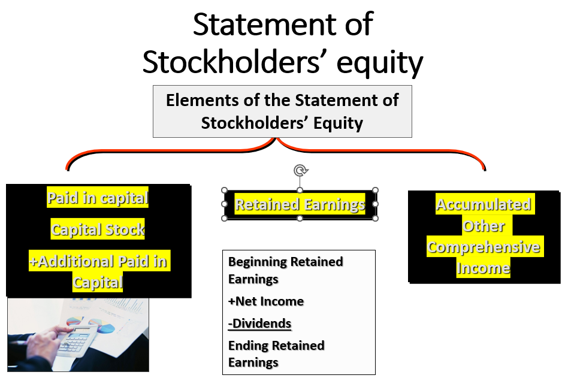
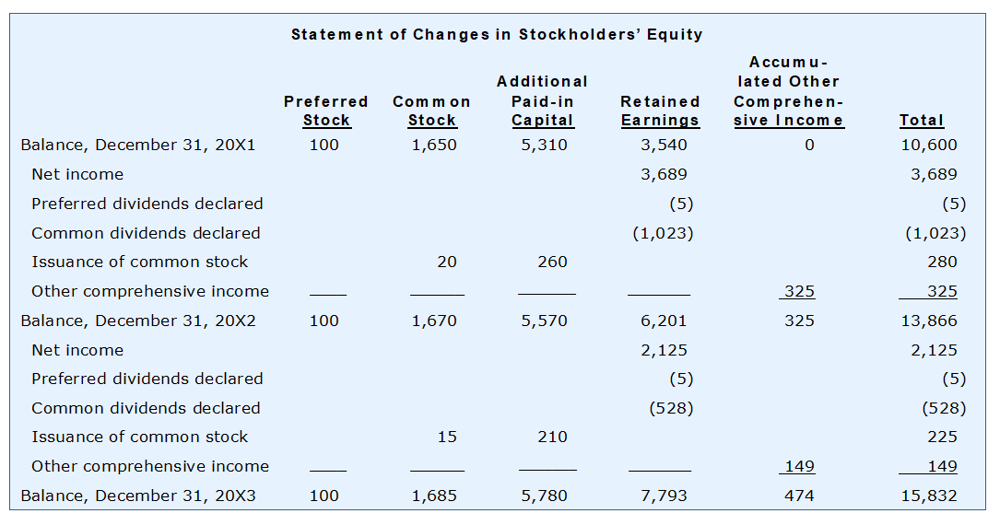
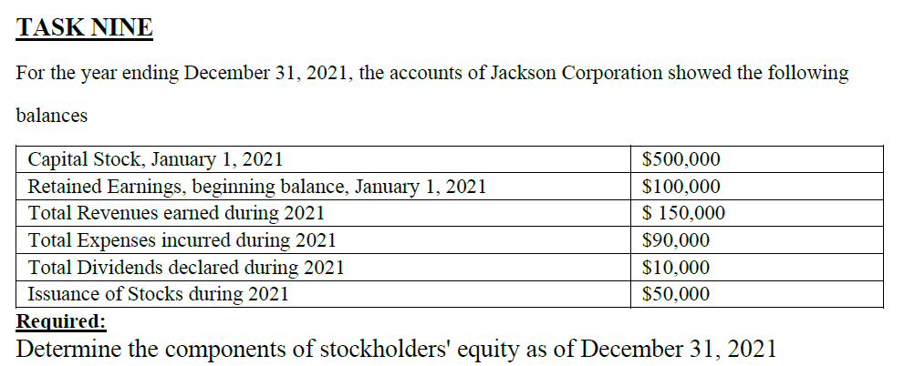
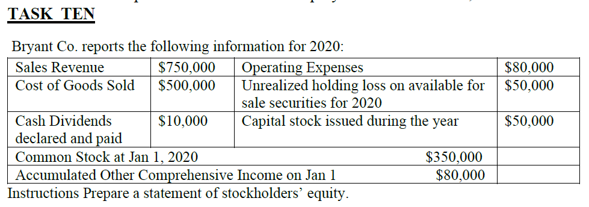

# Lecture-5: Accounting for Managers
>Dr.Maha Ramdan (email: maha.ramdan@eslsca.edu.eg)

## Statment of Stock holder's Equity





<br>

* It shows the shares (Stockholder / Shareholder) between the Co. Owners.
* Owner Equity is determined via:
  * **Paid-in Capital**: how much the owner invested in the company
  * **Retained Earnings**: remaining/savings Profit after distributing dividends.
  * **Accumulated Other Comprehensive Income**: Unrealized Income (on paper gains).
* This Statement/Report shows the changes on the Equity changes during the Year. So it is reported as comparison between the current year w.r.t last year.
* From the Ex. Graph: 
  * why does **Declared** mean? ➡️ because this means that we shall change the values to be **Liabilities**.
  * What is the **Additional Paid-in Capital**?
    * When starting the company, the Authority office approve the company with:
      * *<ins>Authorized Num of Shares</ins>*: Max num of Stocks/Shares that it can issued (Ex. 100K stocks).
      * *<ins>Par value</ins>*: The min value (price) per stock that company can sell with (ex. $10).
    * Usually, the Co. doesn't offer/Sell all of its stock as one shoot, however based on Cash-Needs.
    * So, in the beginning, the Co. owner decided to offer 20K stocks for selling. Those 20K stocks will be purchased by the Main Co. owners by the Par value.
    * 1-year later, Co. decided to issue another 50K stocks, but after checking the Co. Market value, the stock value = $100 instead of the par = $10, how shall we document that?
    * The offered Stocks are either Common or preferred, however the stock agreement shows if it is common or preferred.
  
    | Date | Decision | Capital-Stock | Par | Additional Paid-in Capital / رأس المال المدفوع الإضافي|
    | --- | --- |  --- |  --- |  --- |  
    | 1-Jan 2021 <br>(Co. Foundation) | Issued 20K stocks with Stock par = $10.<br>Stocks owned by Owners<br> **Initial Public Offer (IPO)** | 20k * 10 = 200K | 10 | - |
    | 1-Jan 2022 | Co. Decided to issue another 50K stocks with stock value = $100 (par = 10, extra = 90) for investors | 50k * 10 = 500K | 10 | 50k * 90 = 4.5M|
    | 1-Jun 2022 | Co. offerd another stock-patch = 5K stocks with stock-market-price = 200 (par =10, extra = 190) | 5k * 10 = 50K | 10 | 5k * 190 = 950k |

  * By end of ****<ins>2021</ins>****: 
    * Owners of the company were owning in the company what are equivalent to **<ins>$10,600</ins>** ➡️ Starting of 2022
      * But such info (Starting ➡️ Ending) can easily be reported from the **Balance-Sheet**
      * However Shareholder Statement provide the breakdown of elements during the Year
    * Preferred -Stocks are not increased during 2021
      * However they gain 5 in 2021
    * Common-Stocks are increased by 20 (<ins>Cash-in to Company</ins> = <ins>Common-Stocks are issued</ins> = <ins>New Common-shareholder paid</ins>)
    * Retained Earnings: <br>**`Starting = 3,540`**<br>**`Net-Income = 3,689`**<br>**`Preferred-Dividends = 5`**<br>**`Common Dividends = 1,023`**<br>**`End-Retained-Earning = 3,540 + 3,689 - 5 - 1,023 = 6,201`**
    * Accumulated Other Comprehensive Income (OCI): <br>**`Started value = 0`**<br>**`Gain = 325`**
  * By end of ****<ins>2022</ins>****: 
    * Owners of the company were owning in the company what are equivalent to **<ins>$13,866</ins>** ➡️ Starting of 2023
      * Preferred -Stocks are not increased during 2022
        * However they gain 5 in 2022 ➡️ This is a constant value every year 😉
      * OCI: The investment in land for example has a new market price so the value increased from 325  ➡️ 474
  * By end of ****<ins>2023</ins>****: 
    * Owners of the company were owning in the company what are equivalent to **<ins>$15,832</ins>** ➡️ Starting of 2024
* **Preferred Stocks** vs **Common Stocks**
  |  | **Preferred Stocks (Residual Owners / الملاك المتبقين)** | **Common Stocks**|
  | --- | --- | --- |
  | **Definitions**| * Preferred-Stocks is nice Cash-in to Co. and get a **<ins>constant / fixed Profit</ins>** in ***<ins>case of profit</ins>***.<br>* The **<ins>constant / fixed Profit</ins>** is **independent on** the amount of profit and is **not variable** in the profit.<br>* Stocks which get dividends before distributing dividends on Common-Stocks.<br>* This is common way to get Cash-flow instead of Bank-Loans.<br>* Preferred Stockholders are not managing the Co.<br> In case of Co. **<ins>Liquidation / تصفية</ins>**, Preferred stockholder is the first to get his money back.<br> In Other words, Preferred Stockholders takes the remaining of the profits after Co. paid its liabilities. so they have low risk, that's why they *<ins>**don't** have voting rights.</ins>*<br>* If the company doesn't share dividends on a year, *Preferred-Stocks* are saved constants and shared on the next year + the new value of the *Preferred-Stocks* of the next Year. | * **Common Stockholders** are not distinctive as **Preferred Stockholders**, therefore they *<ins>**have** the voting rights</ins>*.<br>* **Common Stockholders** is better in case of successful Co. with large Profits.<br>* The more Profits you gain, the more common dividends you get.<br>* Those who are interested on the **Earning pre Share (EPS)** |
  | Example | * Preferred-stocks owner provides 1K-EPG and agreed that the profit of those 1K-EGP is 6-EGP<br>* Similar to the Bank-Interest in case of Wadi3a. | * Co. Net Income = $\$10M$<br>* Preferred Stocks = $\$1M$<br>* $\text{Income to Common} = \text{Net Income} - \text{Preferred Stocks} = \$10M - \$1M = \boxed{\$9M}$|

  |  |  Bank Loan | Shareholders |
  | --- | --- | --- |
  | Pros | * Bank won't hold shares in the company.<br>* Interest-Expenses decreases Taxes | |
  | Cons | * Long and Hard approval process.<br>* Restricted to the installment schedule from Bank.<br>* Loan amount Limit from Banks.<br>* Limited Num of Loans allowed to the company, or the more num of loans the higher the interest is. | * He shares with the company main Owners (i.e., Profit, Management ...etc.).|

  | Perspective|  Stocks |
  | --- | --- |
  | Company | Cost |
  | Investor | Return and Risk |

    ```mermaid
    graph TB
        T["<b>Investment Risk Spectrum</b><br>Higher Risk ⬆️ = Higher Return<br>Lower Risk ⬇️ = Lower Return"]

        CS["<b>Common Stocks</b><br>🔴 Highest Risk<br>Variable dividends, last in liquidation<br>Voting rights"]
        PS["<b>Preferred Stocks</b><br>🟠 High Risk<br>Fixed dividends, priority over common<br>No voting rights"]
        CB["<b>Corporate Bonds</b><br>🟡 Medium Risk<br>Fixed interest, paid before stockholders<br>Debt obligation"]
        GB["<b>Government Bonds</b><br>🟢 Low Risk<br>Fixed interest, backed by government<br>Very stable"]
        BL["<b>Bank Loan / Deposits</b><br>🔵 Lowest Risk<br>Fixed interest, guaranteed by bank<br>Most stable"]

        CS -->|"⬇️"| PS
        PS -->|"⬇️"| CB
        CB -->|"⬇️"| GB
        GB -->|"⬇️"| BL

        style T fill:#5B2C6F,stroke:#4A235A,color:#fff
        style CS fill:#E74C3C,stroke:#922B21,color:#fff
        style PS fill:#E67E22,stroke:#BA4A00,color:#fff
        style CB fill:#F1C40F,stroke:#B7950B,color:#333
        style GB fill:#27AE60,stroke:#1E8449,color:#fff
        style BL fill:#2E86C1,stroke:#1B4F72,color:#fff
    ```
---
<div style="page-break-after: always;"></div>

### Exercise

>[!IMPORTANT] Most Important Stockholder's Equity components in any Report
>Paid-in Capital (Capital Stocks (Preferred & Common) + Additonal Paid-in Capital)
>Retained Earnings

#### Task-9



* Most Import Equity Components for any Company:<br>**Paid-in Capital**<br>**Retained Earnings**
* Retained-Earning col shall include only the <span style="background-color:#36CB2F;">**Net-Profit (Net-Income) <ins>ONlY</ins>**</span> ➡️ Because Other detailed info shall be part of the Income-Statement.

|  |Capital Stocks | Retained Earnings | Total | 
|--- |  --- | --- | --- | 
| Balance, Dec-31, 2020 |  500,000 | 100,000 | 600,000 |
| Net-Profit (revenue - Expense) |  | 60,000 | |
| Total Dividends Declared | | (10,000)| |
| Issued of Stocks|  50,000 | | | 
| Balance, Dec-31, 2021 |  550,000 |  150,000 | 700,000 |

---
<div style="page-break-after: always;"></div>

#### Task-10



* **PnL report**: 
    | Items | Value | 
    | --- | --- |
    | Sales Revenue | 750,000 | 
    | COGS | 500,000 | 
    | Gross Profit | 250,000 |
    | Operating Expenses | 80,000 | 
    | Net-Income | 170,000 |

* $\text{Net Income} = \text{Sales Revenue} - \text{COGS} - \text{Operating Expenses}$ <br> $= \$750{,}000 - \$500{,}000 - \$80{,}000 = \boxed{\$170{,}000}$
* **Comprehensive Income Statement** ➡️ What happened during the Year 😉
  * $\text{Comprehensive Income} = \text{Net Income} \pm \text{OCI}$ <br> $= \$170{,}000 - \$50{,}000 = \boxed{\$120{,}000}$

* **Stockholders' Equity Statement** ➡️ This shall show 2019 vs 2020
  * Paid-in Capital : what happened on your Common stocks during the year so your equity is increased or decreased.

    | | Paid-in Capital (Common Stocks) | Retained Earnings | Accumulated OCI | Total |
    |--- | --- | --- | --- | --- |
    | Balance, Dec-31, 2019 | 350,000 | | 80,000 | 430,000 |
    | Net-Income | | 170,000 | | |
    | Capital stocks issued | 50,000| | | |
    | Cash Dividends | | (10,000) | | |
    | Available 4 Sales Securities | |  | (50,000) | |
    |Balance, Dec-31, 2020 | 400,000 | 160,000 | 30,000 | 590,000 |

* **Balance Sheet (Equity Section) — Dec 31, 2020**

    | **Stockholders' Equity** | **Amount** |
    | --- | ---: |
    | Common Stock | $\$400{,}000$ |
    | Retained Earnings | $\$160{,}000$ |
    | Accumulated Other Comprehensive Income | $\$30{,}000$ |
    | **Total Stockholders' Equity** | $\boxed{\$590{,}000}$ |

### Treasury Stocks / اسهم الخزينة

>[!IMPORTANT] Outstanding Stocks
>**Outstanding Stocks** = **Issued_Stocks** - **Treasury_Stocks** 

* **Authorized Stocks**  = 100K ➡️ Max allowed stocks for the company to sale
* **Par Value** = 10
  * Issued Stocks so far = 40K ➡️ 400K is cash-in to Co.
  * Still 60K possible to sale.➡️ <span style="background-color:#FE6666;">*Not documented anywhere*</span>
  * For any reason, the Stock market price trends down:
    * The Co. can asks to buys its own stocks back from Stockholders for 2-reasons: 
      * This helps to indicate a traffic on the Co. Stocks ➡️ Leads to increasing the stocks price again.
      * Co. afraid that someone collects all the stocks from the market and get the ownership of the Co. so it is better to collect them again. (كل نفسك قبل ما حد ياكلك).
    * The Co. purchase the stocks back with the current market value of the stocks.
    * Those Purchased-back stocks are called **<ins>"Treasury Stocks"</ins>** ➡️ This increase in the **<ins>Treasury-Account</ins>**
      * This implicitly means that the share per current owners is increased.
  * Assume we re-purchase 3K stocks back, stock price 8
    * Treasury-stocks = 3k * 8 = 24k
    * This is documented under the Capital Paid-in (stocks) with Negative values.
    * Now the Issued Stocks (<span style="background-color:#36CB2F;">**Outstanding Stocks**</span> = Currently in Market with investors) = 37K
  * Treasury-Stocks can be hold by the Co. for only 1-Year 
    * After 1-year, either to re-sell them or Delete them from your stocks.


## Balance-Sheet (Statement of Financial Position / بيان المركز المالي)


