# Lec-6 - Introduction to Cost Concept
>Dr.Maha Ramdan (email: maha.ramdan@eslsca.edu.eg)
> The initial part of the course is called **Accounting for outsiders** -> released reports for people outside the company,
> so Accounting for those people who are not accounting and outside of the company, Therefore the reports released by each company are following the same formula and standard by all people, so each one can understand this report and don’t need to be working inside the company.
> Therefore they don’t need to understand the details of each steps of the company.
> However, the 2nd part of the course is called **Managerial Accounting**
> This is definitely is different because such reports which for internal are required to provide more flexibility and also fitting to all day2day situations.
> 

* From Now on, this part is split into 2-main parts **“Planning & Control”**
    
  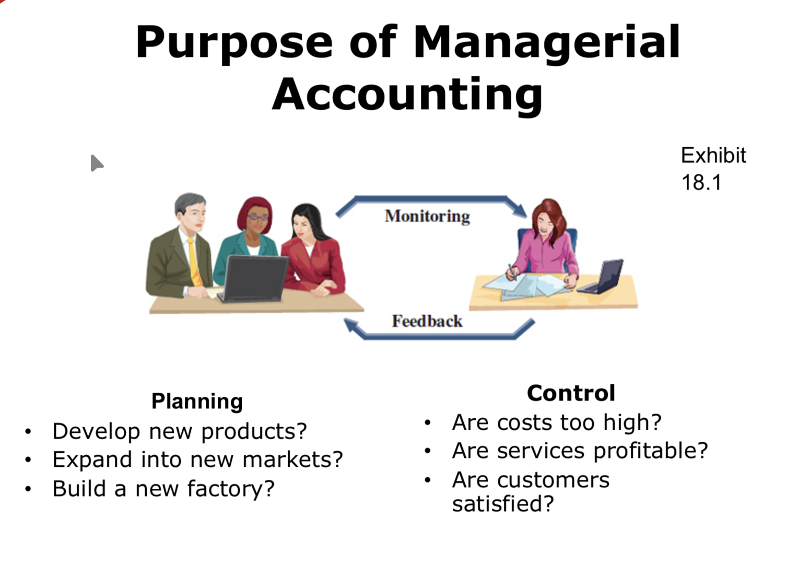
  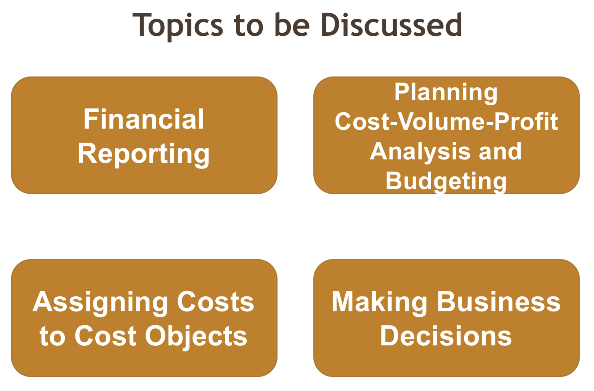

* **Accounting Management** sometimes called **Cost-Management**: this means that each report or topic will be related to cost of something.
  * Therefore, we divided the topics per topics, because each topic is related implication on a certain cost.
  * **Cost-Volume-Profit (Break-even-Analysis)**: Lec 6 & 7
  * **Assigning Cost**: Lec-7, this helps to decide the cost of the product and what are the profit per item and what could be the allowed maneuvers for offers and reductions.
  * **Making Business Decisions**: this provides the clear decision if we shall continue operating this business or not based on Accounting analysis. Or maybe ***make-or-buy*** decision, so shall we buy a certain thing or buy it?. Or maybe ***Resource assignation***, (ex: Uni-limited rooms across provided courses, so based on the most profitable course, decide the rooms assignation)
 
 #### Planning

* One of the famous Ex.: Budget 
  * Budget - موازنة :This reflect whatever related to the future actions and forecast for the upcoming time-window
    * Based on the Forecast-budget,we can create later another PnL (Profit & Lose) to see what shall happen if our forecasted-Budget occurs.
    * This is the last topic in the course and this enable us to know:<br>What are our selling planes?<br>What are our cost forecast?<br>Which Raw-material that we need?<br>Do we need to purchase something or just renting is enough?
  * Balance-Sheet  ميزانية: This is related to the already occurred events and document it. 

     
     
#### Controlling

* After creating our plan, then we definitely need to have a sort of controlling on it to ensure that it is proceeding on-track.
* There is an important meeting called ***“Forecast vs Actual”***
* So, in-case there is a variation between ***“Forecast vs Actual”***, then we need to define the root-case for this.
  * One of the reasons could be political situation (ex. Iran war), so it is hard to plan a cast due to unstable situation for everything.


## Planning

### Cost Classification for Financial Reporting

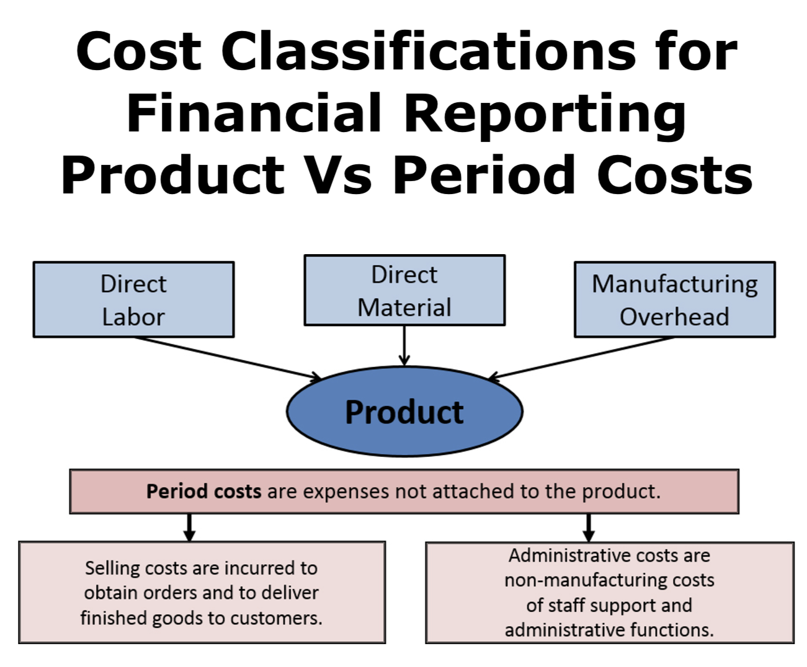
<br>

* Consider that Cost is kind of clothes and you need to cut in a way that provides you the full control over each part of the production process.
* Therefore, you can consider that ***”slogan”: Different Cost for different purposes***.
  * This is used to differentiate the costs based on ifferent topics bsed on functions that are part o the production process.
  * Ex: the uni want to introduce a new program, so what is the cost of this program and what shall be the price of it? Then it is easily to determine the cost of the service to know how to make profit and if it could introduce loss.
  * Let’s assume that we will make a *Pizzeria* to bake Pizza and sell it. So what are the costs in this project:
    * Ovens<br>Package<br>Labour<br>Place where we work<br>Delivery…etc.
    * Based on the pervious part, u can see that cost is split on 2 parts:<br>direct cost in productions<br>indirect cost for functions related to this project (ex. labour in some situation).
    * Also we need to split the costs into:<br>**Variable-Cost**:Costs which are variable on situation.<br>**Fixed-Cost**:Those are the costs that we will pay independent on orders.
      * Let’s Assume that we want just bake one Pizza now at our home, then we never think about the Home rent, Electricity, water, Oven Depreciation ...etc.
      * However, if we want to Cook Pizza to sell as a project, then definitely we will think about rent, electricity..etc.
      * Based on this, we need to think about each item in the process, so we calc the cost per activity and always ask yourself shall I do it or out-sourcing it?

    ### Make-or-Buy per Activity (Cost-Based Decision)

    ```mermaid
    flowchart TD
      A[Analyze Activity Cost] --> B1[Raw Material Handling]
      A --> B2[Packaging]
      A --> B3[Delivery]

      B1 --> C11[Do it In-house: 14 EGP/unit]
      B1 --> C12[Outsource: 18 EGP/unit]
      C11 --> D1[Decision: Do it In-house]
      C12 --> D1

      B2 --> C21[Do it In-house: 7 EGP/unit]
      B2 --> C22[Outsource: 5 EGP/unit]
      C21 --> D2[Decision: Outsource]
      C22 --> D2

      B3 --> C31[Do it In-house: 24 EGP/order]
      B3 --> C32[Outsource: 19 EGP/order]
      C31 --> D3[Decision: Outsource]
      C32 --> D3

      D1 --> E[Final Rule: Choose lower relevant cost per activity]
      D2 --> E
      D3 --> E
    ```

    * The numbers above are an example to explain the logic.
    * In real life, compare **relevant costs only** (avoidable costs), not sunk costs.


### Key Profitability Equations

$$
\boxed{\text{Gross Profit} = \text{Sales} - \text{COGS}}
$$

$$
\boxed{\text{Operating Profit (Income)} = \text{Gross Profit} - \text{SG\&A Expenses}}
$$

> **SG&A** = Selling, General & Administrative Expenses

#### What are the COGS ?

* **Direct-Material**

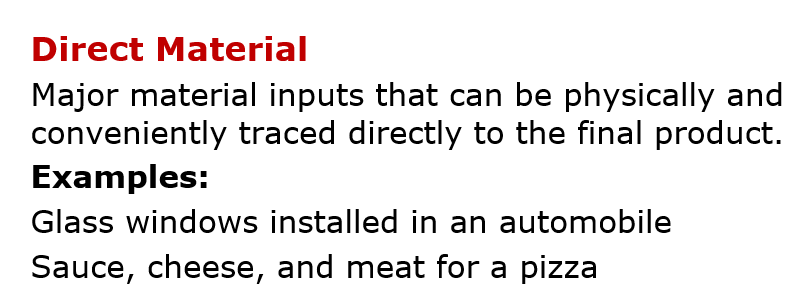

  * These are the raw-material that we can <span style="background-color:#36CB2F;">***easily & Economically***</span> tracing.
    * Ex.: it is easy to identify how much Flour - دقيق to bake one Pizza, then it is easy to identify.


* **Direct-Labor**

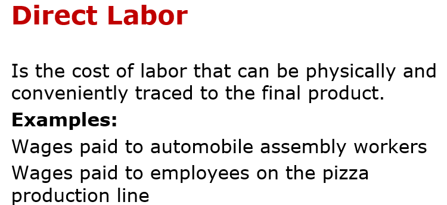

  * Those are the people who are directly involved in the Production process:
    * Ex: In Pizzeria: Baker, Delivery Guy, Cleaning-Guys. / The ***Instructor*** is the direct labor for Uni-Master program. 

* **Manufacturing Overhead**

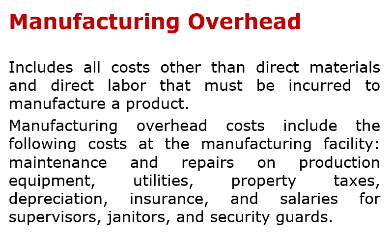

  * Those other indirect costs during the Manufacturing process, usually called ***Indirect-Manufacturing-Cost (IMC)***
  * These ***Indirect-Manufacturing-Cost*** (Manufacturing-Overhead) are the costs within the Manufacture itself not outside of it.
    * Ex: Electricity, Maintenance, Factory-HR, Factory-Accounting-domain, Rent, Cleaning, depreciation  ...etc. 
    * All of these activities are supporting all the manufacturing processes but we can't see them as part of a certain product-Manufacturing.
    * Consider that Raw-Material Transportation is <u>**NOT**</u> included in the **IMC**, because the transportation costs are already * * * * included in the Raw-Material Costs.

>[!IMPORTANT]
>$$\colorbox{lightblue}{$\text{Manufacturing Overhead} = \text{Production Cost} - (\text{Direct Material} + \text{Direct Labor})$}$$

* **Non-Manufacturing Costs (Period Cost)**

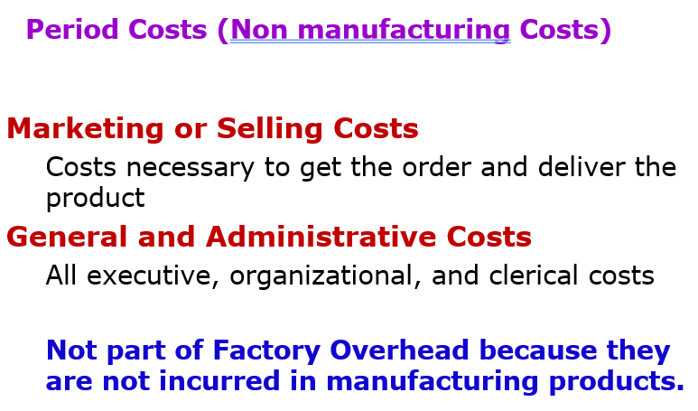

  * Those are the costs which we refered previously as the ***"Selling Costs"*** , so all the costs which are introduced after the production process is over.
    * Ex: Delivery Cost, Warehouse, Marketing, Promotions...etc.

| Product Cost (COG) | Period Cost |
| --- | --- |
| This is the cost that we spend in all activities to start and end the production process.<br>- Ex. If we spend 100K EGP to produce 10K Units, then we see that each Unit costs 10 EGP to be <u>***JUST***</u> produced<br>- Then we sold 2K units, then COGS = 20K EGP.<br>- Assume that we were not able to sell any unit, then COGS = 0, because <span style="background-color:#36CB2F;"> ***COGS = Cost of Goods <u>Sold</u>*** </span> and ***sells = 0***, all of these info won't be shown in the **income-statement**, however it be shown in the **Balance-Sheet**  | Those are the costs incurred after the production process is completed, related to selling and administrating the business within a certain period.<br>- Ex. If we produced 10K Units but spent 50K EGP on Marketing, Delivery, and Sales-HR salaries, these 50K EGP are <u>Period Costs</u><br>- Even if we sold 0 units, these 50K EGP still appear in the income-statement because <span style="background-color:#FFEB3B;"> Period Costs are tied to the Time-Period, NOT to units sold </span><br>- This is the key difference: Product Cost follows the product (appears only when sold), but Period Cost is expensed immediately in the period it occurs<br>- Ex: Marketing, Warehouse rent, Sales-HR salaries, Delivery, Admin costs...etc.|

  * The following graph shows how payments will be landed into the ***Income-Statement***

    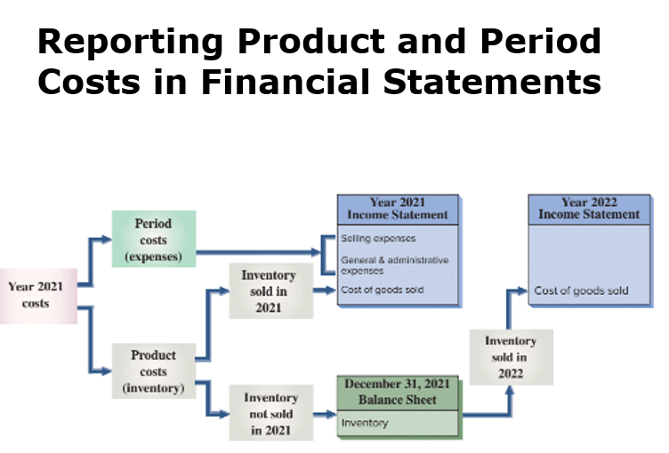


    * So <span style="background-color:#FFEB3B;"><u>**Period-Costs**</u></span> lands directly in the ***Income-Statement***, however <span style="background-color:#FFEB3B;"><u>**Product-Costs**</u></span> lands in ***Income-Statement*** only when Product is sold, else it is shown as <span style="background-color:#9B59B6 ;"><u>**Inventory**</u></span> in the ***Balance-Sheet***
---

### 🏭 Example: Chair Factory — Product Cost vs. Period Cost in Action

> A factory produces **Chairs**. The agreement is to produce **10,000 units/month** at a total production cost of **100,000 EGP**
> — meaning each unit costs **10 EGP** to produce.
>
> Each chair is sold at **25 EGP/unit**.
>
> The factory also has **Period Costs** (showroom rent, salaries, delivery, admin...etc.) = **50,000 EGP/month**
> — these are paid **regardless** of how many units are sold.


```mermaid
block-beta
  columns 3
  block:SETUP:3
    S1["🏭 Monthly Production: 10K Units"] 
    S2["💰 Production Cost: 100K EGP (10 EGP/unit)"]
    S3["🏷️ Sell Price: 25 EGP/unit"]
    S4["📋 Period Cost: 50K EGP/month"]
  end
```

---

#### 📅 January — Sold 7,000 out of 10,000 Units

#### 📅 February — No Production, Sold 3,000 Units from Inventory

#### 📅 March — Produced 10,000 Units, Sold Nothing

| Item | 📅 January | 📅 February | 📅 March |
|:-----|:-----------|:-----------|:---------|
| **Production** | 10,000 units (100K EGP) | ❌ No production (stock available) | 10,000 units (100K EGP) |
| **Sold Units** | 7,000 | 3,000 (from inventory) | 0 |
| **Sales** | 7,000 × 25 = **175,000** | 3,000 × 25 = **75,000** | 0 × 25 = **0** |
| **COGS** | 7,000 × 10 = **70,000** | 3,000 × 10 = **30,000** | 0 × 10 = **0** |
| **Gross Profit** | 175K − 70K = **105,000** | 75K − 30K = **45,000** | 0 − 0 = **0** |
| **Period Cost** | **50,000** | **50,000** | **50,000** |
| **Operating Profit** | <span style="background-color:#36CB2F;">**55,000 ✅**</span> | <span style="background-color:#FF6B6B;">**−5,000 ❌**</span> | <span style="background-color:#FF6B6B;">**−50,000 ❌**</span> |
| **Inventory** | 3K units → **30,000** (Balance Sheet) | **0** | 10K units → **100,000** (Balance Sheet) |

> *(All amounts in EGP)*

> ⚠️ **Wait — something feels illogical here!**
> - In **January**, the actual production cost was **100,000 EGP**, but the Income Statement only shows **70,000** as COGS.
> - In **February**, we paid **zero** for production, yet the Income Statement shows **30,000** as COGS!
> - In **March**, we spent **100,000 EGP** on production, but **0** appears as COGS — it all sits in Inventory!
> - Result: **Profit in Jan**, **Loss in Feb & Mar** — even though the real spending tells a different story.
>
> <span style="background-color:#FFEB3B;"> ***➡️ This puzzle will be explained in the next part of the lecture!*** </span>

---

#### 📊 3-Month Summary

**Chart 1 — Revenue vs. Costs:** Notice how <span style="background-color:#FFEB3B;">**Period Cost stays the same every month (50K)**</span> regardless of sales, while COGS only appears when we actually sell.

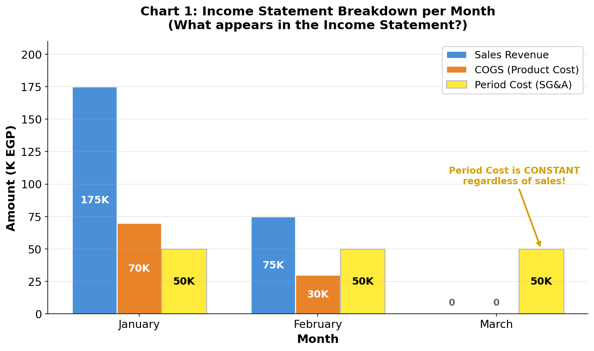

**Chart 2 — Profit Trend:** The Gross Profit (green bar) shrinks as sales drop, but the Period Cost dashed line stays flat — so whenever the bar falls **below** the dashed line, we have a **loss**.

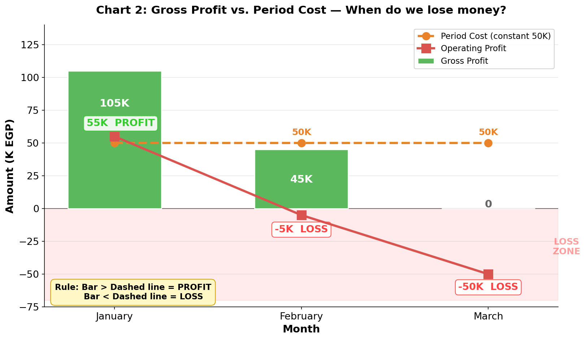

> 🔑 **Key Takeaway:**
> - <span style="background-color:#36CB2F;">**Product Cost (COGS)**</span> only hits the Income Statement **when the product is sold** — otherwise it stays as **Inventory** on the **Balance Sheet**.
> - <span style="background-color:#FFEB3B;">**Period Cost**</span> hits the Income Statement **every single month**, no matter what — sold or not sold, produced or not produced. Simply it is already paid and you can't save it by any-mean.
> - This mismatch between **when we spend money** and **when it appears in the Income Statement** is exactly what makes cost accounting tricky — and is what we'll dive into next! 🚀

### Exercise-1: 

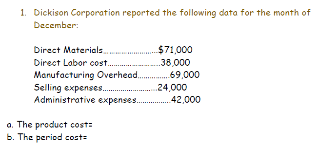

$$
\boxed{\text{Production Costs} = \underbrace{\text{DM}}_{71K} + \underbrace{\text{DL}}_{38K} + \underbrace{\text{MO}}_{69K} = \textbf{178K EGP}}
$$

$$
\boxed{\text{Period Costs} = \underbrace{\text{Selling Exp.}}_{24K} + \underbrace{\text{Admin Exp.}}_{42K} = \textbf{66K EGP}}

$$ 

### Exercise-2: 

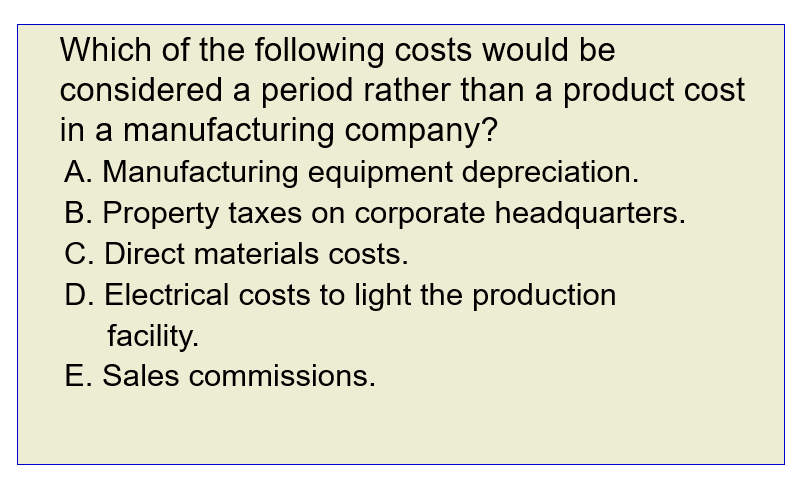

* Selling-Expense and Admin-expenses usually called <span style="background-color:#FFEB3B;"> White-collar</span>, those people are who are not part of any production processes.
* When you hear <span style="background-color:#FF6B6B;"><u>**Period**</u></span> and you don't understand it, then replace it with <span style="background-color:#36CB2F;"><u>**Non-Manufacturing**</u></span>
* Period-Cost = Property-Taxes & Sales-Commissions


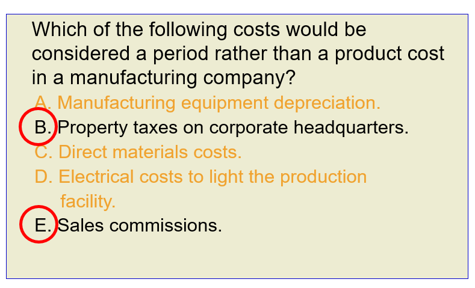

### Exercise-3: 

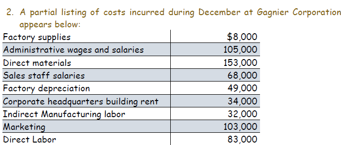

| Cost Item | Cost Type | Amount |
|:----------|:----------|-------:|
| <span style="background-color:#36CB2F;">Factory supplies</span> | <span style="background-color:#36CB2F;">Production-Cost</span> | <span style="background-color:#36CB2F;">$8,000</span> |
| <span style="background-color:#FFEB3B;">Administrative wages and salaries</span> | <span style="background-color:#FFEB3B;">Period-Cost</span> | <span style="background-color:#FFEB3B;">$105,000</span> |
| <span style="background-color:#36CB2F;">Direct materials</span> | <span style="background-color:#36CB2F;">Production-Cost</span> | <span style="background-color:#36CB2F;">$153,000</span> |
| <span style="background-color:#FFEB3B;">Sales staff salaries</span> | <span style="background-color:#FFEB3B;">Period-Cost</span> | <span style="background-color:#FFEB3B;">$68,000</span> |
| <span style="background-color:#36CB2F;">Factory depreciation</span> | <span style="background-color:#36CB2F;">Production-Cost</span> | <span style="background-color:#36CB2F;">$49,000</span> |
| <span style="background-color:#FFEB3B;">Corporate headquarters building rent</span> | <span style="background-color:#FFEB3B;">Period-Cost</span> | <span style="background-color:#FFEB3B;">$34,000</span> |
| <span style="background-color:#36CB2F;">Indirect Manufacturing labor</span> | <span style="background-color:#36CB2F;">Production-Cost</span> | <span style="background-color:#36CB2F;">$32,000</span> |
| <span style="background-color:#FFEB3B;">Marketing</span> | <span style="background-color:#FFEB3B;">Period-Cost</span> | <span style="background-color:#FFEB3B;">$103,000</span> |
| <span style="background-color:#36CB2F;">Direct Labor</span> | <span style="background-color:#36CB2F;">Production-Cost</span> | <span style="background-color:#36CB2F;">$83,000</span> |

* Total Period (Non-Manufacturing) Cost = 310k 
* Indirect-Manufacturing Overhead = 89K (from <span style="background-color:#36CB2F;">**Green**</span> color remove all Direct-Labor and Direct-Material 😉)
  * Usually the Direct-Related (Material + Labor) is easily accepted by Customer, however those which are not ***Indirect*** are not accepted by Customer 😂

>[!IMPORTANT]
>$$\colorbox{lightblue}{$\text{Manufacturing Overhead} = \text{Production Cost} - (\text{Direct Material} + \text{Direct Labor})$}$$

* Product-Cost (Manufacturing Cost) = 325K ➡️ All which are colored in <span style="background-color:#36CB2F;">**Green**</span>
  * <span style="background-color:#9B59B6;">In <u>***Labor***</u> whatever <u>*Direct*</u> or <u>*Indirect*</u> is part of the **Product-Cost**.</span>, Labor is manufacture related word.


### Exercise-4: 

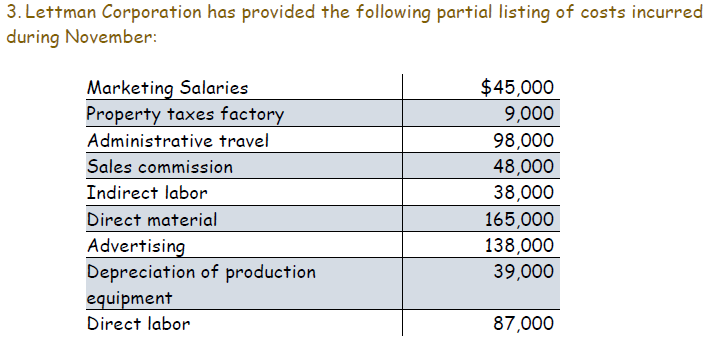


| Cost Item | Cost Type | Amount |
|:----------|:----------|-------:|
| <span style="background-color:#FFEB3B;">Marketing Salaries</span> | <span style="background-color:#FFEB3B;">Period-Cost</span> | <span style="background-color:#FFEB3B;">$45,000</span> |
| <span style="background-color:#36CB2F;">Property taxes factory</span> | <span style="background-color:#36CB2F;">Production-Cost</span> | <span style="background-color:#36CB2F;">$9,000</span> |
| <span style="background-color:#FFEB3B;">Administrative travel</span> | <span style="background-color:#FFEB3B;">Period-Cost</span> | <span style="background-color:#FFEB3B;">$98,000</span> |
| <span style="background-color:#FFEB3B;">Sales commission</span> | <span style="background-color:#FFEB3B;">Period-Cost</span> | <span style="background-color:#FFEB3B;">$48,000</span> |
| <span style="background-color:#36CB2F;">Indirect labor</span> | <span style="background-color:#36CB2F;">Production-Cost</span> | <span style="background-color:#36CB2F;">$38,000</span> |
| <span style="background-color:#36CB2F;">Direct material</span> | <span style="background-color:#36CB2F;">Production-Cost</span> | <span style="background-color:#36CB2F;">$165,000</span> |
| <span style="background-color:#FFEB3B;">Advertising</span> | <span style="background-color:#FFEB3B;">Period-Cost</span> | <span style="background-color:#FFEB3B;">$138,000</span> |
| <span style="background-color:#36CB2F;">Depreciation of production equipment</span> | <span style="background-color:#36CB2F;">Production-Cost</span> | <span style="background-color:#36CB2F;">$39,000</span> |
| <span style="background-color:#36CB2F;">Direct labor</span> | <span style="background-color:#36CB2F;">Production-Cost</span> | <span style="background-color:#36CB2F;">$87,000</span> |


$$
\boxed{\text{Product Cost} = \underbrace{\text{DM}}_{165K} + \underbrace{\text{DL}}_{87K} + \underbrace{\text{MO}}_{\underset{(9K + 38K + 39K)}{86K}} = \textbf{\$338K}}
$$

$$
\boxed{\text{Period Cost} = \underbrace{\text{Marketing Sal.}}_{45K} + \underbrace{\text{Admin Travel}}_{98K} + \underbrace{\text{Sales Comm.}}_{48K} + \underbrace{\text{Advertising}}_{138K} = \textbf{\$329K}}
$$

$$
\colorbox{lightblue}{$\text{Manufacturing Overhead} = 338K - (165K + 87K) = \textbf{86K}$}
$$

<div style="page-break-after: always;"></div>

### Cost Classification for Predicting <u>**Cost-Behavior**</u>

#### Variable-Cost

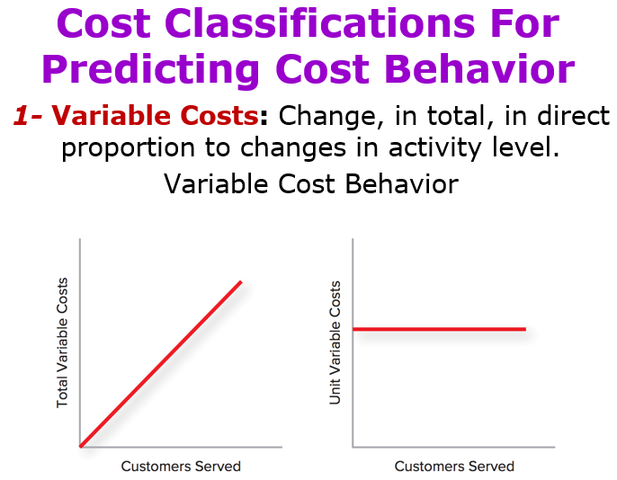

* Why we needs to classify the costs based on its behavior and we aren't satisfied by the Income-Statement?
  * Because, Income-Statement is giving Number based on sales operations and period-costs only which are accepted and important for Outsiders and Tax-office. 
  * However, Maintaining the business running in case of not selling process, then you need to have more detailed view: ex. you need to know what is the min-amount of cash you need to maintain in order to keep the factory still opened.
* Variable-Cost: to decide that this is a variable cost, then it is variable w.r.t. ***Cost-Driver***
  * So In case of production, then the **Production** is Cost-Driver, and the more Production, the more Cost.
  * Ex. the ***Direct-Material*** is clear example of the <u>***Var-Cost***</u>, which increases whenever you increase production.
  * And it is clear that it is variable based on the Driver-Activity (Production).
  * The main Pros of Var-Cost: It is more flexible.
    * 🎓 **Uni Example (Contract-based = Variable Cost):**
      * Uni decided not to hire any Prof, instead ***contract them by hour*** ➡️ Prof money is fully covered by course fees (pay only when courses run).
      * This is ideal when the Uni has **few programs/courses** — zero risk, zero idle salary.
      * However, as programs grow, the Prof takes a larger share of the revenue ➡️ the Uni-Owner's profit shrinks.
      * Risk: Profs may become unavailable or demand double the price when demand is high.
      * Then, there is a **point-2-Decide**: Hire or Contract!


#### Fixed-Cost

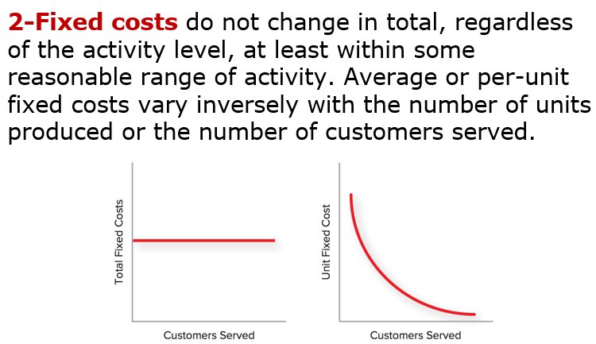

* Fixed cost are the cost which shall be paid whatever we produce or not.
  * Ex: Rent, Part-of-Electricity (ex. Lights), Labor-Salaries.
* So, this is paid in periodic manner (ex. Monthly).
* This is the first item whenever you are ***forecasting your Budget*** 😉.
* Any Payment <u>***regardless***</u> of the Activity-Driver is ***Fixed-Cost***, but consider that it is fixed within a **Range** 😉
  * So, the Labor is working up to 10 hr/day, in case you need to produce more, then either we give him overtime or hire a new one.
* Fixed-Cost Pros: it secures the min-requirement (Capacity) for your business to continue running with min-cost.
    * 🎓 **Uni Example (Hire = Fixed Cost):**
      * Prof is hired with a fixed salary — this salary is covered by **2 courses** (break-even).
      * If the Prof teaches **5 courses**, the remaining **3 courses' revenue is pure profit** to the Uni-Owner.
      * The more courses assigned → the more profit, because the salary stays the same!
* Now, you can understand that the more production of units, less **Fixed-Cost** per unit.
  * So, when you want to make more <span style="background-color:#36CB2F;"><u>**profit**</u></span> in case of **high Production-volume**, then you will make profit from <span style="background-color:#36CB2F;"><u>**Fixed-Cost**</u></span> 😉

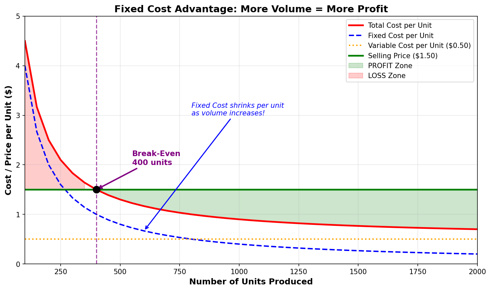

---

> 🔑 **Uni Example — Variable vs. Fixed Cost Comparison (Hire or Contract?)**

| Aspect | <span style="background-color:#FFEB3B;">Contract (Variable Cost)</span> | <span style="background-color:#36CB2F;">Hire (Fixed Cost)</span> |
|:-------|:-----------|:---------|
| **Payment** | Per hour / per course | Fixed monthly salary |
| **Risk when few courses** | ✅ Low — pay only what you use | ❌ High — salary paid even if idle |
| **Risk when many courses** | ❌ High — cost grows linearly | ✅ Low — salary stays flat |
| **Availability** | ❌ Prof may not be available | ✅ Guaranteed capacity |
| **Break-even point** | N/A | ~2 courses cover salary |
| **Profit beyond break-even** | Shared with Prof | 100% to Uni-Owner |
| **Best for** | Small/startup programs | Established programs with many courses |

<div style="page-break-after: always;"></div>

##### <u>Variable vs Fixed Cost</u>


>[!IMPORTANT] COGS vs Total Variable Cost — Don't Mix Them!
>$$\colorbox{lightblue}{$\text{COGS} = \text{All Manufacturing Costs (Variable + Fixed)}$}$$
>$$\colorbox{lightyellow}{$\text{Total Variable Cost} = \text{All Variable Costs (Manufacturing + Non-Manufacturing)}$}$$
>
> **COGS** includes everything inside the factory: Variable MO + DL + DM + **Fixed MO** (rent, depreciation...)
> **Total Variable Cost** includes all variable costs from **everywhere**: factory + marketing + selling...
>
> That's why in Ex-4:
> - COGS = (30 + 10 + 40) × 1K + **15K fixed MO** = **$95K** ← includes fixed MO!
> - Total Var. Cost = (5 + 30 + 10 + 40) × 1K = **$85K** ← excludes fixed MO, includes var. marketing!


##### Contribution Margin

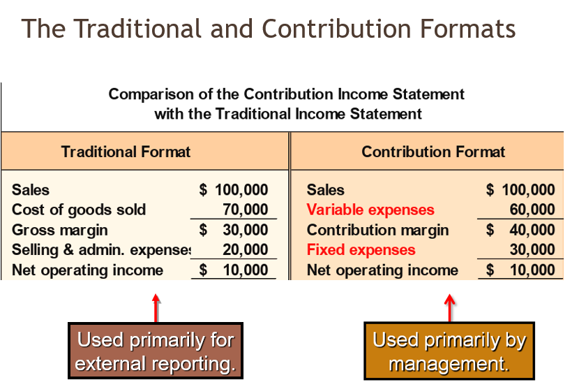

* The Old Income-statement is not useful for the internals (specially Managements).
* **Old-Income-Statement** (Outsider Income-Statement)
  * Calculations is based on Manufacturing-Related and non-Manufacturing-Related.
* **New-Income-Statement** (Internal Income-Statement)
  * Calculation is based on Variable & Fixed Costs.
* Why Management are interested in New-Income-Statement ? ➡️ Considering that Profit calculation output is the same in BOTH! 
  * Initially, Profit calculation is not the same in both cases! ➡️ Profit will be the same in case you sale all the production that you make! 
  * However, the new Income-Statement gives you more insides and view about the fixed-cost that you need to pay even if you are not producing anything (keep Business running ex. Rent, Salaries...etc.).
  * So the Fixed-Cost is the nighmare for any business-owner, he works all the month to cover this.
* Why it is called <span style="background-color:#36CB2F;"><u>***Contribution-Margin***</u></span>?
  * Because, it tells you how much the sales is <span style="background-color:#36CB2F;"><u>***Contributing***</u></span> in covering the **Fixed-Costs**.
  * This implicitly means that the Main/Initial goal of sales is not profit, however to cover the **Fixed-Cost**.
  * So, every Business owner has initial goal where all his fixed-cost is covered and this is called <span style="background-color:#36CB2F;"><u>***Break-even***</u></span>, so neither loss nor gain (ex. selling first 250 Ice-Cream is the break-even, after break-even, starts to profit).
  * To calculate the <span style="background-color:#36CB2F;"><u>***Break-even***</u></span>
    * Contribution-Margin / Fixed-Cost 
    * So, Clients is a contribution-margin for me.
  * In some cases, you can **reverse-engineer the price** using the Contribution Margin. Instead of asking *"how many units to break even?"*, you ask: *"Given my expected volume, what price should I charge to cover all costs?"*
    * This is common in **service businesses** (e.g. medical clinics, consulting) where the volume (number of patients/clients) is roughly known.

  > 🏥 **Example — Pricing a Dental Clinic:**
  > - A dentist opens a clinic with **Fixed Costs = 20,000 EGP/month** (rent, equipment, nurse salary).
  > - **Variable Cost per patient** (materials, disposables) = **50 EGP**
  > - She estimates she can serve **200 patients/month** on average.
  > - To break even: Total Revenue must cover Fixed + Variable → Price × 200 = 20,000 + (50 × 200)
  > - Price × 200 = 20,000 + 10,000 = **30,000** → **Min. Price = 150 EGP/patient**
  > - At 150 EGP she breaks even. If she charges **200 EGP**, her CM = 200 − 50 = **150 EGP/patient**, and her monthly profit = (150 × 200) − 20,000 = **10,000 EGP** 🎉
  > - So the Contribution Margin helps her decide: *"What is the minimum price that keeps my business alive, and what price gives me the profit I want?"*

  > 🧊 **Example — Water Bottles at Uni:**
  > - I sell water bottles at Uni for **10 EGP** each, but I buy each for **8 EGP** → my **Contribution Margin = 2 EGP/bottle**
  > - The Uni charges me **100 EGP/month** rent (Fixed Cost) for the selling spot.
  > - Break-even = Fixed Cost ÷ CM per unit = 100 ÷ 2 = **50 bottles**
  > - So I must sell **50 bottles just to cover the rent** (no profit, no loss).
  > - Starting from bottle **#51**, every 2 EGP is **pure profit** 🎉
  > - **Conclusion:** Each client/bottle is my Contribution Margin — they ***contribute*** toward covering my fixed cost first, then toward my profit.
  >
  > ---
  > 🧊 **مثال — بيع مياه في الجامعة:**
  > - ببيع الازازة بـ 10 جنيه وشاريها بـ 8 جنيه → يعني بكسب **2 جنيه** من كل ازازة (ده الـ Contribution Margin)
  > - الجامعة بتأجرلي المكان بـ **100 جنيه/شهر** (ده الـ Fixed Cost)
  > - يبقى لازم أبيع 100 ÷ 2 = **50 ازازة** عشان أغطي الإيجار بس (Break-even)
  > - من الازازة رقم **51** وبعدها، كل 2 جنيه بتبقى **ربح صافي** 🎉
  > - يعني كل عميل/ازازة هو اللي بيساهم (Contributing) في تغطية التكلفة الثابتة الأول، وبعدها في الربح.

>[!IMPORTANT] Contribution Margin
>$$\colorbox{lightblue}{$\text{Contribution Margin} = \text{Sales} - \text{Total Variable Cost}$}$$
>
> It tells you how much revenue is left **after covering all variable costs** to contribute toward paying **Fixed Costs** and generating **Profit**.
> - يعني بعد ما تشيل كل التكاليف اللي بتتغير (زي خامات و عمالة مباشرة)، الفلوس اللي فاضلة دي هي اللي هتدفع منها الإيجار والمرتبات الثابتة، واللي يفضل بعد كده يبقى ده الربح بتاعك 😉
> - If CM > Fixed Costs → <span style="background-color:#36CB2F;">**Profit**</span>
> - If CM = Fixed Costs → **Break-Even**
> - If CM < Fixed Costs → <span style="background-color:#FF6B6B;">**Loss**</span>

---

<div style="page-break-after: always;"></div>

#### Ex-3:

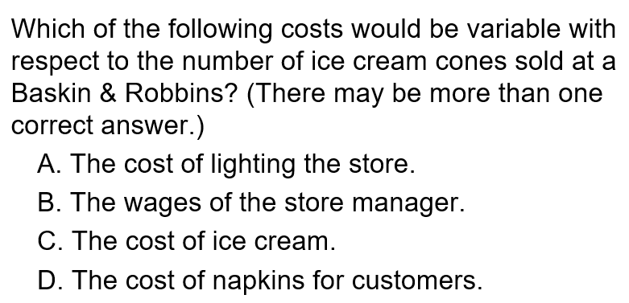

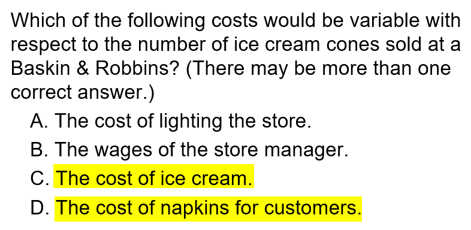

---

<div style="page-break-after: always;"></div>

#### Ex-4:

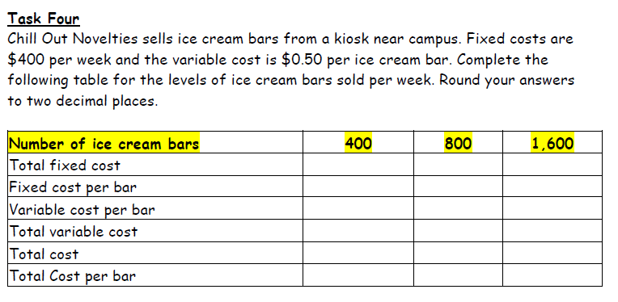

| | 400 | 800 | 1,600 |
|:--|------:|------:|------:|
| **Total fixed cost** | 400|400 |400 |
| **Fixed cost per bar** | 1| 0.5|0.25 |
| **Variable cost per bar** | 0.5 | 0.5 | 0.5|
| **Total variable cost** |200 |400 |800 |
| **Total cost** | 600|800 |1200 |
| **Total cost per bar** | 1.5 | 1| 0.75|

* The following graph shows how the profit is gained from the **Fixed-cost**


---
<div style="page-break-after: always;"></div>

#### Ex-5:

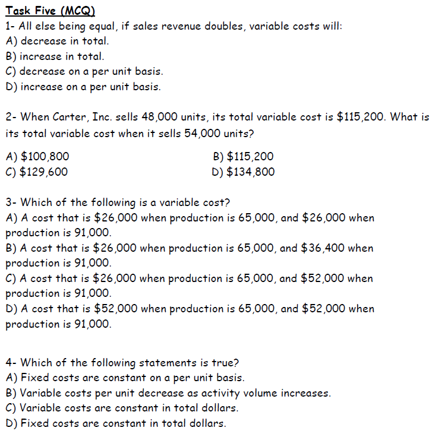

1- B
2- C
3- B
4- D

---
<div style="page-break-after: always;"></div>

#### Ex-6:

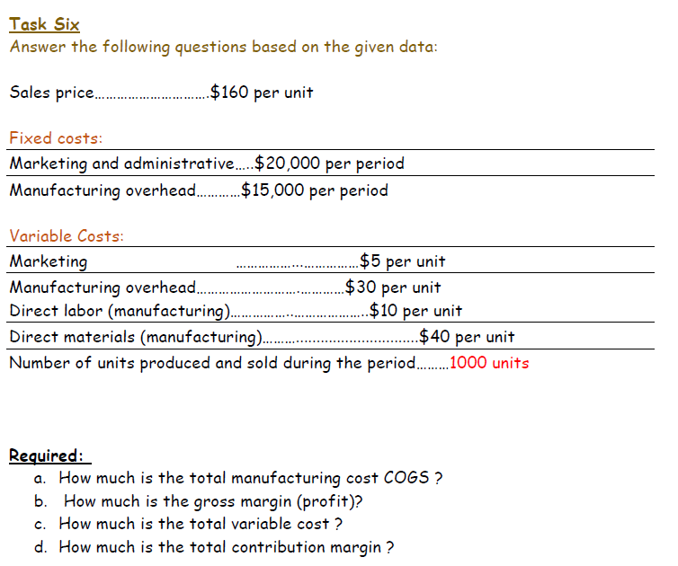

**a.** 
$$
\boxed{\text{COGS} = \underbrace{(\text{MO} + \text{DL} + \text{DM})}_{\text{Var. Manufacturing}} \times 1{,}000 + \underbrace{\text{MO}_{\text{Fixed}}}_{15K} = (30 + 10 + 40) \times 1{,}000 + 15K = \textbf{\$95,000}}
$$

**b.1**
$$
\boxed{\text{Gross Profit} = \text{Sales} - \text{COGS} = (1{,}000 \times 160) - 95K = 160K - 95K = \textbf{\$65,000}}
$$

**b.2**
$$
\boxed{\text{Operation-Profit} = \text{Gross Profit} - \text{Marketting and Admin} = 65{,}000 - 20{,}000 = \textbf{\$45,000}}
$$

**c.**
$$
\boxed{\text{Total Var. Cost} = \underbrace{(\text{Mktg} + \text{MO} + \text{DL} + \text{DM})}_{\text{All Variable}} \times 1{,}000 = (5 + 30 + 10 + 40) \times 1{,}000 = \textbf{\$85,000}}
$$

**d.**
$$
\boxed{\text{Contribution Margin} = \text{Sales} - \text{Total Var. Cost} = 160K - 85K = \textbf{\$75,000}}
$$ 

---
<div style="page-break-after: always;"></div>

#### Ex-7:

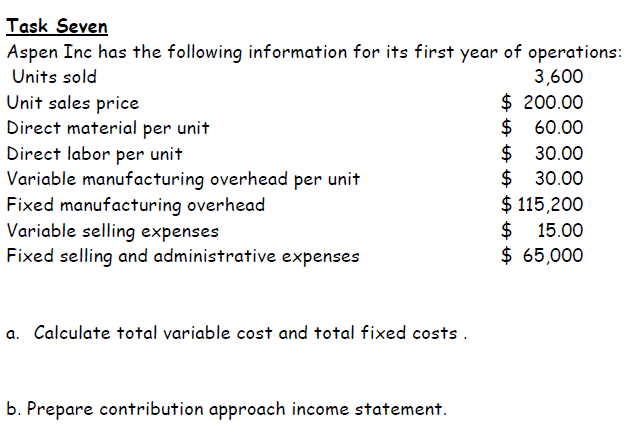


**a.**
$$
\boxed{\text{Total Var. Cost} = \underbrace{(\text{DM} + \text{DL} + \text{VMO} + \text{VSE})}_{\text{All Variable per unit}} \times 3{,}600 = (60 + 30 + 30 + 15) \times 3{,}600 = \textbf{\$486,000}}
$$

$$
\boxed{\text{Total Fixed Cost} = \underbrace{\text{Fixed MO}}_{115{,}200} + \underbrace{\text{Fixed S\&A}}_{65{,}000} = \textbf{\$180,200}}
$$

**b. Contribution Approach Income Statement:**

| Item | Amount |
|:-----|-------:|
| **Sales** | 3,600 × 200 = **$720,000** |
| Less: **Total Variable Cost** | **(486,000)** |
| **Contribution Margin** | **$234,000** |
| Less: **Fixed Costs** | **(180,200)** |
| <span style="background-color:#36CB2F;">**Net Operating Income**</span> | <span style="background-color:#36CB2F;">**$53,800**</span> |

---
<div style="page-break-after: always;"></div>

#### Ex-8:


* Givens: 

|items | Value |
| --- | --- |
| Sales unit (May) | 7,400| 
|Unit-Price | 677 |
| COGS (All Var-Cost) per unit | 441|
| Var-selling-Exp (Per Unit) | 54 | 
| Total Fixed-Selling Exp | 155,600 | 
| Var-Admin-Exp (per unit) | 24 | 
| Total Fixed-Admin-Exp | 370,400 | 

**a. Contribution Format Income Statement** 

$$
\boxed{\text{Total Var. Cost} = \underbrace{(\text{COGS} + \text{VSE} + \text{VAE})}_{\text{All Variable per unit}} \times 7{,}400 = (441 + 54 + 24) \times 7{,}400 = \textbf{\$3,840,600}}
$$

$$
\boxed{\text{Total Fixed Cost} = \underbrace{\text{Fixed Selling}}_{155{,}600} + \underbrace{\text{Fixed Admin}}_{370{,}400} = \textbf{\$526,000}}
$$

| Item | Amount |
|:-----|-------:|
| **Sales** | 7,400 × 677 = **$5,009,800** |
| Less: **Total Variable Cost** | **(3,840,600)** |
| **Contribution Margin** | **$1,169,200** |
| Less: **Fixed Costs** | **(526,000)** |
| <span style="background-color:#36CB2F;">**Net Operating Income**</span> | <span style="background-color:#36CB2F;">**$643,200**</span> |


**b. Traditional Income Statement** 

>[!IMPORTANT] Merchandising Company → COGS = purchase cost only!
> This is a **merchandising** company (buys & resells, no factory). COGS = **$441/unit** (all variable, as stated).
> Do NOT mix selling expenses into COGS — selling & admin are **Operating Expenses** below the Gross Profit line.

$$
\boxed{\text{COGS} = 441 \times 7{,}400 = \textbf{\$3,263,400}}
$$

$$
\boxed{\text{Selling Exp.} = \underbrace{(54 \times 7{,}400)}_{\text{Variable}} + \underbrace{155{,}600}_{\text{Fixed}} = 399{,}600 + 155{,}600 = \textbf{\$555,200}}
$$

$$
\boxed{\text{Admin Exp.} = \underbrace{(24 \times 7{,}400)}_{\text{Variable}} + \underbrace{370{,}400}_{\text{Fixed}} = 177{,}600 + 370{,}400 = \textbf{\$548,000}}
$$

| Item | Amount |
|:-----|-------:|
| **Sales** | **$5,009,800** |
| Less: **COGS** | **(3,263,400)** |
| **Gross Profit** | **$1,746,400** |
| Less: **Selling Expenses** | **(555,200)** |
| Less: **Admin Expenses** | **(548,000)** |
| <span style="background-color:#36CB2F;">**Net Operating Income**</span> | <span style="background-color:#36CB2F;">**$643,200**</span> |

---
<div style="page-break-after: always;"></div>

#### Ex-9:

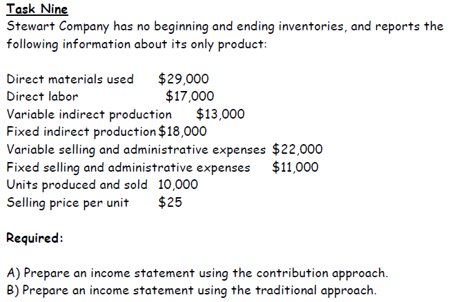

**a. Contribution Format Income Statement** 

$$
\boxed{\text{Total Var. Cost} = \underbrace{\text{DM}}_{29K} + \underbrace{\text{DL}}_{17K} + \underbrace{\text{VIP}}_{13K} + \underbrace{\text{VS\&A}}_{22K} = \textbf{\$81,000}}
$$

$$
\boxed{\text{Total Fixed Cost} = \underbrace{\text{Fixed Indirect Prod.}}_{18K} + \underbrace{\text{Fixed S\&A}}_{11K} = \textbf{\$29,000}}
$$

| Item | Amount |
|:-----|-------:|
| **Sales** | 10,000 × 25 = **$250,000** |
| Less: **Total Variable Cost** | **(81,000)** |
| **Contribution Margin** | **$169,000** |
| Less: **Fixed Costs** | **(29,000)** |
| <span style="background-color:#36CB2F;">**Net Operating Income**</span> | <span style="background-color:#36CB2F;">**$140,000**</span> |


**b. Traditional Income Statement** 

$$
\boxed{\text{COGS} = \underbrace{\text{DM}}_{29K} + \underbrace{\text{DL}}_{17K} + \underbrace{\text{VIP}}_{13K} + \underbrace{\text{FIP}}_{18K} = \textbf{\$77,000}}
$$

$$
\boxed{\text{S\&A Expenses} = \underbrace{\text{Variable S\&A}}_{22K} + \underbrace{\text{Fixed S\&A}}_{11K} = \textbf{\$33,000}}
$$

| Item | Amount |
|:-----|-------:|
| **Sales** | **$250,000** |
| Less: **COGS** | **(77,000)** |
| **Gross Profit** | **$173,000** |
| Less: **S&A Expenses** | **(33,000)** |
| <span style="background-color:#36CB2F;">**Net Operating Income**</span> | <span style="background-color:#36CB2F;">**$140,000**</span> |

---
<div style="page-break-after: always;"></div>

#### Ex-10:

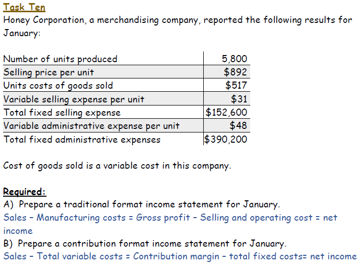

**a. Traditional Income Statement** 

$$
\boxed{\text{COGS} = 517 \times 5{,}800 = \textbf{\$2,998,600}}
$$

$$
\boxed{\text{Selling Exp.} = \underbrace{(31 \times 5{,}800)}_{\text{Variable} = 179{,}800} + \underbrace{152{,}600}_{\text{Fixed}} = \textbf{\$332,400}}
$$

$$
\boxed{\text{Admin Exp.} = \underbrace{(48 \times 5{,}800)}_{\text{Variable} = 278{,}400} + \underbrace{390{,}200}_{\text{Fixed}} = \textbf{\$668,600}}
$$

| Item | Amount |
|:-----|-------:|
| **Sales** | 5,800 × 892 = **$5,173,600** |
| Less: **COGS** | **(2,998,600)** |
| **Gross Profit** | **$2,175,000** |
| Less: **Selling Expenses** | **(332,400)** |
| Less: **Admin Expenses** | **(668,600)** |
| <span style="background-color:#36CB2F;">**Net Operating Income**</span> | <span style="background-color:#36CB2F;">**$1,174,000**</span> |


**b. Contribution Format Income Statement** 

$$
\boxed{\text{Total Var. Cost} = \underbrace{(\text{COGS} + \text{VSE} + \text{VAE})}_{\text{All Variable per unit}} \times 5{,}800 = (517 + 31 + 48) \times 5{,}800 = 596 \times 5{,}800 = \textbf{\$3,456,800}}
$$

$$
\boxed{\text{Total Fixed Cost} = \underbrace{\text{Fixed Selling}}_{152{,}600} + \underbrace{\text{Fixed Admin}}_{390{,}200} = \textbf{\$542,800}}
$$

| Item | Amount |
|:-----|-------:|
| **Sales** | **$5,173,600** |
| Less: **Total Variable Cost** | **(3,456,800)** |
| **Contribution Margin** | **$1,716,800** |
| Less: **Fixed Costs** | **(542,800)** |
| <span style="background-color:#36CB2F;">**Net Operating Income**</span> | <span style="background-color:#36CB2F;">**$1,174,000**</span> |

---
<div style="page-break-after: always;"></div>

### 📋 Lec-6 Quiz Summary — All Rules & Formulas

---

#### 1. Cost Classification — Product vs Period

| | **Product Cost (Manufacturing)** | **Period Cost (Non-Manufacturing)** |
|:---|:---|:---|
| **Includes** | DM + DL + MOH | Selling + Admin expenses |
| **Appears in Income Stmt** | Only when product is **SOLD** (as COGS) | **Immediately** in the period incurred |
| **If unsold** | Sits as **Inventory** on Balance Sheet | Still expensed — cannot be deferred |
| **Keyword clues** | Factory, production, manufacturing | Marketing, admin, delivery, sales commission |

---

#### 2. Components of Product Cost

$$\colorbox{lightblue}{$\text{Product Cost} = \text{Direct Materials} + \text{Direct Labor} + \text{Manufacturing Overhead}$}$$

$$\colorbox{lightblue}{$\text{Manufacturing Overhead} = \text{Product Cost} - (\text{DM} + \text{DL})$}$$

| Component | Traceable? | Examples |
|:---|:---:|:---|
| **Direct Materials** | ✅ | Wood, flour, steel — physically in the product |
| **Direct Labor** | ✅ | Worker wages on the production line |
| **Manufacturing OH** | ❌ | Factory rent, utilities, depreciation, indirect labor |

---

#### 3. Variable vs Fixed Costs

| | **Variable Cost** | **Fixed Cost** |
|:---|:---|:---|
| **Behavior** | Changes with activity level | Stays constant regardless of activity |
| **Per unit** | Constant per unit | Decreases per unit as volume rises |
| **Total** | Increases with volume | Stays the same |
| **Examples** | DM, DL, sales commissions | Rent, salary, depreciation, insurance |

---

#### 4. COGS vs Total Variable Cost (DON'T MIX!)

$$\colorbox{lightblue}{$\text{COGS} = \text{All Manufacturing Costs (Variable Mfg + Fixed Mfg)}$}$$

$$\colorbox{lightyellow}{$\text{Total Variable Cost} = \text{All Variable Costs (Mfg + Non-Mfg)}$}$$

> COGS includes Fixed MOH. Total Variable Cost excludes Fixed MOH but includes Variable Selling.

---

#### 5. Two Income Statements

**Traditional (for outsiders):**

$$\text{Sales} - \text{COGS} = \text{Gross Profit} - \text{S\&A Expenses} = \text{Net Operating Income}$$

**Contribution Format (for managers):**

$$\text{Sales} - \text{Total Variable Cost} = \text{Contribution Margin} - \text{Fixed Costs} = \text{Net Operating Income}$$

> Both give the **same NOI** (when all production is sold). The difference is how costs are grouped.

---

#### 6. Contribution Margin

$$\colorbox{lightblue}{$\text{CM} = \text{Sales} - \text{Total Variable Cost}$}$$

$$\colorbox{lightblue}{$\text{CM per unit} = \text{Price} - \text{Variable Cost per unit}$}$$

| CM vs FC | Result |
|:---|:---|
| CM > FC | **Profit** |
| CM = FC | **Break-Even** |
| CM < FC | **Loss** |

---

#### 7. Quick Classification Rules for Exams

| Clue Word | Classification |
|:---|:---|
| "Factory ___" (rent, supplies, depreciation) | **Product Cost → Manufacturing OH** |
| "Direct ___" (materials, labor) | **Product Cost → Direct** |
| "Indirect labor" / "Indirect materials" | **Product Cost → Manufacturing OH** |
| "Sales ___" / "Marketing" / "Advertising" | **Period Cost** |
| "Administrative ___" | **Period Cost** |
| "Commission" (sales) | **Period Cost** |
| "Property tax — factory" | **Product Cost → Manufacturing OH** |
| "Depreciation — production equipment" | **Product Cost → Manufacturing OH** |
| "Depreciation — office equipment" | **Period Cost** |
