# Lec-7 - Cost-Volume-Profit Analysis "Break Even Analysis"
>Dr.Maha Ramdan (email: maha.ramdan@eslsca.edu.eg)


* Starting from the last time, we decided to split our expenses into 2-parts (Variable & Fixed) Costs.
* The following Contribution-Margin Income statment for Coffee-Shop

    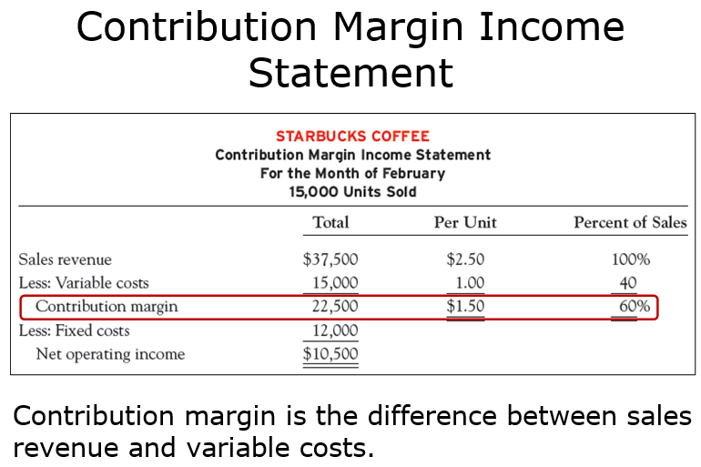

    * The contribution margin represents the amount of sales revenue left to contribute toward fixed costs and profit after variable costs have been covered. In this example, the total contribution margin earned on 15,000 units sold is 22,500 (37,500 sales revenue – 15,000 variable costs). When the fixed costs of 12,000 are subtracted, the net operating income is $10,500. 
    * Variable-Cost is 1/2.5 (Price per unit) = 40% of the Sales 
    * Contribution-Margin 1.5/2.5 (Price per unit) 60% of the Sales ➡️ This means that each sales operation, the seller is able to have a contribution by 60% of the operation.
    * Why are we interested in such Ratios ?
      * for this example, the Owner decided to sell other products (Tea, Water, coca ...etc.), then he need these ratios to understand which product has better Contribution-Margin.
    * We used to consider the Labor as Var-Cost.
    
    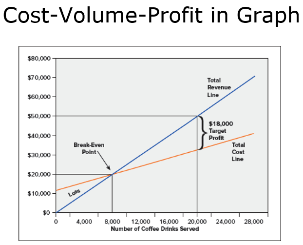

    * After serving a certain num of coffee orders, then I will cover all my fixed-costs and start to make profit.
    * If Starbucks sells 20,000 cups of coffee, it will earn a target profit of 18,000 EGP. Total revenue will be 50,000EGP (20,000 cups times 2.50 EGP per cup), total variable costs will be 20,000 EGP (20,000 cups times 1.00 EGP per cup), and fixed costs will be 12,000 EGP. So total revenue will be 50,000 EGP and total costs will be 32,000 EGP (20,000 EGP plus 12,000 EGP) resulting in a target profit of 18,000 EGP.

>[!IMPORTANT] Contribution Margin & Target Profit Equations
>$$\colorbox{lightblue}{$\text{Contribution Margin (per unit)} = \text{Selling Price} - \text{Variable Cost per unit}$}$$
>$$\colorbox{lightblue}{$\text{CM Ratio} = \dfrac{\text{CM per unit}}{\text{Selling Price}} = \dfrac{1.50}{2.50} = 60\%$}$$
>
>$$\colorbox{lightyellow}{$\text{Break-even (units)} = \dfrac{\text{Fixed Costs}}{\text{CM per unit}} = \dfrac{12{,}000}{1.50} = 8{,}000 \text{ cups}$}$$
>
>$$\colorbox{lightgreen}{$\text{Units for Target Profit} = \dfrac{\text{Fixed Costs} + \text{Target Profit}}{\text{CM per unit}} = \dfrac{12{,}000 + 18{,}000}{1.50} = 20{,}000 \text{ cups}$}$$
>
> - **CM per unit** = how much each unit contributes toward Fixed Costs & Profit
> - **Break-even** = the point where CM exactly covers Fixed Costs (zero profit)
> - **Target Profit** = just add the desired profit on top of Fixed Costs, then divide by CM per unit


### Beak-Even Analysis 
> The Point where Fixed-Cost = 0 (Because I already covered them 😉)
  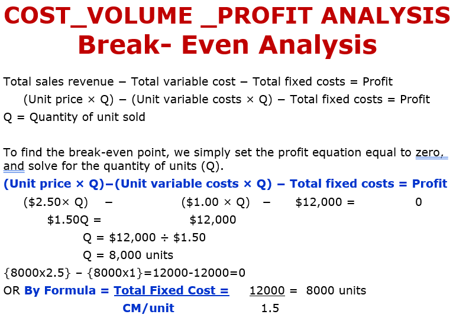

* As shown from Fig, to get the Break-Even Point, we set the Profit to 0.
  * At the 

  


>[!IMPORTANT] Break-Even Point — Set Profit = 0
>$$\text{Profit} = \text{Sales} - \text{Variable Costs} - \text{Fixed Costs}$$
>
> At Break-even, Profit = 0:
>$$0 = (P \times Q) - (V \times Q) - FC$$
>$$0 = Q \times (P - V) - FC$$
>$$Q \times \underbrace{(P - V)}_{\text{CM per unit}} = FC$$
>$$\colorbox{lightblue}{$\text{Break-even (units)} = \dfrac{FC}{P - V} = \dfrac{FC}{\text{CM per unit}} = \dfrac{12{,}000}{2.50 - 1.00} = \dfrac{12{,}000}{1.50} = \textbf{8,000 cups}$}$$
>
> Where: P = Selling Price, V = Variable Cost per unit, Q = Quantity, FC = Fixed Costs
>
> Simply: **set profit to zero** in the income equation and solve for Q — that gives you the exact number of units needed to cover all costs with nothing left over.

> 🏪 **Example — Two Ways to Calculate Break-Even (same answer!):**
> - The Uni Cafe sells coffee at **2.50 EGP/cup**, Variable Cost = **1.00 EGP/cup**, Fixed Costs = **12,000 EGP**
> - **CM per cup** = 2.50 − 1.00 = **1.50 EGP** → **CM Ratio** = 1.50 / 2.50 = **60%**
>
> ---
> **Path 1 — Using CM per unit (answer in cups):**
>$$\colorbox{lightblue}{$\text{Break-even} = \dfrac{FC}{\text{CM per unit}} = \dfrac{12{,}000}{1.50} = \textbf{8,000 cups}$}$$
> Revenue at 8,000 cups = 8,000 × 2.50 = **20,000 EGP**
>
> ---
> **Path 2 — Using CM Ratio (answer in EGP):**
>$$\colorbox{lightyellow}{$\text{Break-even} = \dfrac{FC}{\text{CM Ratio}} = \dfrac{12{,}000}{0.60} = \textbf{20,000 EGP}$}$$
> Cups at 20,000 EGP = 20,000 / 2.50 = **8,000 cups**
>
> ---
> Both paths lead to the **same break-even point** (8,000 cups = 20,000 EGP) — just different perspectives:
> - **Path 1**: "How many cups do I need?" → divide by CM **per unit**
> - **Path 2**: "How much revenue do I need?" → divide by CM **ratio**
>
> - **Verification:** Sales = 20,000 → Variable Costs = 40% × 20,000 = 8,000 → CM = 12,000 = Fixed Costs ✅ → Profit = 0!
> - يعني الطريقتين بيوصلوا لنفس النقطة: ٨٠٠٠ كوب = ٢٠٠٠٠ جنيه — الأولى بتحسب بالوحدات والتانية بالفلوس

##### Ex-1

  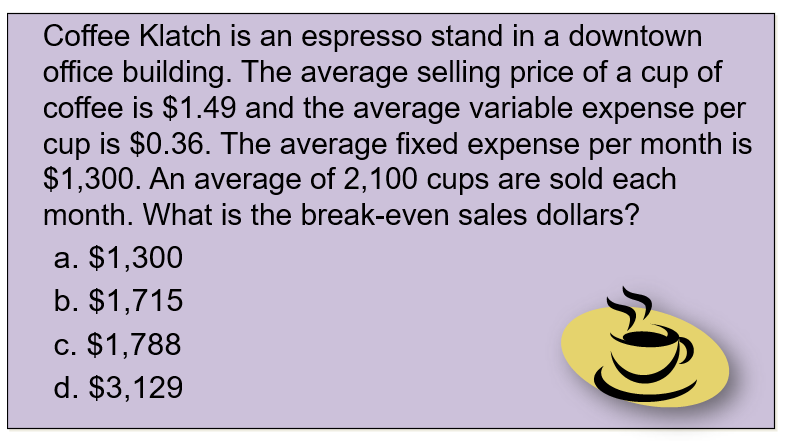

> **Givens:** Price = \$1.49/cup, Variable Cost = \$0.36/cup, Fixed Costs = \$1,300/month, Sales = 2,100 cups/month

$$\text{CM per unit} = 1.49 - 0.36 = \$1.13$$

$$\text{CM Ratio} = \dfrac{1.13}{1.49} = 75.84\%$$

$$\colorbox{lightblue}{$\text{Break-Even Sales (\$)} = \dfrac{FC}{\text{CM Ratio}} = \dfrac{1{,}300}{0.7584} = \textbf{\$1,715}$}$$

> ✅ Answer: **(b) \$1,715**

$$\colorbox{lightyellow}{$\text{Break-Even (cups)} = \dfrac{FC}{\text{CM per unit}} = \dfrac{1{,}300}{1.49 - 0.36} = \dfrac{1{,}300}{1.13} = \textbf{1,150 cups}$}$$


#### Target Profit 

* So, the Owner when he want to just cover the **Fixed-Costs** only, then he found the He want **Contribution-Margin** to cover 12,000 EGP
  * What if he wants to make <span style="background-color:#36CB2F;">**Profit (Target-Profit)**</Span> by ***11,000 EGP***, then how much **contribution-Margin** that he shall do ?

  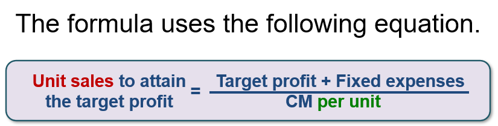
  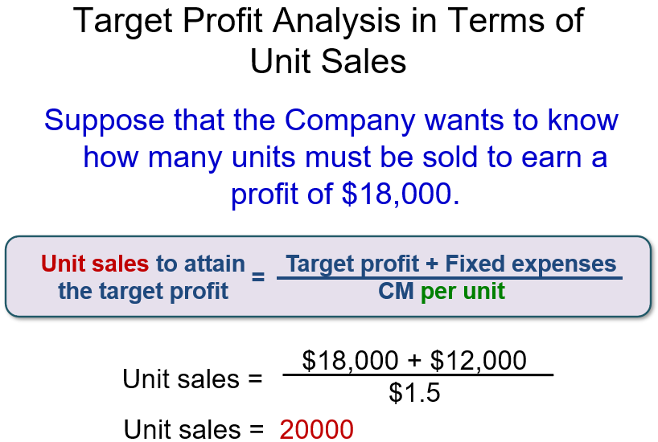
  

> 🏪 **Continuing the Cafe Example — Target Profit of 11,000 EGP:**
> - Same givens: Price = **2.50 EGP/cup**, Variable Cost = **1.00 EGP/cup**, Fixed Costs = **12,000 EGP**
> - CM per cup = **1.50 EGP**, CM Ratio = **60%**
> - Now the owner doesn't just want to break even — he wants a **profit of 11,000 EGP**
> - So the Contribution Margin must cover: Fixed Costs **+** Target Profit = 12,000 + 11,000 = **23,000 EGP**
>
> ---
> **Path 1 — How many cups?**
>$$\colorbox{lightblue}{$\text{Units} = \dfrac{FC + \text{Target Profit}}{\text{CM per unit}} = \dfrac{12{,}000 + 11{,}000}{1.50} = \dfrac{23{,}000}{1.50} = \textbf{15,333 cups}$}$$
>
> ---
> **Path 2 — How much revenue?**
>$$\colorbox{lightyellow}{$\text{Sales} = \dfrac{FC + \text{Target Profit}}{\text{CM Ratio}} = \dfrac{12{,}000 + 11{,}000}{0.60} = \dfrac{23{,}000}{0.60} = \textbf{38,333 EGP}$}$$
>---
>he will take 20,000 EGP to cover his **fixed-cost** and the remaining will be his Target-Profit
> ---
> **Verification:** Sales = 38,333 → Variable Costs = 40% × 38,333 = 15,333 → CM = 38,333 − 15,333 = **23,000** → Profit = 23,000 − 12,000 = **11,000 EGP** ✅
> - يعني عشان يكسب 11,000 جنيه ربح، لازم الـ CM يغطي التكاليف الثابتة (12,000) + الربح المطلوب (11,000) = 23,000 جنيه → يبيع حوالي 15,333 كوب
>

##### Ex-2

  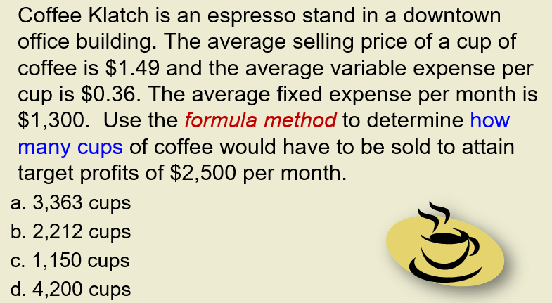

> **Givens:** Price = \$1.49/cup, Variable Cost = \$0.36/cup, Fixed Costs = \$1,300/month, Target Profit = \$2,500/month

$$\text{CM per unit} = 1.49 - 0.36 = \$1.13$$

$$\text{CM Ratio} = \dfrac{1.13}{1.49} = 75.84\%$$

$$\colorbox{lightyellow}{$\text{Break-Even (cups)} = \dfrac{FC}{\text{CM per unit}} = \dfrac{1{,}300}{1.13} = \textbf{1,150 cups}$}$$

$$\colorbox{lightyellow}{$\text{Break-Even (\$)} = \dfrac{FC}{\text{CM Ratio}} = \dfrac{1{,}300}{0.7584} = \textbf{\$1,715}$}$$

$$\colorbox{lightgreen}{$\text{Target Profit (cups)} = \dfrac{FC + \text{Target Profit}}{\text{CM per unit}} = \dfrac{1{,}300 + 2{,}500}{1.13} = \dfrac{3{,}800}{1.13} = \textbf{3,363 cups}$}$$

$$\colorbox{lightgreen}{$\text{Target Profit (\$)} = \dfrac{FC + \text{Target Profit}}{\text{CM Ratio}} = \dfrac{1{,}300 + 2{,}500}{0.7584} = \dfrac{3{,}800}{0.7584} = \textbf{\$5,011}$}$$

> ✅ Answer: **(a) 3,363 cups**

#### Margin of Safety

  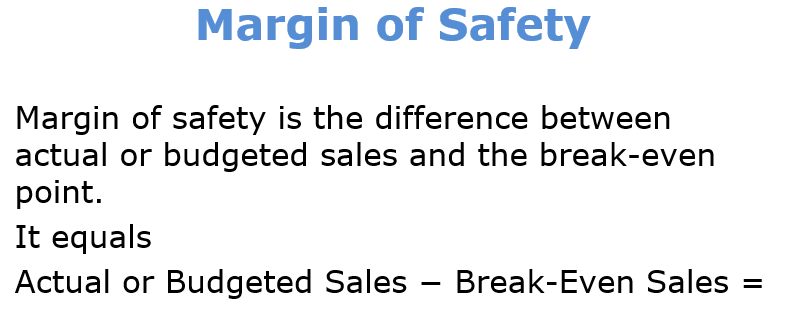
  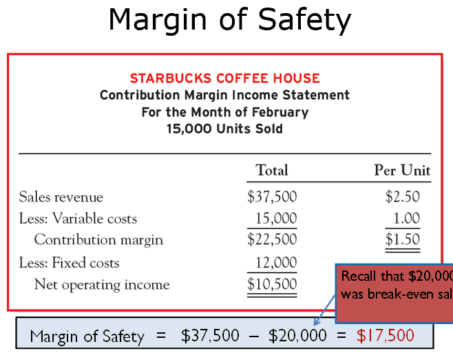


* There are slight naming for the **Break-Even**
  * Till the **Break-Even** (ex. 8000 Cup), this is the risk area (Risk margin) because you may need to pay from your own money to cover the Fixed-Cost.
  * Till (ex. 8000+7000 = 15,000 Cup), this is the ***Safety (Profit)Margin***, it is called Safety because it tells you how far you are from the **Break-Even** point.
    * Imagine you are in Exam, and pass point is 10 and total points are 20, so you want add 5 points as safety to be far from the Pass-Point (i.e, 10) by another 5 points.
>[!IMPORTANT] Margin of Safety — How far can sales drop before you lose money?
>$$\text{Margin of Safety (\$)} = \text{Actual Sales} - \text{Break-even Sales} = 37{,}500 - 20{,}000 = \textbf{17,500 EGP}$$
>
>$$\colorbox{lightblue}{$\text{Margin of Safety (\%)} = \dfrac{\text{Actual Sales} - \text{Break-even Sales}}{\text{Actual Sales}} = \dfrac{17{,}500}{37{,}500} = \textbf{46.67\%}$}$$
>
> ➡️ This means sales can **drop by up to 46.67%** before the cafe reaches the break-even point and starts losing money.
> - يعني المبيعات ممكن تنزل بنسبة 46.67% قبل ما تبدأ الخسارة — دي منطقة الأمان بتاعتك 
>
> | | **Margin of Safety** | **Profitability (Profit Margin)** |
> |:--|:--|:--|
> | **Measures** | How far sales can **drop** before you hit break-even | How much **profit** you actually earn |
> | **Formula** | (Actual Sales − Break-even Sales) / Actual Sales | Net Operating Income / Actual Sales |
> | **Cafe example** | (37,500 − 20,000) / 37,500 = **46.67%** | 10,500 / 37,500 = **28%** |
> | **Tells you** | "I can lose 46.67% of my sales before I start losing money" | "I keep 28 piasters from every 1 EGP sold" |
> | **Nature** | **Risk/cushion** measure | **Earnings** measure |

* Usually the investor aims to have a certain safety-margin to his investments, then based on his aim, we calculate the Budget sales, based on Sales team we knew if this is possible or not. 

---
<div style="page-break-after: always;"></div>

#### Task-1

  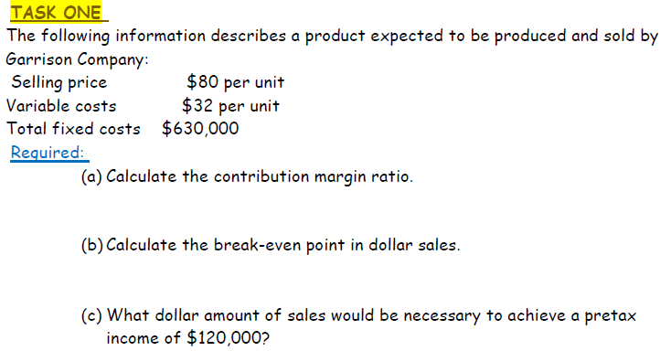

> **Givens:** Price = \$80/unit, Variable Cost = \$32/unit, Fixed Costs = \$630,000

**(a) Contribution Margin Ratio:**

$$\text{CM per unit} = 80 - 32 = \$48$$

$$\colorbox{lightblue}{$\text{CM Ratio} = \dfrac{80 - 32}{80} = \dfrac{48}{80} = \textbf{60\%}$}$$

**(b) Break-Even Point in dollar sales:**

$$\colorbox{lightyellow}{$\text{Break-Even Sales (\$)} = \dfrac{FC}{\text{CM Ratio}} = \dfrac{630{,}000}{0.60} = \textbf{\$1,050,000}$}$$

**(c) Sales for Target Profit of \$120,000:**

$$\colorbox{lightgreen}{$\text{Target Profit Sales (\$)} = \dfrac{FC + \text{Target Profit}}{\text{CM Ratio}} = \dfrac{630{,}000 + 120{,}000}{0.60} = \dfrac{750{,}000}{0.60} = \textbf{\$1,250,000}$}$$

---
<div style="page-break-after: always;"></div>

#### Task-2

  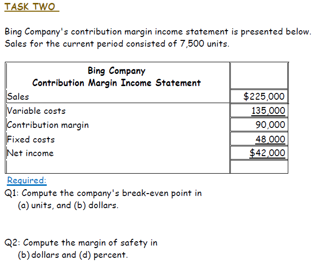

> **Givens:** Sales = \$225,000 (7,500 units), Variable Costs = \$135,000, CM = \$90,000, Fixed Costs = \$48,000, Net Income = \$42,000

$$\text{Unit Price} = \dfrac{225{,}000}{7{,}500} = \$30 \qquad \text{Unit Variable Cost} = \dfrac{135{,}000}{7{,}500} = \$18$$

$$\text{CM per unit} = 30 - 18 = \$12 \qquad \text{CM Ratio} = \dfrac{12}{30} = 40\%$$

> **Alternative (using Total CM directly from the income statement):**
>$$\text{CM per unit} = \dfrac{\text{Total CM}}{\text{Units}} = \dfrac{90{,}000}{7{,}500} = \$12 \qquad \text{CM Ratio} = \dfrac{\text{Total CM}}{\text{Sales}} = \dfrac{90{,}000}{225{,}000} = 40\%$$

**Q1(a) — Break-Even in units:**

$$\colorbox{lightblue}{$\text{Break-Even (units)} = \dfrac{FC}{\text{CM per unit}} = \dfrac{48{,}000}{12} = \textbf{4,000 units}$}$$

**Q1(b) — Break-Even in dollars:**

$$\colorbox{lightyellow}{$\text{Break-Even (\$)} = \dfrac{FC}{\text{CM Ratio}} = \dfrac{48{,}000}{0.40} = \textbf{\$120,000}$}$$

**Q2(b) — Margin of Safety in dollars:**

$$\colorbox{lightgreen}{$\text{MoS (\$)} = \text{Actual Sales} - \text{Break-even Sales} = 225{,}000 - 120{,}000 = \textbf{\$105,000}$}$$

**Q2(d) — Margin of Safety in percent:**

$$\colorbox{lightgreen}{$\text{MoS (\%)} = \dfrac{\text{Actual Sales} - \text{Break-even Sales}}{\text{Actual Sales}} = \dfrac{105{,}000}{225{,}000} = \textbf{46.67\%}$}$$

---
<div style="page-break-after: always;"></div>

#### Task-3

  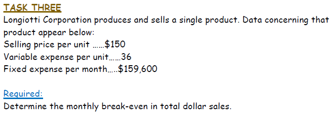

> **Givens:** Price = \$150/unit, Variable Cost = \$36/unit, Fixed Costs = \$159,600/month

$$\text{CM per unit} = 150 - 36 = \$114$$

$$\text{CM Ratio} = \dfrac{114}{150} = 76\%$$

$$\colorbox{lightblue}{$\text{Break-Even (\$)} = \dfrac{FC}{\text{CM Ratio}} = \dfrac{159{,}600}{0.76} = \textbf{\$210,000}$}$$

---
<div style="page-break-after: always;"></div>

#### Task-4

  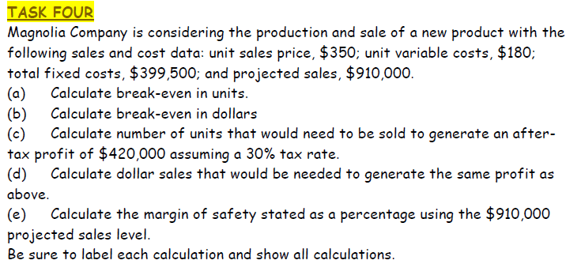

> **Givens:** Price = \$350/unit, Variable Cost = \$180/unit, Fixed Costs = \$399,500, Projected Sales = \$910,000

$$\text{CM per unit} = 350 - 180 = \$170 \qquad \text{CM Ratio} = \dfrac{170}{350} = 48.57\%$$

**(a) Break-Even in units:**

$$\colorbox{lightblue}{$\text{Break-Even (units)} = \dfrac{FC}{\text{CM per unit}} = \dfrac{399{,}500}{170} = \textbf{2,350 units}$}$$

**(b) Break-Even in dollars:**

$$\colorbox{lightyellow}{$\text{Break-Even (\$)} = \dfrac{FC}{\text{CM Ratio}} = \dfrac{399{,}500}{0.4857} = \textbf{\$822,524}$}$$

**(c) Units for After-Tax Profit of \$420,000 (Tax Rate = 30%):**

$$\text{Pre-tax Profit} = \dfrac{\text{After-tax Profit}}{1 - \text{Tax Rate}} = \dfrac{420{,}000}{1 - 0.30} = \dfrac{420{,}000}{0.70} = \$600{,}000$$

$$\colorbox{lightgreen}{$\text{Units} = \dfrac{FC + \text{Pre-tax Profit}}{\text{CM per unit}} = \dfrac{399{,}500 + 600{,}000}{170} = \dfrac{999{,}500}{170} = \textbf{5,880 units}$}$$

**(d) Dollar sales for same profit:**

$$\colorbox{lightgreen}{$\text{Sales (\$)} = 5{,}880 \times 350 = \textbf{\$2,058,000}$}$$

**(e) Margin of Safety (%) using projected sales of \$910,000:**

$$\colorbox{lightblue}{$\text{MoS (\%)} = \dfrac{\text{Projected Sales} - \text{Break-even Sales}}{\text{Projected Sales}} = \dfrac{910{,}000 - 822{,}524}{910{,}000} = \dfrac{87{,}476}{910{,}000} = \textbf{9.61\%}$}$$

---
<div style="page-break-after: always;"></div>

#### Task-5

  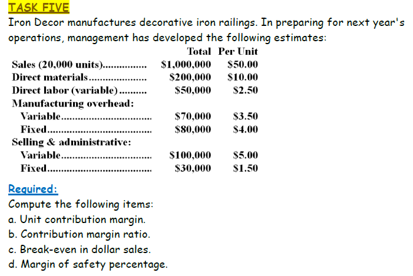

> **Givens:** Price = \$50/unit, 20,000 units. Variable: DM = \$10, DL = \$2.50, MO = \$3.50, S&A = \$5.00. Fixed: MO = \$80,000, S&A = \$30,000

**(a) Unit Contribution Margin:**

$$\text{Total Variable Cost/unit} = \underbrace{10 + 2.50 + 3.50}_{\text{Manufacturing}} + \underbrace{5.00}_{\text{Selling}} = \$21.00$$

$$\colorbox{lightblue}{$\text{CM per unit} = 50 - 21 = \textbf{\$29}$}$$

**(b) Contribution Margin Ratio:**

$$\colorbox{lightblue}{$\text{CM Ratio} = \dfrac{29}{50} = \textbf{58\%}$}$$

**(c) Break-Even in dollar sales:**

$$\text{Total Fixed Costs} = 80{,}000 + 30{,}000 = \$110{,}000$$

$$\colorbox{lightyellow}{$\text{Break-Even (\$)} = \dfrac{FC}{\text{CM Ratio}} = \dfrac{110{,}000}{0.58} = \textbf{\$189,655}$}$$

**(d) Margin of Safety (%):**

$$\colorbox{lightgreen}{$\text{MoS (\%)} = \dfrac{\text{Sales} - \text{Break-even Sales}}{\text{Sales}} = \dfrac{1{,}000{,}000 - 189{,}655}{1{,}000{,}000} = \dfrac{810{,}345}{1{,}000{,}000} = \textbf{81.03\%}$}$$

* 81.03% of the sales contains profit. 
* How much Profit in them?

$$\text{Net Income} = \text{Sales} - \text{Variable Costs} - \text{Fixed Costs} = 1{,}000{,}000 - 420{,}000 - 110{,}000 = \textbf{\$470,000}$$

> **Or using MoS:** The profit lives inside the Margin of Safety sales. Every dollar of MoS sales contributes at the CM Ratio:
>$$\colorbox{lightgreen}{$\text{Profit} = \text{MoS (\$)} \times \text{CM Ratio} = 810{,}345 \times 0.58 = \textbf{\$470,000}$}$$

>[!IMPORTANT] Key Takeaway — MoS ≠ Pure Profit
> ➡️ Only **58% of the MoS sales become profit** — not all of it! Why? Because each dollar of MoS sales still carries its variable cost (42%). The CM Ratio filters out that cost and leaves you with the **pure profit portion**.
> - يعني مش كل الـ MoS ربح صافي — لأ، بس 58% منه هو الربح الفعلي، لأن كل جنيه مبيعات لسه بيشيل تكلفة متغيرة (42%) — أنا مش بابيع هوا 😂
>
> ➡️ If your business sells **multiple products**, compare their **CM Ratios** and **MoS%** side by side — the product with the higher CM Ratio turns more of its safety margin into profit. Focus on selling **more** of that product.
> - لو عندك أكتر من منتج، قارن الـ CM Ratio بتاع كل واحد — اللي نسبته أعلى هو اللي بيحولّك أكبر جزء من المبيعات لربح → ركّز تبيع منه أكتر
>
> ---
> ➡️ **Turnover vs. Profitability Trade-off:**
> Not all products with **low CM Ratio** are bad! Some products sell **very fast** (high turnover) — they make small profit per unit but compensate with **volume**.
>
> | | **High Turnover / Low CM** | **Low Turnover / High CM** |
> |:--|:--|:--|
> | **Examples** | Bread, milk, water, chips | Electronics, perfumes, jewelry |
> | **CM per unit** | Low (e.g. 0.50) | High (e.g. \$50) |
> | **How often it sells** | Very fast — sells 1,000×/day | Slow — sells 5×/day |
> | **Daily profit** | 1,000 × 0.50 = **500** | 5 × 50 = **$250** |
> | **Strategy** | Keep shelves full, never run out | Display well, push to customers |
>
> - **Supermarket logic:** Bread has a tiny margin but the **turnover is massive** — it sells hundreds of times a day. That's why supermarkets keep it even with a 5% CM Ratio. Meanwhile, a premium chocolate bar has 40% CM but only sells a few times a day.
> - **Total Profit = CM per unit × Volume (turnover)** — so a product with low CM but high turnover can beat a high CM product with slow turnover!
> - يعني مش دايما المنتج اللي هامشه عالي هو الأحسن — العيش والمية هامشهم قليل بس بيتباعوا ألف مرة في اليوم، لكن العطور هامشها عالي بس بتتباع مرة أو اتنين → المهم الربح الإجمالي = هامش × عدد المرات (دوران المنتج) 

---
<div style="page-break-after: always;"></div>

### Mutli-Product Cost-Volume-Profit Analysis

  

* Ex: The Cafe in Uni sells different products, however all of these products share the same fixed-costs (ex. Rent, Water, Electricity..etc.)
  * However, there are some other scnarios, where a certain product has its own Fixed-cost (ex. special Machine rented to produce a certain product). ➡️ Next Lec.

>[!IMPORTANT] Multi-Product CVP — The Weighted-Average Approach
> When a business sells **multiple products**, you can't just use one CM per unit — you need a **weighted average** based on the assumed **mix** of products sold.
>
> **Two ways to define the mix:**
>
> | Method | Mix defined as | You calculate | Gives you answer in |
> |:--|:--|:--|:--|
> | **Product Mix** | Ratio of **units** sold (e.g. 3 coffees : 1 cake) | Weighted-avg **CM per unit** | **Units** to break even |
> | **Sales Mix** | % of **revenue** from each product | Weighted-avg **CM Ratio** | **Dollars** to break even |
>
> - Both methods give the **same answer** (just like single-product) — as long as you have full price info
> - **Critical assumption:** The analysis is only valid for **that specific mix**. If the mix changes, the break-even changes too!
>
> **In simple terms:**
> 1. Assume a mix (e.g. "for every 3 coffees, I sell 1 cake")
> 2. Blend the CMs into one weighted-average number
> 3. Use the same Break-even / Target Profit formulas as before — just with the weighted CM
>

  

* In the previous Example, the values are presented and aggregated in Dollars (same unit) as we can't calc (coffe + Pastries)
* As long as the Prices per Type is constant and ratios are constants, then the **Weight-Avg Contribution-Margin** is ✅
* Using this simple analysis, it is clear that Pastries has more **Contribution-Margin** (68.5%), which means that it is more profitable. However Coffee turnover is much higher **Sales** (24K).
* The question now is: how much we need to sell from both products to reach the Break-Even Point (FC = 12K)?
  * They sum up totall Sales and Total Var-Costs for both Products, then calc the <span style="background-color:#36CB2F;">CM-Ratio = 62.5%</span>
* Why it is called <span style="background-color:#B22222;">**"Weighted-Avg CM"**</span>?
  * Because this ratio considers the weight of sales per product. NOt just an avg.

> 🏪 **Starbucks Multi-Product Example — Weighted-Average CM Ratio:**
>
> ```
> ┌─────────────────────────────────────────────────────────────────┐
> │            Total Sales Revenue = $33,600                        │
> ├──────────────────────────────┬──────────────────────────────────┤
> │     ☕ Coffee = $24,000      │     🥐 Pastries = $9,600         │
> │     (71.43% of sales)       │     (28.57% of sales)            │
> │     CM Ratio = 60%          │     CM Ratio = 68.75%            │
> ├──────────────────────────────┴──────────────────────────────────┤
> │  Weighted-Avg CM Ratio = 62.5%                                 │
> │  (every $1 of revenue → $0.625 goes toward FC & Profit)        │
> └─────────────────────────────────────────────────────────────────┘
> ```
>
> **How to get the 62.5%:**
>$$\text{Weighted CM Ratio} = \dfrac{\text{Total CM}}{\text{Total Sales}} = \dfrac{21{,}000}{33{,}600} = 62.5\%$$
>
> **Or by weighting each product's CM Ratio by its sales share:**
>$$= (60\% \times 71.43\%) + (68.75\% \times 28.57\%) = 42.86\% + 19.64\% = 62.5\%$$
>
> **What it means:**
> - On **average**, for every **\$1 of sales**, the business earns **\$0.625** in contribution margin
> - This blended number accounts for the fact that coffee sells more (71%) but has lower CM, while pastries sell less (29%) but have higher CM
> - ⚠️ **Only valid if the mix stays 71/29!** — If you sell more pastries, the weighted CM goes UP. More coffee → it goes DOWN.
>
> **Using it:**
>$$\colorbox{lightblue}{$\text{Break-Even (\$)} = \dfrac{FC}{\text{Weighted CM Ratio}} = \dfrac{12{,}000}{0.625} = \textbf{\$19,200}$}$$
>
> - يعني الـ 62.5% دي **متوسط مرجح** — بتاخد في الاعتبار إن القهوة بتبيع أكتر (71%) بس هامشها أقل، والمعجنات بتبيع أقل (29%) بس هامشها أعلى
> - لو المزيج اتغير (بعت معجنات أكتر)، الـ Weighted CM هيزيد → نقطة التعادل هتقل

* Now, let's calculate the **Break-Even for the whole company** and then **split it back** to each product using their sales-mix ratios:

**Step 1 — Total Break-Even:**

$$\colorbox{lightblue}{$\text{Total Break-Even (\$)} = \dfrac{FC}{\text{Weighted-Avg CM Ratio}} = \dfrac{12{,}000}{0.625} = \textbf{\$19,200}$}$$

**Step 2 — Split by product (using each product's sales-mix %):**

$$\colorbox{lightyellow}{$\text{Coffee BE} = \underbrace{71.43\%}_{\text{Coffee share}} \times 19{,}200 = \textbf{\$13,714}$}$$

$$\colorbox{lightyellow}{$\text{Pastries BE} = \underbrace{28.57\%}_{\text{Pastries share}} \times 19{,}200 = \textbf{\$5,486}$}$$

> **Verification:** \$13,714 + \$5,486 = **\$19,200** ✅
> - يعني أول حاجة بنحسب نقطة التعادل للشركة ككل (19,200$)، وبعدين بنقسمها على كل منتج حسب نسبته من المبيعات — القهوة 71% والمعجنات 29%

#### ⚠️ <span style="background-color:#B22222; color:white; padding:2px 6px; border-radius:4px;">What if the mix changes? 😱</span>

Suppose by end of month, we earned **\$19,200 in revenue** — but **all of it was coffee** (zero pastries sold). Did we break even?

**No!** Because \$19,200 was the break-even for the **original mix (71/29)**. With a **new mix (100% coffee)**, the weighted CM changes:

$$\text{New W-Avg CM} = (\underbrace{100\%}_{\text{Coffee}} \times 60\%) + (\underbrace{0\%}_{\text{Pastries}} \times 68.75\%) = 60\% + 0\% = \textbf{60\%}$$

$$\colorbox{lightyellow}{$\text{New Break-Even} = \dfrac{FC}{\text{New W-Avg CM}} = \dfrac{12{,}000}{0.60} = \textbf{\$20,000}$}$$

> <span style="background-color:#B22222; color:white; padding:2px 4px; border-radius:3px;">**We're \$800 short!**</span> We sold \$19,200 but need \$20,000 to break even under this new mix.
>
> **Why?** Coffee has a **lower CM Ratio** (60%) than the blended average (62.5%). By selling only coffee, every dollar contributes less — so we need more dollars to cover the same \$12,000 in fixed costs.
>
> - يعني لو كل المبيعات طلعت قهوة بس (من غير معجنات)، الـ Weighted CM بينزل من 62.5% لـ 60% → نقطة التعادل بتزيد من 19,200 لـ 20,000 → يعني 19,200 مش كفاية! لازم نبيع أكتر

#### ✅ <span style="background-color:#36CB2F; color:white; padding:2px 6px; border-radius:4px;">Opposite scenario — Only Pastries sold 🥐</span>

Now suppose by end of month, we earned **\$19,200 in revenue** — but **all of it was pastries** (zero coffee sold). Did we break even?

**Yes — and we even made profit!** Because pastries have a **higher** CM Ratio (68.75%) than the blended average (62.5%):

$$\text{New W-Avg CM} = (\underbrace{0\%}_{\text{Coffee}} \times 60\%) + (\underbrace{100\%}_{\text{Pastries}} \times 68.75\%) = 0\% + 68.75\% = \textbf{68.75\%}$$

$$\colorbox{lightgreen}{$\text{New Break-Even} = \dfrac{FC}{\text{New W-Avg CM}} = \dfrac{12{,}000}{0.6875} = \textbf{\$17,455}$}$$

> <span style="background-color:#36CB2F; color:white; padding:2px 4px; border-radius:3px;">**We passed break-even by \$1,745!**</span> We sold \$19,200 but only needed \$17,455.
>
> **Profit** = CM − FC = (68.75% × \$19,200) − \$12,000 = \$13,200 − \$12,000 = **\$1,200** 🎉
>
> **Why?** Pastries have a **higher CM Ratio** (68.75%) than the blended average (62.5%). By selling only pastries, every dollar contributes more — so fewer dollars are needed to cover fixed costs.
>
> - يعني لو كل المبيعات طلعت معجنات بس، الـ Weighted CM بيطلع من 62.5% لـ 68.75% → نقطة التعادل بتنزل من 19,200 لـ 17,455 → يعني 19,200 كفاية وزيادة! كسبنا 1,200$

> 📊 **Summary — How the mix shifts the break-even:**
>
> | Scenario | Sales Mix | W-Avg CM | Every \$1 sold → covers | Speed to cover \$12K FC | Break-Even | Status at \$19,200 |
> |:--|:--|:--|:--|:--|:--|:--|
> | Original (planned) | 71% Coffee / 29% Pastries | 62.5% | \$0.625 toward FC | Medium | **\$19,200** | Exactly at BE |
> | All Coffee ☕ | 100% Coffee / 0% Pastries | 60% | \$0.60 toward FC | 🐢 Slowest | **\$20,000** | ❌ \$800 short |
> | All Pastries 🥐 | 0% Coffee / 100% Pastries | 68.75% | \$0.6875 toward FC | 🚀 Fastest | **\$17,455** | ✅ \$1,200 profit |
>
> ➡️ **Lesson:** The higher the W-Avg CM, the **faster** each dollar of sales fills up the \$12,000 FC bucket — so you reach break-even with fewer total sales. Shifting the mix toward the **higher-CM product** = faster collection = lower break-even.
> - الخلاصة: كل ما الـ W-Avg CM يزيد، كل دولار مبيعات بيملا دلو الـ FC (12,000) أسرع → توصل لنقطة التعادل بمبيعات أقل. لو المزيج اتغير ناحية المنتج الأعلى هامش = تحصيل أسرع = تعادل أقل

---
<div style="page-break-after: always;"></div>

#### Task-12

  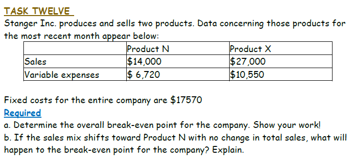

> **Givens:** Product N: Sales = \$14,000, VC = \$6,720. Product X: Sales = \$27,000, VC = \$10,550. Fixed Costs = \$17,570

**a. Overall Break-Even Point:**

$$\text{Total Sales} = 14{,}000 + 27{,}000 = \$41{,}000$$

| | Product N | Product X |
|:--|:--|:--|
| **CM Ratio** | $1 - \dfrac{6{,}720}{14{,}000} = \textbf{52\%}$ | $1 - \dfrac{10{,}550}{27{,}000} = \textbf{60.93\%}$ |
| **Sales Weight** | $\dfrac{14{,}000}{41{,}000} = \textbf{34.15\%}$ | $\dfrac{27{,}000}{41{,}000} = \textbf{65.85\%}$ |
| **Individual BE** | $\dfrac{17{,}570}{0.52} = \textbf{\$33,788}$ | $\dfrac{17{,}570}{0.6093} = \textbf{\$28,836}$ |

$$\text{W-Avg CM} = (34.15\% \times 52\%) + (65.85\% \times 60.93\%) = 17.76\% + 40.12\% = \textbf{57.88\%}$$

> **Alternative (Direct Method) — faster, fewer steps:**
>$$\text{Total CM} = \underbrace{(14{,}000 - 6{,}720)}_{N = 7{,}280} + \underbrace{(27{,}000 - 10{,}550)}_{X = 16{,}450} = 23{,}730$$
>$$\text{W-Avg CM} = \dfrac{\text{Total CM}}{\text{Total Sales}} = \dfrac{23{,}730}{41{,}000} = \textbf{57.88\%} \quad \checkmark$$

$$\colorbox{lightblue}{$\text{Overall Break-Even} = \dfrac{FC}{\text{W-Avg CM}} = \dfrac{17{,}570}{0.5788} = \textbf{\$30,356}$}$$

**b. If the sales mix shifts toward Product N (total sales unchanged at \$41,000):**

> Product N has a **lower CM Ratio** (52%) compared to Product X (60.93%). Shifting sales toward Product N **decreases** the Weighted-Avg CM → the break-even point **increases**.
>
> ➡️ The company will still break even (since \$41,000 > new BE), but **profit will decrease** and the **margin of safety shrinks** — meaning the business becomes more vulnerable to a sales downturn.
>
> - يعني المنتج N هامشه أقل (52% < 61%)، فلو بعنا منه أكتر → الـ W-Avg CM بينزل → نقطة التعادل بتزيد → الربح بيقل والأمان بيقل

---
<div style="page-break-after: always;"></div>

### Degree of Operating Leverage (DOL)
> يعنى لما اقولك انا عندى 
> Leverage
> يعنى انا عندى ميزة

  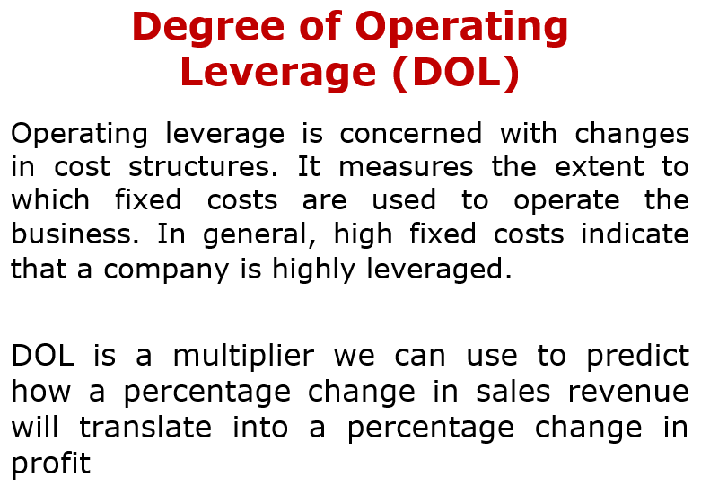

$$\colorbox{lightblue}{$\text{DOL} = \dfrac{\overbrace{\text{Contribution Margin}}^{\text{Numerator (البسط)}}}{\underbrace{\text{Net Operating Income}}_{\text{Denominator (المقام)}}} = \dfrac{CM}{CM - FC}$}$$

**How it works:**

- Since **Net Operating Income = CM − FC**, the formula simplifies to:

$$\text{DOL} = \dfrac{CM}{CM - FC}$$

- **If FC = 0** → NOI = CM → DOL = CM / CM = **1** (no leverage — profit moves 1:1 with sales)
- **If FC > 0** → the denominator (NOI) is smaller than the numerator (CM) → DOL **> 1** (profit is amplified)

**Why DOL > 1 matters:**

A DOL of 4 means: if sales increase by **10%**, profit increases by **10% × 4 = 40%**. But if sales *decrease* by 10%, profit drops by 40% too — it's a double-edged sword!

$$\colorbox{lightyellow}{$\text{\% Change in Profit} = \text{DOL} \times \text{\% Change in Sales}$}$$

**In simple terms:**
- DOL = 1 → No fixed costs → profit changes **at the same rate** as sales (no amplification)
- DOL > 1 → Fixed costs exist → profit changes **faster** than sales (amplified both ways ↑↓)
- The **higher** the fixed costs relative to variable costs, the **higher** the DOL → more risk but more reward

> - الـ DOL بيقيس **قد إيه الربح حساس لتغيرات المبيعات**
> - لو FC = 0 (مفيش تكاليف ثابتة) → DOL = 1 → يعني لو المبيعات زادت 10%، الربح هيزيد 10% بالظبط
> - لو FC كبيرة → DOL > 1 → يعني تغير صغير في المبيعات بيعمل تغير **أكبر** في الربح (تضخيم)
> - مثال: DOL = 4 → لو المبيعات زادت 10%، الربح هيزيد 40%! بس لو نزلت 10%، الربح هينزل 40% برضو — سلاح ذو حدين ⚔️

> 🏦 **Real-life analogy — Bank Loan (Financial Leverage):**
>
> Imagine you take a loan from a bank to expand your factory → the bank approves → now you have **more capacity** to produce and sell → **more potential profit**. This is **leverage** — using borrowed resources to amplify your returns.
>
> But it's **not free** — it comes with **higher risk**:
> - ✅ If sales go **up** → you earn more profit AND can easily repay the bank → leverage **worked in your favor**
> - ❌ If sales go **down** (production issue, market crash) → profit drops **faster** (because FC from the loan doesn't decrease) → you may **not be able to repay** the bank → potential bankruptcy
>
> **Operating Leverage works the same way:** Instead of borrowing money, you're "borrowing" fixed costs (machines, rent, salaries). They give you capacity to produce more, but if sales drop, those fixed costs don't disappear — they amplify your losses.
>
> - يعني زي ما لو اخدت قرض من البنك عشان توسع المصنع — لو المبيعات زادت هتكسب أكتر وتقدر ترجع الفلوس. بس لو المبيعات نزلت، التكاليف الثابتة (القسط) مش بتنزل → الربح بينهار وممكن متقدرش ترجع الفلوس للبنك. الـ Operating Leverage نفس الفكرة بس بالتكاليف الثابتة بدل القرض

> 🏗️ **The Next Question — Where do you invest the loan? Fixed or Variable Cost Structure?**
>
> You got the loan. Now you want to expand. Example: A university needs more teaching capacity.
> - **Option A (Variable Cost):** Hire **contract staff** (part-time lecturers) — pay per course/semester
> - **Option B (Fixed Cost):** Hire **full-time staff** — fixed monthly salary regardless of student count
>
> | | **Variable Cost Structure** (Contract Staff) | **Fixed Cost Structure** (Full-Time Staff) |
> |:--|:--|:--|
> | **Cost behavior** | Cost rises/falls with activity | Cost stays the same regardless of activity |
> | **Financial risk** | 🟢 **Lower** — if students drop, costs drop too | 🔴 **Higher** — salaries must be paid even if students drop |
> | **Resource availability** | 🔴 **Risky** — contractors may not be available when needed | 🟢 **Reliable** — staff is always there, ready to work |
> | **Profit at high volume** | 📉 **Lower** — every extra unit adds more variable cost | 📈 **Higher** — FC is already paid, so extra units = pure CM |
> | **DOL** | **Low** (close to 1) — profit changes slowly | **High** (>> 1) — profit changes fast |
> | **Best for** | Uncertain demand, startup phase | Stable/growing demand, mature business |
>
> **Why Fixed Cost = Higher Profit at Volume?**
> - With **Variable structure**: selling 100 more units → costs go up by 100 × VC → profit grows slowly
> - With **Fixed structure**: selling 100 more units → costs stay the same → **all extra CM goes straight to profit!**
>
> ---
>
> ❓ **The Critical Question: When should you choose the Fixed Cost (High Leverage) structure?**
>
> ➡️ **When you are confident that sales volume will be consistently HIGH and STABLE.** Because:
> - Fixed costs give you **capacity** and **flexibility** to scale up without proportional cost increases
> - But you need the **volume** to justify them — otherwise you're paying for idle capacity
>
> **Decision Rule:**
> - 📊 If your sales are **above break-even by a comfortable margin** (high MoS%) → go Fixed → maximize profit through leverage
> - 📊 If your sales are **uncertain or close to break-even** (low MoS%) → stay Variable → minimize risk
> - 📊 As the business **matures and demand stabilizes** → gradually shift from Variable to Fixed
>
> - يعني لو اخدت القرض، تصرفه فين؟
>   - **تكاليف متغيرة** (عقود مؤقتة): أأمن ماليًا — لو المبيعات نزلت، التكلفة بتنزل معاها. بس الموارد مش مضمونة وربحك أقل كل ما النشاط زاد
>   - **تكاليف ثابتة** (موظفين دائمين): أخطر ماليًا — هتدفع المرتبات حتى لو المبيعات نزلت. بس الموارد متاحة دايمًا وربحك أعلى عند الحجم الكبير
>   - **امتى تختار الثابت؟** لما تكون واثق إن المبيعات هتفضل عالية ومستقرة → الـ FC هيبقى leverage ليك مش عليك


#### ☕ Cafe Example — Should the owner buy an automatic coffee machine?

| | **Before Automation** (Variable Cost Structure) | **After Automation** (Fixed Cost Structure) |
|:--|:--|:--|
| **Graph** | 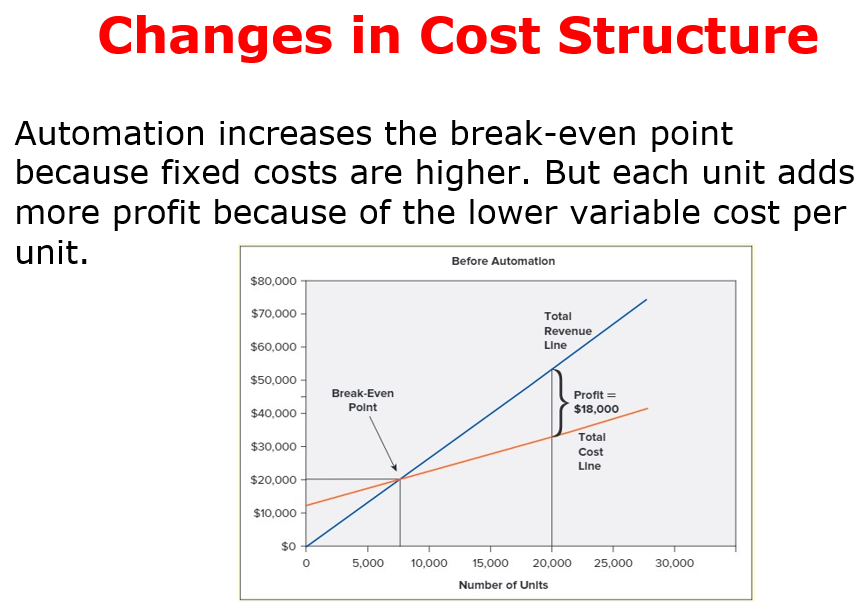 |  |
| **Setup** | Few students → human worker makes coffee, paid **commission per order** | Many students → buys automatic machine, pays **loan + maintenance monthly** |
| **Cost type** | Mostly **Variable** — the more orders, the more you pay the worker | Mostly **Fixed** — machine costs the same whether you make 10 or 1,000 cups |
| **Total Cost line (orange)** | 📈 **Steep slope** — costs rise fast with each order (high VC per unit) | 📉 **Gentle slope** — costs barely rise with more orders (low VC per unit) |
| **Fixed Costs** | **Low** (just rent, utilities) | **High** (loan repayment, maintenance, rent) |
| **Break-Even** | ✅ **Low** — easy to reach (small FC to cover) | ⚠️ **High** — harder to reach (large FC to cover) |
| **Profit after BE** | Grows **slowly** (each extra cup still costs commission) | Grows **fast** (each extra cup costs almost nothing!) ➡️ distance between blue line and organe line incresaes and that's indicate more profit |
| **DOL** | Low (≈ 1) | High (>> 1) |
| **Best when** | Demand is **low or uncertain** | Demand is **high and stable** |

> **Key Insight from the graphs:**
> - **Before:** The orange line (Total Cost) has a steep slope because every cup adds worker commission → you break even quickly but profit grows slowly after that
> - **After:** The orange line starts higher (more FC) but has a gentle slope because the machine doesn't charge per cup → you break even later, but once you do, **profit accelerates rapidly**
>
> - يعني قبل الأتمتة: خط التكاليف بيطلع بسرعة (كل كوب = عمولة) → نقطة التعادل قريبة بس الربح بيكبر ببطء
> - بعد الأتمتة: خط التكاليف بيبدأ أعلى (ماكينة غالية) بس ميله قليل (الكوب مش بيكلف حاجة زيادة) → نقطة التعادل أبعد بس بعدها الربح بيزيد بسرعة 🚀

##### Example — Comparing DOL: No Automation vs. Automation

  

> **Indifference point:** Both structures produce the **same profit (\$18,000)** at **20,000 cups sold**. The question is: what happens when sales change?

| | **No Automation** (Variable Structure) | **Automation** (Fixed Structure) |
|:--|:--|:--|
| Price per cup | \$2.50 | \$2.50 |
| Variable Cost / cup | \$1.00 | \$0.30 |
| **CM per cup** | **\$1.50** | **\$2.20** |
| **CM Ratio** | 1.50 / 2.50 = **60%** | 2.20 / 2.50 = **88%** |
| Fixed Costs | \$12,000 | \$26,000 |
| **At 20,000 cups:** | | |
| Sales Revenue | \$50,000 | \$50,000 |
| Total Variable Costs | \$20,000 | \$6,000 |
| **Total CM** | **\$30,000** | **\$44,000** |
| Less: Fixed Costs | \$12,000 | \$26,000 |
| **Net Operating Income** | **\$18,000** | **\$18,000** |

  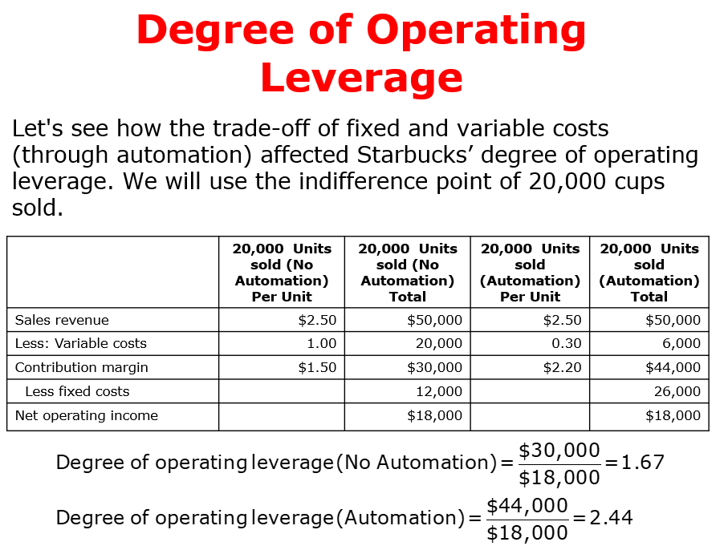

**Calculating DOL for each structure:**

$$\colorbox{lightyellow}{$\text{DOL (No Automation)} = \dfrac{CM}{NOI} = \dfrac{30{,}000}{18{,}000} = \textbf{1.67}$}$$

$$\colorbox{lightgreen}{$\text{DOL (Automation)} = \dfrac{CM}{NOI} = \dfrac{44{,}000}{18{,}000} = \textbf{2.44}$}$$

**What do these numbers mean? Let's test with a 10% increase in sales:**

$$\colorbox{lightyellow}{$\text{No Automation: \% Profit Change} = 1.67 \times 10\% = \textbf{16.7\%} \quad \Rightarrow \quad \text{New Profit} = 18{,}000 \times 1.167 = \textbf{\$21,000}$}$$

$$\colorbox{lightgreen}{$\text{Automation: \% Profit Change} = 2.44 \times 10\% = \textbf{24.4\%} \quad \Rightarrow \quad \text{New Profit} = 18{,}000 \times 1.244 = \textbf{\$22,400}$}$$

> **Verification (Automation at 22,000 cups = +10%):**
> - Sales = 22,000 × 2.50 = \$55,000
> - VC = 22,000 × 0.30 = \$6,600
> - CM = \$48,400
> - NOI = 48,400 − 26,000 = **\$22,400** ✅ (that's 24.4% more than \$18,000)

**The same works in reverse (10% sales DECREASE):**

| | **No Automation** (DOL = 1.67) | **Automation** (DOL = 2.44) |
|:--|:--|:--|
| Sales change | +10% | −10% | +10% | −10% |
| Profit change | +16.7% | −16.7% | +24.4% | −24.4% |
| New profit | \$21,000 | \$15,000 | \$22,400 | \$13,600 |

>[!IMPORTANT] DOL — Quick Problem-Solving Formula
>$$\colorbox{lightblue}{$\text{DOL} = \dfrac{\text{Contribution Margin}}{\text{Net Operating Income}} = \dfrac{CM}{CM - FC}$}$$
>
>$$\colorbox{lightgreen}{$\text{New Profit} = \text{Old Profit} \times (1 + \text{DOL} \times \text{\% Change in Sales})$}$$
>
> **Steps to solve any DOL problem:**
> 1. Calculate **CM** (Total Sales − Total VC)
> 2. Calculate **NOI** (CM − FC)
> 3. **DOL** = CM ÷ NOI
> 4. Multiply DOL × % sales change = **% profit change**
> 5. Apply to original profit to get **new profit**
>
> **Key insight:** Both structures earn \$18,000 at 20,000 cups. But automation (DOL = 2.44) makes profit **more sensitive** — it rises faster when sales grow, but falls faster when sales drop.
>
> - يعني الاتنين بيكسبوا نفس الربح (18,000) عند 20,000 كوب. بس الأتمتة (DOL = 2.44) بتخلي الربح **أحس** بأي تغيير — لو المبيعات زادت 10%، الربح بيزيد 24.4% (مش بس 16.7%). بس لو نزلت 10%، الربح بينزل 24.4% برضو!
> - **القاعدة:** DOL أعلى = ربح أسرع في الصعود 🚀 بس خسارة أسرع في النزول 📉

---

#### ⚔️ DOL — The Double-Edged Sword (سلاح ذو حدين)

> Think of DOL as a **multiplier on your profit's reaction to sales changes**. It doesn't create profit or loss — it **amplifies** whatever direction sales go.

| Sales Direction | Low DOL (≈ 1.67) | High DOL (≈ 2.44) | Verdict |
|:--|:--|:--|:--|
| 📈 Sales **UP** 10% | Profit up **16.7%** | Profit up **24.4%** | <span style="color:#36CB2F">**High DOL = Your best friend**</span> |
| 📈 Sales **UP** 20% | Profit up **33.4%** | Profit up **48.8%** | <span style="color:#36CB2F">**Amplified gains!**</span> |
| 📉 Sales **DOWN** 10% | Profit down **16.7%** | Profit down **24.4%** | <span style="color:#B22222">**High DOL = Your worst enemy**</span> |
| 📉 Sales **DOWN** 20% | Profit down **33.4%** | Profit down **48.8%** | <span style="color:#B22222">**Amplified destruction!**</span> |
| ⚠️ Sales **DOWN** 41% | Profit down **68.5%** | Profit down **100%** ❌ | <span style="color:#B22222">**Automation hits ZERO profit!**</span> |

**Why does this happen?**

- **High DOL = High Fixed Costs** → Fixed costs don't shrink when sales fall. They sit there like a rock on your chest:
  - When sales are **rising** → FC stays constant → every extra dollar of sales becomes almost pure profit → DOL **rewards** you
  - When sales are **falling** → FC stays constant → you still owe the same rent/machine payments with less revenue → DOL **punishes** you

$$\colorbox{lightyellow}{$\underbrace{\text{High DOL}}_{\text{High FC Structure}} = \underbrace{\text{Huge reward when sales} \uparrow}_{\text{Best Friend 🚀}} \quad + \quad \underbrace{\text{Huge damage when sales} \downarrow}_{\text{Worst Enemy 💀}}$}$$

> **Real-world analogy — Financial Leverage:**
> - DOL works exactly like **borrowing money to invest**:
>   - If you borrow \$1M and invest → market goes UP 10% → you gain on the full \$1M → **leverage helped you** 🎉
>   - Same loan → market goes DOWN 10% → you lose on the full \$1M → **leverage destroyed you** 💥
>   - DOL is the **operating** version of the same concept — instead of debt, it's **fixed costs** that create the leverage
>
> **When to choose High DOL (Automation)?**
> - ✅ When demand is **stable and growing** (e.g., Starbucks in a busy city)
> - ✅ When you're **confident** sales will stay above break-even
> - ❌ **NEVER** when demand is uncertain or seasonal — the fixed costs will eat you alive during slow months
>
> **When to choose Low DOL (Variable Structure)?**
> - ✅ When demand is **unpredictable** — you pay workers only when there's work
> - ✅ Startups with unproven markets — low FC = lower risk of catastrophic loss
> - ❌ You sacrifice the upside — even when sales boom, profit grows slowly

> **بالعربي — ليه DOL سلاح ذو حدين:**
> - DOL هو **مُضاعِف** — بيضاعف أي تغيير في المبيعات ويعكسه على الربح
> - لو المبيعات **طالعة** → DOL عالي = صاحبك الوفي — بيزود ربحك أسرع من أي حد 🚀
> - لو المبيعات **نازلة** → DOL عالي = عدوك اللدود — بيدمر ربحك بنفس السرعة 💀
> - **السبب:** التكاليف الثابتة مبتقلش! يعني لو المبيعات نزلت، أنت لسه بتدفع إيجار الماكينة وأنت مبتبيعش → الربح بيختفي بسرعة
> - **القرار:** لو واثق إن المبيعات هتفضل عالية → اختار أتمتة (DOL عالي). لو مش متأكد → خلي التكاليف متغيرة (DOL واطي) عشان تقلل المخاطرة

---
<div style="page-break-after: always;"></div>

#### Task-15

  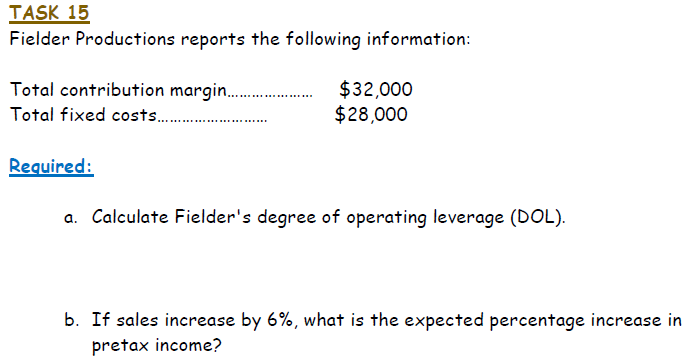

**Given:** CM = \$32,000 | FC = \$28,000

$$\text{NOI} = CM - FC = 32{,}000 - 28{,}000 = \$4{,}000$$

**a. Fielder's Degree of Operating Leverage (DOL):**

$$\colorbox{lightgreen}{$\text{DOL} = \dfrac{CM}{NOI} = \dfrac{32{,}000}{4{,}000} = \textbf{8}$}$$

**b. If sales increase by 6%, expected % increase in pretax income:**

$$\colorbox{lightyellow}{$\text{\% Profit Increase} = DOL \times \text{\% Sales Change} = 8 \times 6\% = \textbf{48\%}$}$$

> **Verification:**
> - New CM = 32,000 × 1.06 = \$33,920
> - New NOI = 33,920 − 28,000 = **\$5,920**
> - % Change = (5,920 − 4,000) / 4,000 = **48%** ✅

---
<div style="page-break-after: always;"></div>

#### Task-16

  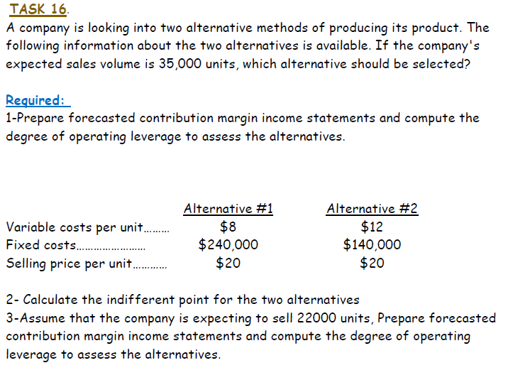

**Given:** Price = \$20, Volume = 35,000 units | Alt#1: VC=\$8, FC=\$240K | Alt#2: VC=\$12, FC=\$140K

**1- Forecasted CM Income Statement + DOL** ✅

| | **Alternative #1** | **Alternative #2** |
|:--|--:|--:|
| Sales (35,000 × \$20) | \$700,000 | \$700,000 |
| Less: Variable Costs | (280,000) | (420,000) |
| **Contribution Margin** | **\$420,000 (60%)** | **\$280,000 (40%)** |
| Less: Fixed Costs | (240,000) | (140,000) |
| **Net Operating Income** | **\$180,000** | **\$140,000** |

$$\colorbox{lightyellow}{$\text{DOL}_{Alt1} = \dfrac{CM}{NOI} = \dfrac{420{,}000}{180{,}000} = \textbf{2.33}$}$$

$$\colorbox{lightgreen}{$\text{DOL}_{Alt2} = \dfrac{CM}{NOI} = \dfrac{280{,}000}{140{,}000} = \textbf{2.00}$}$$

> **Decision at 35,000 units:** Choose **Alternative #1** — higher profit (\$180K vs \$140K) and DOL of 2.33 is acceptable since we're well above break-even.


**2- Calculate the Indifference Point (نقطة التساوي)**

> **What is it?** The sales volume where **both alternatives give the SAME profit**. Below this point one is better, above it the other is better.

$$\colorbox{lightblue}{$\text{Set: } NOI_{Alt1} = NOI_{Alt2}$}$$

$$CM_1 \times Q - FC_1 = CM_2 \times Q - FC_2$$

$$12Q - 240{,}000 = 8Q - 140{,}000$$

$$4Q = 100{,}000$$

$$\colorbox{lightgreen}{$Q = \textbf{25,000 units} \quad \Rightarrow \quad \text{Both earn } \$60{,}000$}$$

> **Verify:** Alt#1 = 12(25,000) − 240,000 = **\$60,000** | Alt#2 = 8(25,000) − 140,000 = **\$60,000** ✅
>
> **Meaning:**
> - Below 25,000 units → **Alt #2 wins** (lower FC = less risk)
> - Above 25,000 units → **Alt #1 wins** (higher CM/unit = faster profit growth)
> - Since expected sales = 35,000 > 25,000 → **choose Alt #1**
>
> **🔗 Connecting Indifference Point to DOL:**
> - Alt#1 has **higher DOL** (more FC) → this is a **double-edged sword**:
>   - ✅ **Sales ABOVE indifference point** (>25K) → High DOL = <span style="color:#36CB2F">**great opportunity!**</span> Every extra unit earns more profit faster
>   - ❌ **Sales BELOW indifference point** (<25K) → High DOL = <span style="color:#B22222">**high risk!**</span> Profit collapses because FC doesn't shrink
> - Alt#2 has **lower DOL** (more VC) → safer but slower profit growth
>
> | Sales Level | High DOL (Alt#1) | Low DOL (Alt#2) | Winner |
> |:--|:--|:--|:--|
> | Above 25K (growing) | 🚀 Profit grows **fast** | 🐢 Profit grows slowly | **Alt#1** |
> | Below 25K (declining) | 💀 Profit **destroyed** fast | 🛡️ Profit drops slowly | **Alt#2** |
> | Exactly 25K | \$60,000 | \$60,000 | Tie |
>
> - بالعربي: نقطة التساوي بتقسم القرار: لو المبيعات فوق 25,000 → اختار DOL العالي (البديل 1) عشان الربح هيزيد بسرعة. لو المبيعات تحت 25,000 → اختار DOL الواطي (البديل 2) عشان الخسارة هتبقى أقل. DOL عالي + مبيعات عالية = فرصة ذهبية 🚀 | DOL عالي + مبيعات قليلة = كارثة 💀

**3- At 22,000 units — Re-prepare CM Income Statement + DOL** ✅

| | **Alternative #1** | **Alternative #2** |
|:--|--:|--:|
| Sales (22,000 × \$20) | \$440,000 | \$440,000 |
| Less: Variable Costs | (176,000) | (264,000) |
| **Contribution Margin** | **\$264,000 (60%)** | **\$176,000 (40%)** |
| Less: Fixed Costs | (240,000) | (140,000) |
| **Net Operating Income** | **\$24,000** | **\$36,000** |

$$\colorbox{lightyellow}{$\text{DOL}_{Alt1} = \dfrac{264{,}000}{24{,}000} = \textbf{11}$}$$

$$\colorbox{lightgreen}{$\text{DOL}_{Alt2} = \dfrac{176{,}000}{36{,}000} = \textbf{4.89}$}$$

>[!IMPORTANT] Why did DOL jump from 2.33 → 11 ?!
>
> DOL is **not fixed** — it changes based on how close you are to break-even:
>
> $$\text{DOL} = \dfrac{CM}{NOI} = \dfrac{CM}{CM - FC}$$
>
> - **At 35,000 units** (far above BE): NOI = \$180K → DOL = 420K/180K = **2.33** (safe zone)
> - **At 22,000 units** (barely above BE): NOI = \$24K → DOL = 264K/24K = **11** (danger zone!)
>
> **Why?** Alt#1 break-even = FC/CM per unit = 240,000/12 = **20,000 units**
> At 22,000 you're only **2,000 units above break-even!**
>
> **What DOL = 11 means practically:**
> - If sales drop just **9%** (≈ 2,000 units) → profit drops 11 × 9% = **99%** → almost zero! 💀
> - If sales increase 10% → profit increases 11 × 10% = **110%** → doubles! 🚀
> - You're walking on a tightrope — tiny changes in sales cause massive profit swings
>
> **Compare with Alt#2:** BE = 140,000/8 = **17,500 units**
> At 22,000 you're **4,500 units above BE** → DOL = 4.89 (still risky but much safer)
>
> | | Alt#1 (DOL=11) | Alt#2 (DOL=4.89) |
> |:--|:--|:--|
> | If sales drop 5% | Profit drops **55%** → \$10,800 | Profit drops **24.4%** → \$27,200 |
> | If sales drop 9% | Profit drops **99%** → \$240 😱 | Profit drops **44%** → \$20,160 |
> | Distance from BE | Only 2,000 units | 4,500 units (safer) |
>
> **Conclusion at 22,000 units:** Now **Alt #2 wins!** — Higher profit (\$36K vs \$24K) AND lower risk (DOL = 4.89 vs 11)
>
> ---
> **بالعربي — ليه DOL اتغير من 2.33 لـ 11:**
> - DOL مش رقم ثابت! بيتغير حسب بُعدك عن نقطة التعادل
> - عند 35,000 كوب: بعيد عن التعادل → DOL = 2.33 (آمن)
> - عند 22,000 كوب: قريب جداً من التعادل (20,000) → DOL = 11 (خطر!)
> - DOL = 11 يعني: لو المبيعات نزلت 9% بس → الربح بيختفي كله تقريباً!
> - **الخلاصة:** كل ما قربت من نقطة التعادل، DOL بيزيد = الخطر بيزيد
