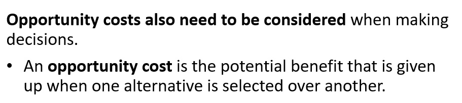
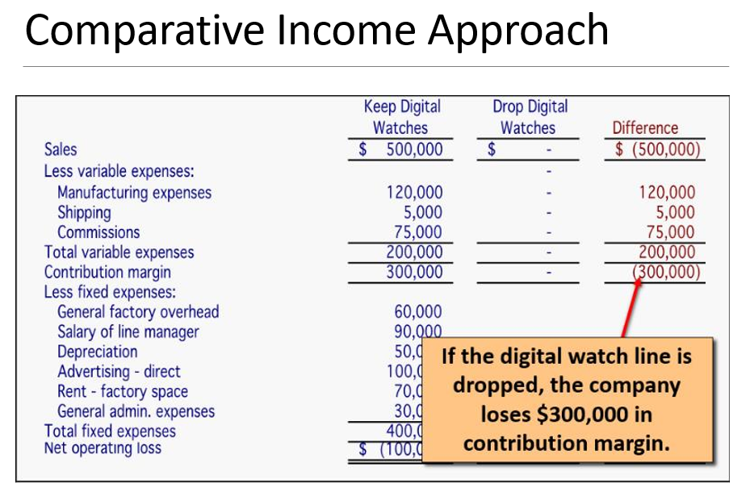
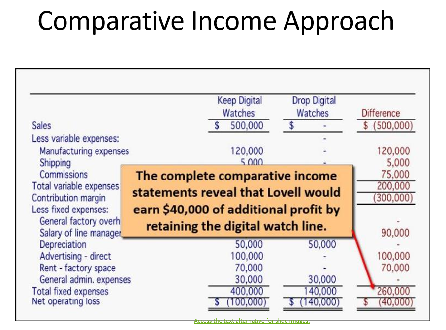
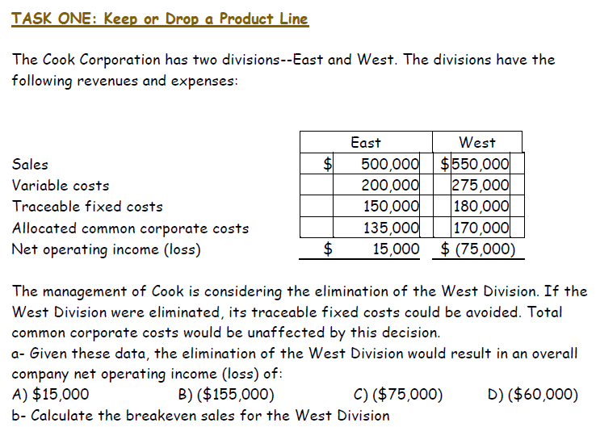
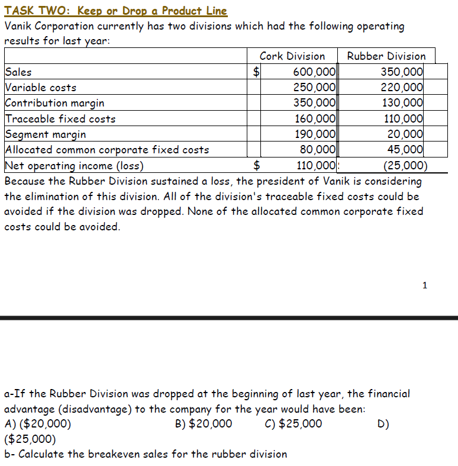
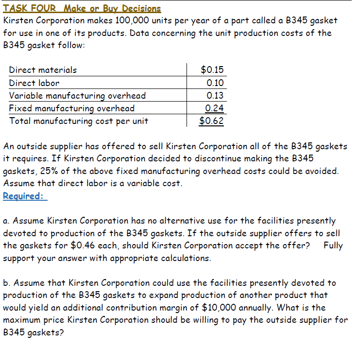

# Lec-8 - Differential Analysis: The Key to Decision Making

> Dr.Maha Ramdan (email: maha.ramdan@eslsca.edu.eg)

### Relevant and Irrelevant Costs

``

> When making a decision between two alternatives, **not all costs matter**. Only the costs that **change** between the options are relevant to your decision.

#### ✅ Relevant Costs (تكاليف مرتبطة بالقرار)

These are costs that **differ** between alternatives — they help you decide.

**1. Incremental Cost (التكلفة الإضافية):**

> An increase in cost when you choose one alternative over another.

- **Simple example:** You currently drive to work (costs \$5/day in gas). If you switch to Uber (\$15/day), the **incremental cost** = \$15 − \$5 = **\$10/day extra**
- It's the **difference** between the two options — the extra cost you'll pay if you switch

**2. Avoidable Cost (التكلفة القابلة للتجنب):**

> A cost you can **eliminate** by choosing one alternative over another.

- **Simple example:** You rent a warehouse for \$5,000/month. If you close that warehouse, you **avoid** paying \$5,000 → that rent is an **avoidable cost**
- If a cost **disappears** when you pick a different option → it's avoidable → it's **relevant** to your decision

---

#### ❌ Irrelevant Costs (تكاليف غير مرتبطة بالقرار)

These are costs that **DON'T change** no matter what you decide — ignore them!

**1. Sunk Cost (التكلفة الغارقة):**

> A cost already incurred that **cannot be recovered** regardless of what you decide.

- **Simple example:** You bought a gym membership for \$1,000 (non-refundable). Now deciding whether to go or stay home — the \$1,000 is **gone either way**. It should NOT affect your decision today.
- 🚫 **Never let sunk costs drive your decisions!** The money is spent — don't throw good money after bad just because you already paid.

**2. Future costs that don't differ between alternatives:**

> If a cost will be the **same** regardless of which option you choose → it's irrelevant.

- **Simple example:** You're deciding between two suppliers. Both require you to pay the same \$2,000 shipping fee. That shipping cost is **irrelevant** — it won't help you choose because it's identical either way.

---

> [!IMPORTANT] Decision Rule — What to Focus On
>
> |                      | **Relevant** (INCLUDE in decision)        | **Irrelevant** (IGNORE in decision)                             |
> | :------------------- | :---------------------------------------------- | :-------------------------------------------------------------------- |
> | **Definition** | Costs that**differ** between alternatives | Costs that are the**same** or already spent                     |
> | **Types**      | Incremental costs, Avoidable costs              | Sunk costs, Costs that don't differ                                   |
> | **Time**       | **Future** costs that change              | **Past** costs (already paid) or future costs that don't change |
> | **Action**     | Analyze them carefully                          | Remove them from analysis completely                                  |
>
> **The Golden Rule:**
>
> $$
> \colorbox{lightblue}{$\text{Only costs that DIFFER between alternatives affect the decision}$}
> $$
>
> - يعني لما تيجي تاخد قرار، بص بس على التكاليف اللي **هتتغير** بين الخيارات
> - لو تكلفة **اتدفعت خلاص** (sunk) → انساها — مش هترجع
> - لو تكلفة **هتتدفع في كل الحالات** بنفس المبلغ → متبصلهاش — مش هتفرق في قرارك
> - ركز بس على: إيه اللي **هيزيد** أو **هيتوفر** لو اخترت طريق بدل التاني

#### 💰 Opportunity Cost (تكلفة الفرصة البديلة)

> The **benefit you give up** when you choose one option over another.

- **Example:** You have \$100K. Option A: invest in stocks (earn 10%). Option B: open a shop. If you choose the shop, your **opportunity cost** = the \$10K you could have earned from stocks.
- It's not a cost you pay — it's a gain you **miss out on**.
- يعني تكلفة الفرصة = اللي **ضاع منك** لما اخترت حاجة بدل التانية. لو فتحت محل بدل ما تستثمر في الأسهم، الربح اللي كنت هتاخده من الأسهم دي هي تكلفة الفرصة.

### Decision Making using `<u>`Contribution Margin`</u>` Approach

``

> **Should you drop a product/segment?** Only if total company profit **increases** after dropping it.

**Decision Rule — Compare two things:**

$$
\colorbox{lightblue}{$\text{CM Lost (if dropped)} \quad \text{vs} \quad \text{FC Avoided (if dropped)}$}
$$

- If **FC Avoided > CM Lost** → ✅ **Drop it** (you save more than you lose)
- If **FC Avoided < CM Lost** → ❌ **Keep it** (you'd lose more than you save)

> **Example:** Lovell Company considers dropping its Digital Watch segment.
>
> - Digital Watch contributes **\$X** in CM → this CM is **lost** if dropped
> - Some fixed costs tied to Digital Watch (e.g. dedicated staff, lease) can be **avoided** if dropped
> - Compare: Is the avoidable FC **bigger** than the lost CM? If yes → drop. If no → keep.
>
> ⚠️ **Common trap:** A segment can show a "loss" on paper (after allocating shared FC), but still be **worth keeping** — because its CM covers some FC that won't disappear even if you drop it!
>
> - يعني لو بتفكر تشيل منتج: قارن الـ CM اللي هتخسره لو شلته مع الـ FC اللي هتوفره. لو التوفير أكبر → شيله. لو الخسارة أكبر → خليه حتى لو "شكله خسران" في التقرير.

#### Adding/Dropping Segment Example

``

|                                                                                         Investigation Finding 1                                                                                         |                                                                                         Investigation Finding 2                                                                                         |                                                                                                 Solution                                                                                                 |
| :------------------------------------------------------------------------------------------------------------------------------------------------------------------------------------------------------: | :------------------------------------------------------------------------------------------------------------------------------------------------------------------------------------------------------: | :------------------------------------------------------------------------------------------------------------------------------------------------------------------------------------------------------: |
| `` | `` | `` |
|                                                                      FC overhead & admin →**reallocated** (won't disappear)                                                                      |                                                                            Equipment →**no resale value** (sunk cost)                                                                            |                                                                           CM Lost\$300K > FC Avoided \$260K → **Keep!**                                                                           |

> **The Trap:** Digital Watches shows a **\$100,000 loss**. The naive answer is "drop it!" But that might be WRONG.

**The Income Statement — Digital Watches Segment:**

|                                   |                Amount |
| :-------------------------------- | --------------------: |
| Sales                             |             \$500,000 |
| Less: Variable Expenses           |                       |
| — Variable manufacturing costs   |             (120,000) |
| — Variable shipping costs        |               (5,000) |
| — Commissions                    |              (75,000) |
| **Total Variable Expenses** |   **(200,000)** |
| **Contribution Margin**     |   **\$300,000** |
| Less: Fixed Expenses              |                       |
| — General factory overhead       |              (60,000) |
| — Salary of line manager         |              (90,000) |
| — Depreciation of equipment      |              (50,000) |
| — Advertising - direct           |             (100,000) |
| — Rent - factory space           |              (70,000) |
| — General admin. expenses        |              (30,000) |
| **Total Fixed Expenses**    |   **(400,000)** |
| **Net Operating Loss**      | **\$(100,000)** |

---

**🧠 How to Solve This Type of Problem (Exam Steps):**

**Step 1 — Identify what is LOST if we drop (= CM lost):**

$$
\colorbox{lightyellow}{$\text{CM Lost} = \$300{,}000$}
$$

If we drop Digital Watches, we lose all \$500K in sales AND save all \$200K in variable costs → net loss = **\$300K of CM gone**.

**Step 2 — Classify each Fixed Cost: Avoidable or Unavoidable?**

> **Investigation reveals:**
>
> - The **fixed general factory overhead** and **general administrative expenses** will **not be affected** by dropping the digital watch line → they will be **reallocated to other product lines**
> - The **equipment** used to manufacture digital watches has **no resale value or alternative use** → depreciation is a pure sunk cost with zero opportunity cost

| Fixed Cost                        | Avoidable?      | Why? (Exam clue)                                              |
| :-------------------------------- | :-------------- | :------------------------------------------------------------ |
| General factory overhead\$60,000  | ❌**No**  | "will not be affected" —**reallocated** to other lines |
| Salary of line manager\$90,000    | ✅**Yes** | **Direct/traceable** — manager fired if line dropped   |
| Depreciation of equipment\$50,000 | ❌**No**  | **Sunk** + no resale value + no alternative use         |
| Advertising - direct\$100,000     | ✅**Yes** | "**direct**" — no product = no ads needed              |
| Rent - factory space\$70,000      | ✅**Yes** | **Segment-specific** — can cancel the lease            |
| General admin. expenses\$30,000   | ❌**No**  | "will not be affected" —**reallocated** to other lines |

**Step 3 — Sum the Avoidable Fixed Costs:**

$$
\colorbox{lightyellow}{$\text{FC Avoided} = 90{,}000 + 100{,}000 + 70{,}000 = \$260{,}000$}
$$

**Step 4 — Compare & Decide:**

$$
\colorbox{lightblue}{$\text{CM Lost} = \$300{,}000 \quad > \quad \text{FC Avoided} = \$260{,}000$}
$$

$$
\colorbox{lightgreen}{$\text{Net disadvantage of dropping} = 300{,}000 - 260{,}000 = \textbf{\$40,000 worse off}$}
$$

> ❌ **DO NOT DROP!** If we drop Digital Watches, the company loses \$40,000 more profit than it saves.
>
> **Why?** The segment shows a "\$100K loss" on paper, but that includes **\$140K of unavoidable FC**:
>
> - Factory overhead (\$60K) + Admin (\$30K) = **reallocated** to other product lines (won't disappear!)
> - Depreciation (\$50K) = **sunk** cost — equipment has no resale value and no alternative use
>
> These \$140K will burden the remaining segments regardless → the "loss" is an illusion caused by cost allocation.

---

> [!IMPORTANT] Exam Problem-Solving Framework
>
> **When you see "Should we drop this segment?" in an exam:**
>
> 1. ✅ Find **CM of the segment** (Sales − Variable Costs) → this is what you **LOSE**
> 2. ✅ Go through **each fixed cost** and ask: "Does this cost **disappear** if we drop?" → Yes = Avoidable
> 3. ✅ Sum all **avoidable FC** → this is what you **SAVE**
> 4. ✅ Compare: **CM Lost vs FC Avoided**
>    - CM Lost > FC Avoided → **KEEP** (dropping makes you worse off)
>    - CM Lost < FC Avoided → **DROP** (dropping makes you better off)
>
> **How to identify Avoidable vs Unavoidable:**
>
> - ✅ **Avoidable:** Direct salary, direct advertising, segment-specific rent, direct supervision
> - ❌ **Unavoidable:** Allocated overhead, depreciation (sunk), shared admin, company-wide costs
>
> **Key clue words in exams:**
>
> - "allocated" / "common" / "shared" → usually **unavoidable**
> - "direct" / "traceable" / "can be eliminated" → usually **avoidable**
> - بالعربي: لما تشوف سؤال "نشيل المنتج ده؟":
>
>   1. احسب الـ CM اللي هتخسره
>   2. شوف كل تكلفة ثابتة: هتختفي لو شلت المنتج؟ → لو أيوه = avoidable
>   3. قارن: CM المفقود أكبر ولا FC الموفر أكبر؟
>   4. لو CM > FC → **متشيلش!** (حتى لو شكله خسران في التقرير)

### Decision Making using `<u>`Comparative Income`</u>` Approach

> **This is the same Digital Watches problem but solved differently** — instead of comparing CM Lost vs FC Avoided, we build **two full income statements side by side** and compare.

**The Comparative Income Statement:**

|                                   |  Keep Digital Watches |  Drop Digital Watches |            Difference |
| :-------------------------------- | --------------------: | --------------------: | --------------------: |
| Sales                             |             \$500,000 |                   \$0 |           (\$500,000) |
| Less: Variable Expenses           |                       |                       |                       |
| — Manufacturing                  |             (120,000) |                    — |               120,000 |
| — Shipping                       |               (5,000) |                    — |                 5,000 |
| — Commissions                    |              (75,000) |                    — |                75,000 |
| **Total Variable Expenses** |   **(200,000)** |          **—** |     **200,000** |
| **Contribution Margin**     |   **\$300,000** |          **—** | **(\$300,000)** |
| Less: Fixed Expenses              |                       |                       |                       |
| — General factory overhead       |              (60,000) |              (60,000) |                    — |
| — Salary of line manager         |              (90,000) |                    — |                90,000 |
| — Depreciation                   |              (50,000) |              (50,000) |                    — |
| — Advertising - direct           |             (100,000) |                    — |               100,000 |
| — Rent - factory space           |              (70,000) |                    — |                70,000 |
| — General admin. expenses        |              (30,000) |              (30,000) |                    — |
| **Total Fixed Expenses**    |   **(400,000)** |   **(140,000)** |     **260,000** |
| **Net Operating Loss**      | **\$(100,000)** | **\$(140,000)** |  **\$(40,000)** |

**How to read this:**

- **"Drop" column:** Only unavoidable FC remain (\$60K overhead + \$50K depreciation + \$30K admin = \$140K). All revenue and variable costs go to zero. Avoidable FC disappear.
- **"Difference" column:** Shows the net impact of dropping → company is **\$40,000 worse off**!
- The loss goes from \$100K → \$140K — meaning the "loss" actually **gets bigger** if you drop!

$$
\colorbox{lightgreen}{$\text{Difference in Net Income} = (-100{,}000) - (-140{,}000) = +\$40{,}000 \text{ in favor of KEEPING}$}
$$

> **Why does loss increase from \$100K to \$140K after dropping?**
>
> - Before: the \$300K CM was covering \$260K of avoidable FC **plus** \$40K toward the unavoidable FC
> - After: no CM coming in, but \$140K unavoidable FC still must be paid → pure loss of \$140K
> - The segment was "helping" pay \$40K of shared costs even while showing a "loss"

---

> [!IMPORTANT] Comparative Income vs Contribution Margin Approach
>
> |                        | **CM Approach** (faster)                  | **Comparative Income** (more detailed)             |
> | :--------------------- | :---------------------------------------------- | :------------------------------------------------------- |
> | **Method**       | Compare CM Lost vs FC Avoided directly          | Build two full income statements side by side            |
> | **Answer**       | \$300K − \$260K = **\$40K disadvantage** | −\$100K vs −\$140K = **\$40K disadvantage**      |
> | **Best for**     | Quick decisions, exam speed                     | Full picture, when boss wants to see complete financials |
> | **Same answer?** | ✅**Always yes** — both give \$40K       | ✅**Always yes**                                   |
>
> - بالعربي: الطريقة دي بتعمل قائمة دخل كاملة لكل سيناريو (خلي المنتج / شيله) وبتقارن. النتيجة واحدة: الشركة هتخسر 40,000 زيادة لو شالت الساعات. الفرق إن الطريقة دي بتوريك الصورة الكاملة — فين الفلوس رايحة وفين جاية.

``
``

---

#### Task-1

**Given:** East (Sales=\$500K, VC=\$200K, Traceable FC=\$150K, Allocated=\$135K, NOI=\$15K) | West (Sales=\$550K, VC=\$275K, Traceable FC=\$180K, Allocated=\$170K, NOI=−\$75K)

> **Key info:** If West eliminated → traceable FC **can be avoided**, common corporate costs **unaffected**

**a. If West is eliminated → overall company NOI?**

**Method 1 — CM Approach (fast):**

$$
\text{West CM} = 550{,}000 - 275{,}000 = \$275{,}000
$$

$$
\text{Avoidable FC} = \$180{,}000 \text{ (traceable only)}
$$

$$
\colorbox{lightyellow}{$\text{Disadvantage of dropping} = CM_{Lost} - FC_{Avoided} = 275{,}000 - 180{,}000 = \$95{,}000$}
$$

$$
\text{Current Total NOI} = 15{,}000 + (-75{,}000) = -\$60{,}000
$$

$$
\colorbox{lightgreen}{$\text{New Company NOI} = -60{,}000 - 95{,}000 = \textbf{-\$155,000}$}
$$

**Method 2 — Comparative Income (your method):** ✅

|                                      | East Only (after dropping West) |
| :----------------------------------- | ------------------------------: |
| Sales                                |                       \$500,000 |
| Variable Costs                       |                       (200,000) |
| Traceable FC                         |                       (150,000) |
| Allocated Common Costs (135K + 170K) |                       (305,000) |
| **Net Operating Loss**         |           **(\$155,000)** |

> West's \$170K allocated costs don't disappear — they get **reallocated** to East → East now bears \$305K total.

$$
\colorbox{lightgreen}{$\text{Answer: (B) } \$155{,}000 \text{ loss}$}
$$

---

**b. Break-Even for West Division:**

$$
\text{West CM Ratio} = \dfrac{550{,}000 - 275{,}000}{550{,}000} = \dfrac{275{,}000}{550{,}000} = 50\%
$$

$$
\colorbox{lightblue}{$\text{Break-Even} = \dfrac{FC_{Total}}{CM Ratio} = \dfrac{180{,}000 + 170{,}000}{0.50} = \dfrac{350{,}000}{0.50} = \textbf{\$700,000}$}
$$

> West needs \$700K in sales to cover all its assigned costs (traceable + allocated).

---

#### Task-2

**Given:** Cork (Sales=\$600K, VC=\$250K, CM=\$350K, Traceable FC=\$160K, Allocated=\$80K, NOI=\$110K) | Rubber (Sales=\$350K, VC=\$220K, CM=\$130K, Traceable FC=\$110K, Allocated=\$45K, NOI=−\$25K)

> **Key info:** All traceable FC **can be avoided**. **None** of the allocated common corporate FC could be avoided.

**a. Financial advantage (disadvantage) of dropping Rubber Division:**

$$
\text{Rubber CM Lost} = 350{,}000 - 220{,}000 = \$130{,}000
$$

$$
\text{Avoidable FC} = \$110{,}000 \text{ (all traceable FC)}
$$

$$
\colorbox{lightyellow}{$\text{Disadvantage of dropping} = CM_{Lost} - FC_{Avoided} = 130{,}000 - 110{,}000 = \textbf{\$20,000}$}
$$

$$
\colorbox{lightgreen}{$\text{Answer: (A) } (\$20{,}000) \text{ disadvantage — do NOT drop}$}
$$

> The Rubber Division's CM (\$130K) exceeds its avoidable costs (\$110K) by \$20K → it's contributing \$20K toward common costs. Dropping it makes the company \$20K worse off.

> **Shortcut check:** Segment Margin = CM − Traceable FC = 130K − 110K = **\$20K** > 0 → Keep! (Segment margin is positive = segment is covering its own traceable costs and contributing toward shared costs)

---

**b. Break-Even for Rubber Division:**

$$
\text{CM Ratio} = \dfrac{130{,}000}{350{,}000} = 37.14\%
$$

$$
\colorbox{lightblue}{$\text{Break-Even} = \dfrac{FC_{Total}}{CM Ratio} = \dfrac{110{,}000 + 45{,}000}{0.3714} = \dfrac{155{,}000}{0.3714} = \textbf{\$417,339}$}
$$

---

### Make or Buy Decision

A **"Make or Buy" decision** is when a company decides whether to **manufacture** a component/part **internally** or **purchase** it **externally** from an outside supplier.

> A company involved in more than one activity in the entire value chain is called ``**vertically integrated**. The decision to carry out an activity internally rather than buy externally from a supplier = **"Make or Buy" decision**.

``

> **بالعربي:** قرار "اصنع أو اشتري" = هل الشركة تصنع الجزء بنفسها ولا تشتريه من مورّد خارجي؟ نقارن التكلفة القابلة للتجنب (لو صنعنا) مع سعر الشراء من بره.

---

#### Example: Essex Company — Make or Buy Part 4A

**Essex Company** manufactures **Part 4A** that is used internally in one of its products. The company produces **20,000 parts per year**.

**Unit Product Cost breakdown:**

| Cost Item                         |    Per Unit    |
| :-------------------------------- | :------------: |
| Direct Materials                  |      \$9      |
| Direct Labor                      |      \$5      |
| Variable Overhead                 |      \$1      |
| Depreciation of special equipment |      \$3      |
| Supervisor's salary               |      \$2      |
| General factory overhead          |      \$10      |
| **Total Unit Product Cost** | **\$30** |

``

**Investigation findings (key facts):**

1. The special equipment has **no resale value** → Depreciation (\$3/unit) is a ``**sunk cost → IRRELEVANT**
2. General factory overhead is **allocated on the basis of direct labor hours** and would be ``**unaffected by this decision → IRRELEVANT** (it continues whether we make or buy)
3. An outside supplier has offered to provide the 20,000 parts at **\$25 per part**

$$
\colorbox{lightyellow}{Should the company stop making Part 4A and buy it from the outside supplier?}
$$

``

---

#### Solution: Identify Relevant (Avoidable) Costs

> [!IMPORTANT] The Decision Rule
>
> - Only compare **avoidable costs** of making vs. the **purchase price** of buying
> - Costs that will **continue regardless** of the decision are **irrelevant** (ignore them!)
> - ~~Depreciation~~ → Sunk (equipment has no resale value)
> - ~~Allocated General Factory OH~~ → Unaffected (common cost allocated to all products)

| Cost Item                      | Per Unit | Make (20,000 units) |         Buy         |
| :----------------------------- | :-------: | :-----------------: | :-----------------: |
| Outside purchase price         |   \$25   |                    | **\$500,000** |
| Direct Materials               |    \$9    |      \$180,000      |                    |
| Direct Labor                   |    \$5    |      \$100,000      |                    |
| Variable Overhead              |    \$1    |      \$20,000      |                    |
| ~~Depreciation of equip.~~    | ~~\$3~~ |         —         |                    |
| Supervisor's salary            |    \$2    |      \$40,000      |                    |
| ~~Allocated gen. factory OH~~ | ~~\$10~~ |         —         |                    |
| **Total Relevant Cost**  |          | **\$340,000** | **\$500,000** |

``

``

---

#### The Decision

$$
\colorbox{lightgreen}{Financial advantage of Making = \$500,000 - \$340,000 = \textbf{\$160,000}}
$$

> **Conclusion:** Since the total avoidable costs of making (\$340,000) are **less than** the cost of buying (\$500,000), Essex should **continue to MAKE** Part 4A.
>
> The company saves **\$160,000** by making internally.

``

---

#### Opportunity Cost in Make or Buy Decisions

``

**What if the space used to make Part 4A had an alternative use?**

An ``**opportunity cost** is the **benefit that is foregone** (given up) as a result of pursuing some course of action. It is **NOT** an actual cash outlay and is **NOT recorded** in the formal accounting records.

> [!IMPORTANT] Opportunity Cost in Make or Buy
> If the factory space currently used to make Part 4A could be used for **something else** (e.g., produce another profitable product), then:
>
> $$
> \colorbox{lightblue}{Opportunity Cost = Segment Margin from the \textbf{best alternative use} of the space}
> $$
>
> This opportunity cost would be **added to the "Make" cost** when comparing:
>
> $$
> \text{True Cost of Making} = \text{Avoidable Costs} + \text{Opportunity Cost}
> $$
>
> If the True Cost of Making > Buy Price → **switch to BUY**

**Example:** If Essex could earn a \$200,000 segment margin using the space for another product:

- Make cost = \$340,000 + \$200,000 (opportunity cost) = **\$540,000**
- Buy cost = **\$500,000**
- Now buying is cheaper! → Switch to **BUY** (\$40,000 advantage)

> **بالعربي:** تكلفة الفرصة البديلة = الربح اللي هتخسره لو فضلت تصنّع بدل ما تستخدم المساحة/الموارد في حاجة تانية أربح. لو المساحة ممكن تستخدم في منتج تاني يكسبك أكتر، لازم تضيف الكسب ده على تكلفة التصنيع وتقارن تاني.

---

#### Task-4

**a. Should Kirsten Corporation accept the offer? (No alternative use for facilities)**

> [!IMPORTANT] Key Investigation Facts
>
> - Direct labor = **variable cost** → avoidable
> - Only **25%** of Fixed Mfg OH is avoidable → $0.24 × 25\% = \$0.06/unit$
> - The remaining **75%** of Fixed Mfg OH **continues regardless** → **IRRELEVANT**

| Cost Item                           |  Per Unit  |  Make (Avoidable)  |        Buy        |
| :---------------------------------- | :---------: | :----------------: | :----------------: |
| Outside purchase price              |   \$0.46   |                    | **\$46,000** |
| Direct Materials                    |   \$0.15   |      \$15,000      |                    |
| Direct Labor                        |   \$0.10   |      \$10,000      |                    |
| Variable Mfg Overhead               |   \$0.13   |      \$13,000      |                    |
| Fixed Mfg OH (25% avoidable)        |   \$0.06   |      \$6,000      |                    |
| ~~Fixed Mfg OH (75% unavoidable)~~ | ~~\$0.18~~ |         —         |                    |
| **Total Relevant Cost**       |            | **\$44,000** | **\$46,000** |

$$
\colorbox{lightgreen}{Financial Advantage of Making = \$46,000 - \$44,000 = \textbf{\$2,000}}
$$

> **Decision:** **REJECT** the supplier's offer. Kirsten should **continue making** Part B345.
> Making saves \$2,000 compared to buying.

---

**b. Maximum price Kirsten should pay the outside supplier (with \$10,000 CM alternative use)**

$$
\colorbox{lightblue}{$Max\ Price = \dfrac{\text{Avoidable Costs} + \text{Opportunity Cost}}{\text{Units}}$}
$$

$$
\text{Max Price} = \dfrac{\$44,000 + \$10,000}{100,000} = \dfrac{\$54,000}{100,000} = \textbf{\$0.54 per unit}
$$

> At any price **above \$0.54**, Kirsten should make internally.
> At any price **at or below \$0.54**, Kirsten should buy from the supplier.

---

### 📋 Lec-8 Summary — All Decision Rules & Formulas

---

#### 1. Relevant vs Irrelevant Costs

| | **Relevant** (USE in decision) | **Irrelevant** (IGNORE) |
|:---|:---|:---|
| **Definition** | Costs that **differ** between alternatives | Costs that are the **same** or already spent |
| **Types** | Incremental costs, Avoidable costs | Sunk costs, Costs that don't differ |
| **Exam clue words** | "direct", "traceable", "can be eliminated" | "allocated", "common", "shared", "no resale value" |

$$\colorbox{lightblue}{$\text{Only costs that DIFFER between alternatives affect the decision}$}$$

---

#### 2. Drop or Keep a Segment (CM Approach)

$$\colorbox{lightblue}{$\text{Compare: CM Lost (if dropped) vs FC Avoided (if dropped)}$}$$

| Outcome | Decision |
|:---|:---|
| FC Avoided **>** CM Lost | ✅ **DROP** (you save more than you lose) |
| FC Avoided **<** CM Lost | ❌ **KEEP** (you'd lose more than you save) |

$$\colorbox{lightyellow}{$\text{Net Disadvantage of Dropping} = \text{CM Lost} - \text{FC Avoided}$}$$

**Shortcut:** If the problem gives a **Segment Margin** → that IS the disadvantage of dropping (when all traceable FC are avoidable)

**Break-Even Sales (to justify keeping):**

$$\colorbox{lightblue}{$\text{BE Sales} = \dfrac{\text{Avoidable FC}}{\text{CM Ratio}}$}$$

---

#### 3. Drop or Keep a Segment (Comparative Income Approach)

| Step | Action |
|:---|:---|
| 1 | Build **full income statement** for "Keep" scenario |
| 2 | Build **full income statement** for "Drop" scenario (only unavoidable FC remain) |
| 3 | Compare total NOI → bigger NOI wins |

> Both approaches **always give the same answer**.

---

#### 4. Make or Buy Decision

$$\colorbox{lightblue}{$\text{Compare: Avoidable Cost of Making vs Purchase Price of Buying}$}$$

| Outcome | Decision |
|:---|:---|
| Avoidable Make Cost **<** Buy Price | ✅ **MAKE** internally |
| Avoidable Make Cost **>** Buy Price | ✅ **BUY** externally |

**Identifying relevant costs when making:**

| ✅ Avoidable (relevant) | ❌ Irrelevant |
|:---|:---|
| Direct Materials | Depreciation (if no resale value → sunk) |
| Direct Labor (if variable) | Allocated factory OH (if unaffected) |
| Variable Overhead | Any cost that continues regardless |
| Supervisor salary (if direct/traceable) | |
| Avoidable portion of Fixed OH | Unavoidable portion of Fixed OH |

---

#### 5. Opportunity Cost in Make or Buy

$$\colorbox{lightblue}{$\text{True Cost of Making} = \text{Avoidable Costs} + \text{Opportunity Cost}$}$$

$$\colorbox{lightyellow}{$\text{Opportunity Cost} = \text{Segment Margin from the best alternative use of the space/resources}$}$$

**Maximum price willing to pay an outside supplier:**

$$\colorbox{lightblue}{$\text{Max Price} = \dfrac{\text{Avoidable Costs} + \text{Opportunity Cost}}{\text{Units}}$}$$

---

#### 6. Quick Reference — Exam Clue Words

| Clue Word in Problem | Meaning | Classification |
|:---|:---|:---|
| "allocated" / "common" / "shared" | Cost is spread across segments | **Unavoidable → IRRELEVANT** |
| "direct" / "traceable" / "can be eliminated" | Cost belongs to this segment only | **Avoidable → RELEVANT** |
| "no resale value" / "already purchased" | Cannot recover the money | **Sunk → IRRELEVANT** |
| "will not be affected" / "unaffected" | Stays the same either way | **Non-differing → IRRELEVANT** |
| "X% of FC could be avoided" | Only that % is relevant | **Partially avoidable** |
| "alternative use" / "could use the space for..." | Opportunity cost exists | **Add to Make cost** |
