# Lec-9 - Assigning Cost to Product

> Dr.Maha Ramdan (email: maha.ramdan@eslsca.edu.eg)

---

### Two Cost Accounting Systems

There are **two** systems companies use to track how much it costs to make their products:

| | **Job-Order Costing** | **Process Costing** |
|:---|:---|:---|
| **What it makes** | Custom, unique jobs/orders | Continuous, identical units |
| **Production style** | By order (one at a time or small batches) | Mass production (large volume) |
| **Volume** | Low | High |
| **Standardization** | Low (each job is different) | High (all units are the same) |
| **Examples** | Custom furniture, car manufacturing, construction, consulting | Paper, water bottles, cement, oil refining |
| **Cost tracking** | Costs tracked **per job** | Costs tracked **per process/department** |

> **بالعربي:** نظام الـ Job-Order = كل طلبية ليها تكلفة مختلفة (زي ورشة موبيليا كل طلب مختلف). نظام الـ Process = كل الوحدات زي بعض (زي مصنع مياه معدنية كل ازازة زي التانية).

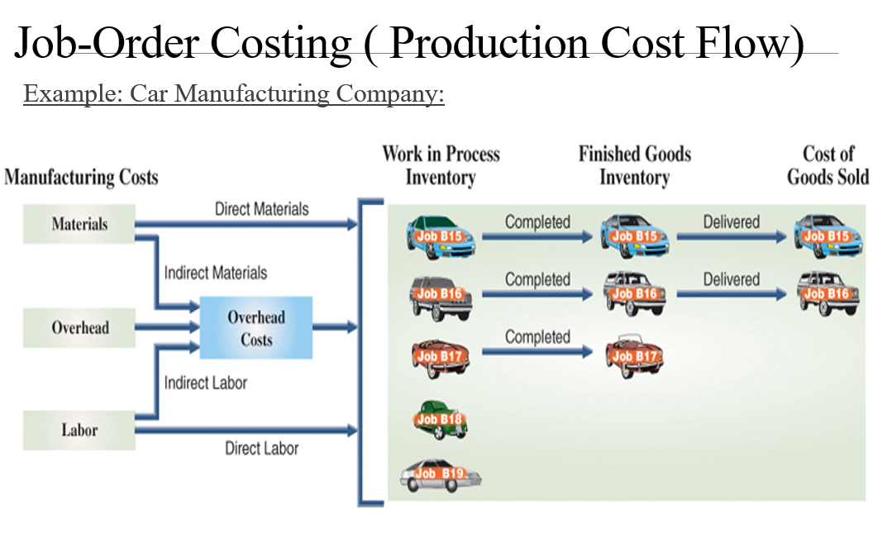

**This lecture focuses on Job-Order Costing.**

---

### Components of Manufacturing Cost

Every product's cost has **3 components:**

| # | Component | Description | Traceable to Job? |
|:---|:---|:---|:---:|
| 1 | **Direct Materials (DM)** | Raw inputs used in production (wood, steel, fabric) | ✅ Yes — physically traceable |
| 2 | **Direct Labor (DL)** | Wages of workers who **directly** make the product | ✅ Yes — traceable via time tickets |
| 3 | **Manufacturing Overhead (MOH)** | **Indirect** costs: rent, utilities, depreciation, supervisor salary, indirect materials, indirect labor | ❌ No — **shared** across all jobs |

$$\colorbox{lightblue}{$\text{Total Product Cost} = \text{DM} + \text{DL} + \text{MOH}$}$$

> **The Problem with MOH:** You can easily trace how much wood (DM) and how many labor hours (DL) went into Job A-143. But how do you split the factory rent or electricity bill across 50 different jobs? You **can't trace** it → you must **ALLOCATE** it using a rate.

> **بالعربي:** تكلفة المنتج = مواد مباشرة + عمالة مباشرة + تكاليف صناعية غير مباشرة. المشكلة إن التكاليف غير المباشرة (إيجار المصنع، كهرباء، إهلاك) مشتركة بين كل الطلبات ومش ممكن تتبعها لطلب واحد → لازم نوزعها بمعدل تحميل.

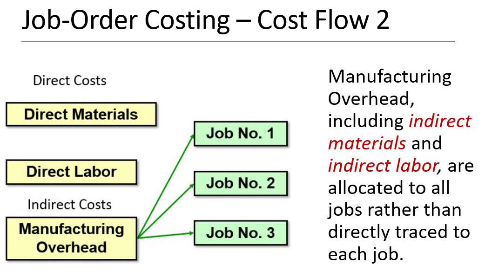

---

### Cost Assignment — Direct vs Indirect

| | **Direct Costs** | **Indirect Costs** |
|:---|:---|:---|
| **Method** | **Physically Traced** to the cost object | **Allocated** using a cost-allocation base |
| **Examples** | DM, DL | MOH (rent, depreciation, utilities, indirect labor) |
| **Accuracy** | High — you know exactly what went where | Lower — depends on how good your allocation base is |

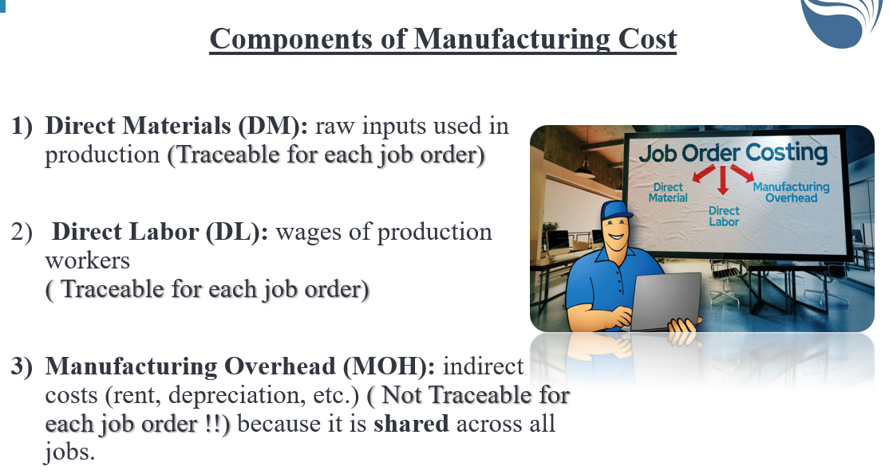

---

### Job-Order Costing — Production Cost Flow

$$\text{Manufacturing Costs} \xrightarrow{\text{added to}} \text{Work in Process (WIP)} \xrightarrow{\text{completed}} \text{Finished Goods} \xrightarrow{\text{sold}} \text{COGS}$$

**How it works:**

1. **DM** → When materials are requisitioned (requested) for a specific job, the cost is recorded on that job's **Job Cost Sheet**
2. **DL** → Workers fill out **time tickets** showing hours worked on each job → labor cost goes to that job
3. **MOH** → Cannot be traced → **applied** (allocated) to each job using a **predetermined rate**
4. When the job is **completed** → total cost moves from WIP to **Finished Goods Inventory**
5. When the job is **sold** → cost moves from Finished Goods to **Cost of Goods Sold (COGS)**

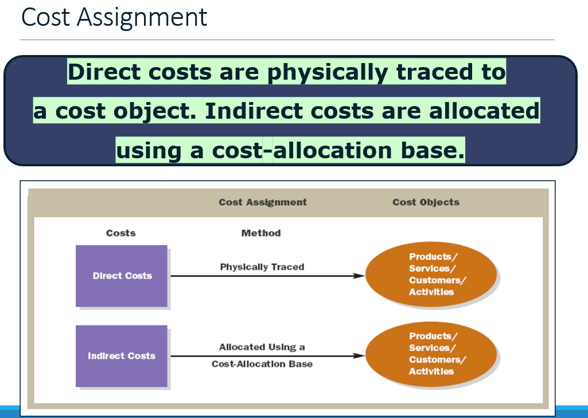

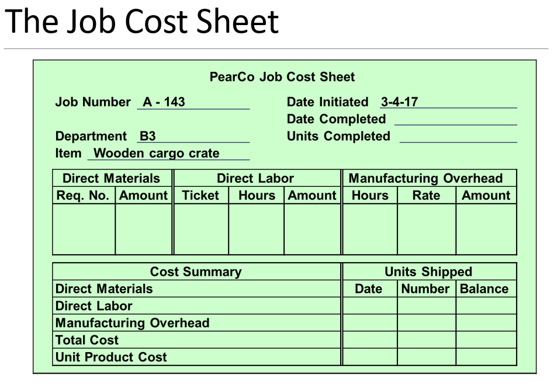

---

### The Job Cost Sheet

The **Job Cost Sheet** is the document that tracks ALL costs for a specific job. Think of it as a "receipt" for each job.

**Example — PearCo Job A-143 (Wooden Cargo Crate):**

| | Direct Materials | Direct Labor | Manufacturing OH |
|:---|:---:|:---:|:---:|
| **Source Doc** | Materials Requisition Form | Employee Time Ticket | Predetermined OH Rate |
| **Amount** | \$116 | \$120 (8 hrs × \$15/hr) | \$32 (8 hrs × \$4/hr) |

| Cost Summary | Amount |
|:---|---:|
| Direct Materials | \$116 |
| Direct Labor | \$120 |
| Manufacturing Overhead | \$32 |
| **Total Cost** | **\$268** |
| **Unit Product Cost** (2 units) | **\$134** |

> **How did they get MOH = \$32?** The worker spent 8 direct labor hours on this job. The OH rate is \$4/DLH. So: $8 \times \$4 = \$32$. That's the overhead **applied** to this job.

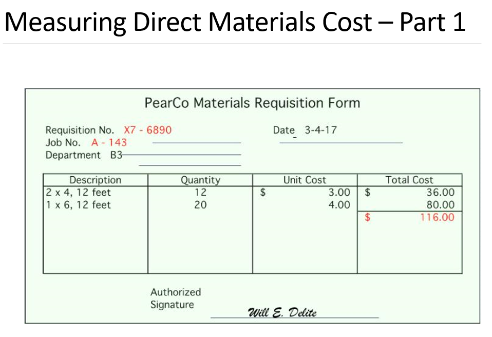

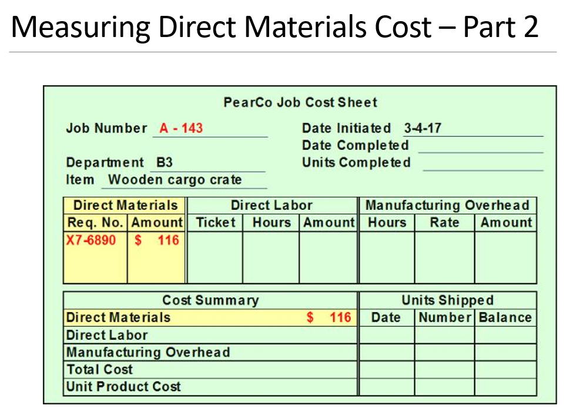

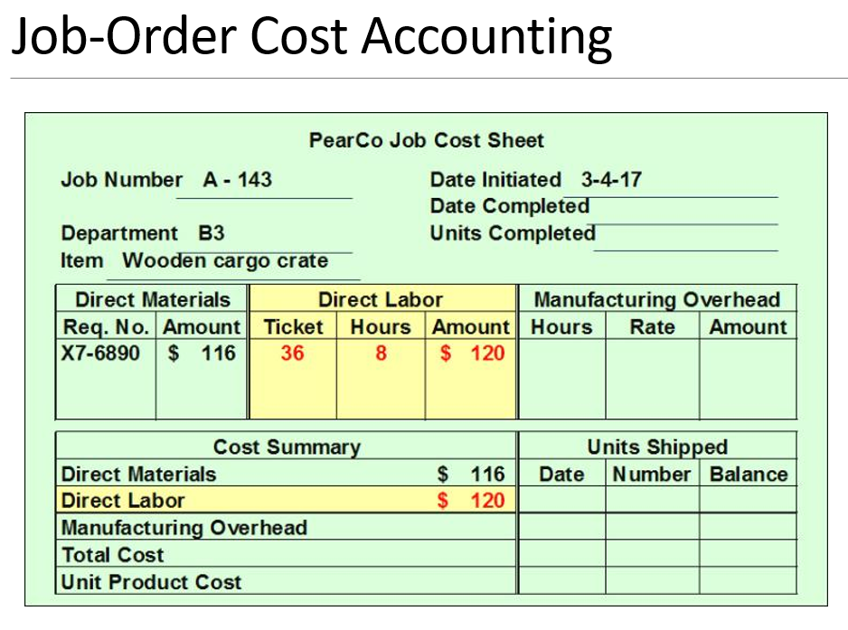

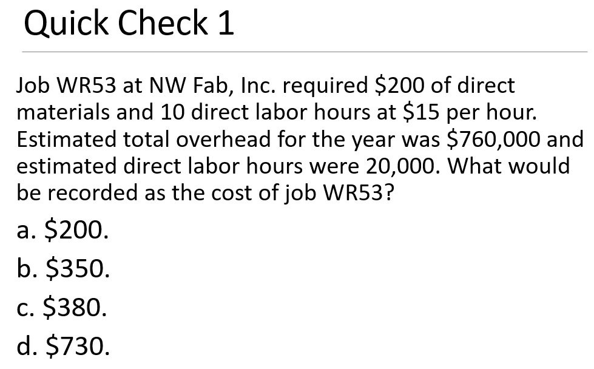

---
  
### Predetermined Overhead Rate (POHR)

#### 🧠 Let's understand the PROBLEM first

Imagine you own a furniture factory. You got 3 orders today:
- **Job 1:** Make 2 wooden tables
- **Job 2:** Make 10 chairs
- **Job 3:** Make 1 custom bookshelf

For each job, you easily know:
- ✅ **How much wood** you used → Direct Materials (you weigh it, count the boards)
- ✅ **How many hours** your workers spent → Direct Labor (they clock in/out per job)

But **what about the factory rent (\$10,000/month)?** Or **electricity (\$3,000/month)?** Or **machine depreciation?**

These costs are **NOT for one specific job** — they're for the **whole factory**. You can't say "this \$10K rent is for the tables" because ALL jobs share the same factory.

$$\colorbox{lightyellow}{$\text{This is the OVERHEAD problem: shared costs that benefit ALL jobs equally}$}$$

#### The Solution: Create a "Rate" to Split Overhead Fairly

Think of it like splitting a restaurant bill between friends. You need a **fair basis** to divide. In manufacturing, we pick something measurable — usually **hours worked**.

$$\colorbox{lightblue}{$\text{POHR} = \dfrac{\text{Estimated Total Overhead for the Year}}{\text{Estimated Total Hours for the Year}}$}$$

> **POHR** = Predetermined Overhead Rate = the amount of overhead we charge **per hour** of work

#### 🔑 Why "Predetermined" (= calculated BEFORE the year starts)?

| Problem | Why we can't wait until year-end |
|:---|:---|
| **Timing** | A customer orders in January. You need to quote a price NOW. But you won't know actual overhead until December! |
| **Seasonal swings** | Heating costs spike in winter. If you used actual monthly OH, the same chair would cost more in January than July — nonsense! |

> **So at the START of the year**, management **estimates**: "We think our total overhead will be \$640,000 and our workers will work about 160,000 hours total."

#### Example: PearCo

$$\text{POHR} = \dfrac{\$640{,}000 \text{ (estimated OH)}}{160{,}000 \text{ DLH (estimated hours)}} = \textbf{\$4 per direct labor hour}$$

**What does \$4/DLH mean in plain English?**
> For every 1 hour a worker spends on YOUR job, we charge your job **\$4 extra** for rent, electricity, depreciation, etc. — because your job was **using** the factory during that hour.

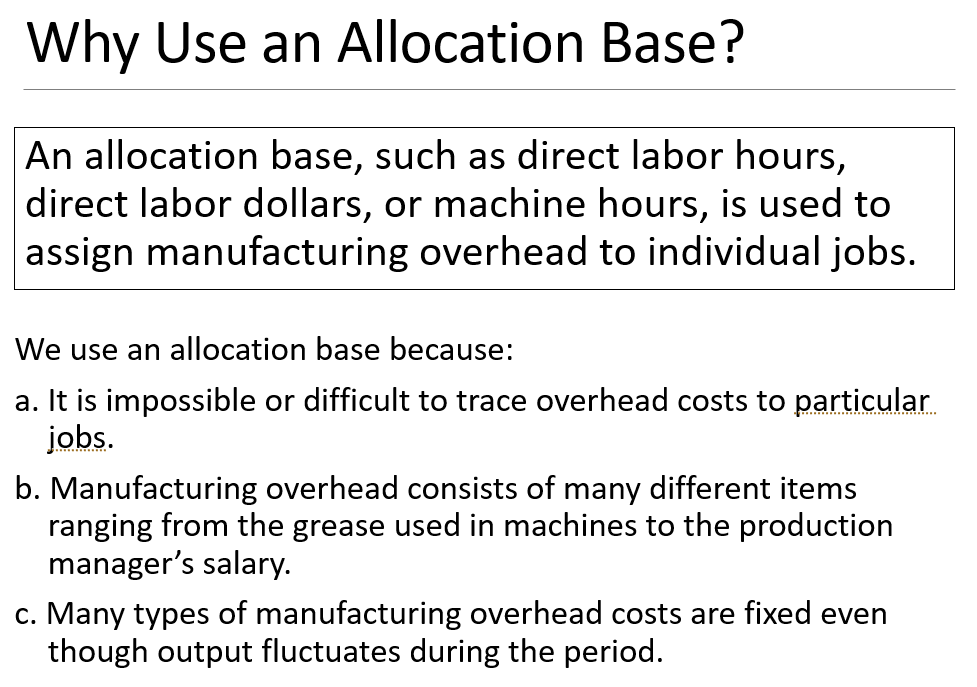

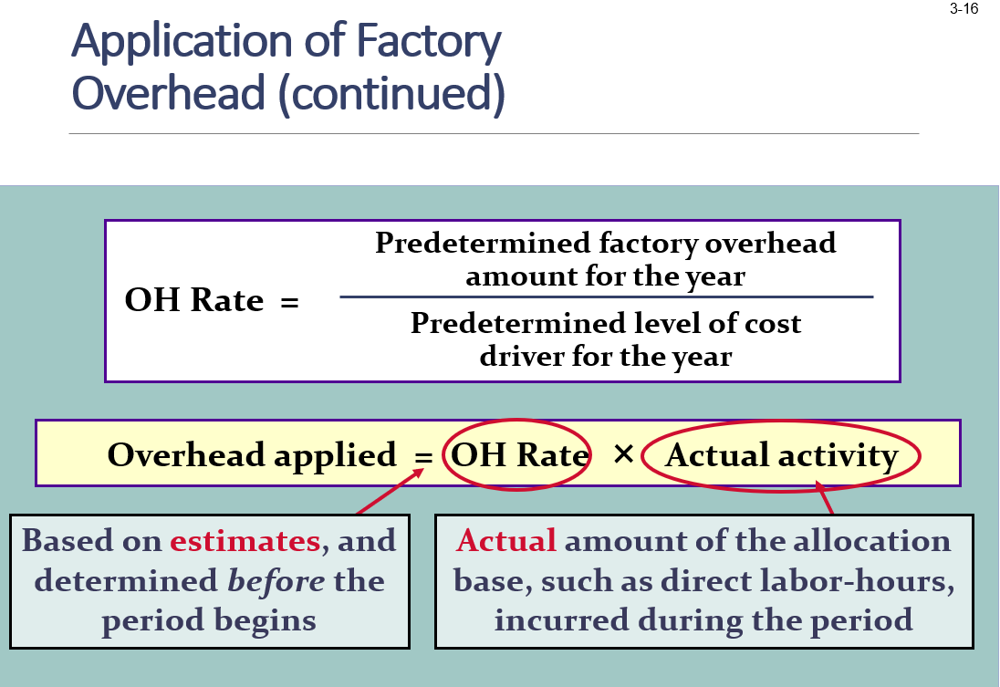

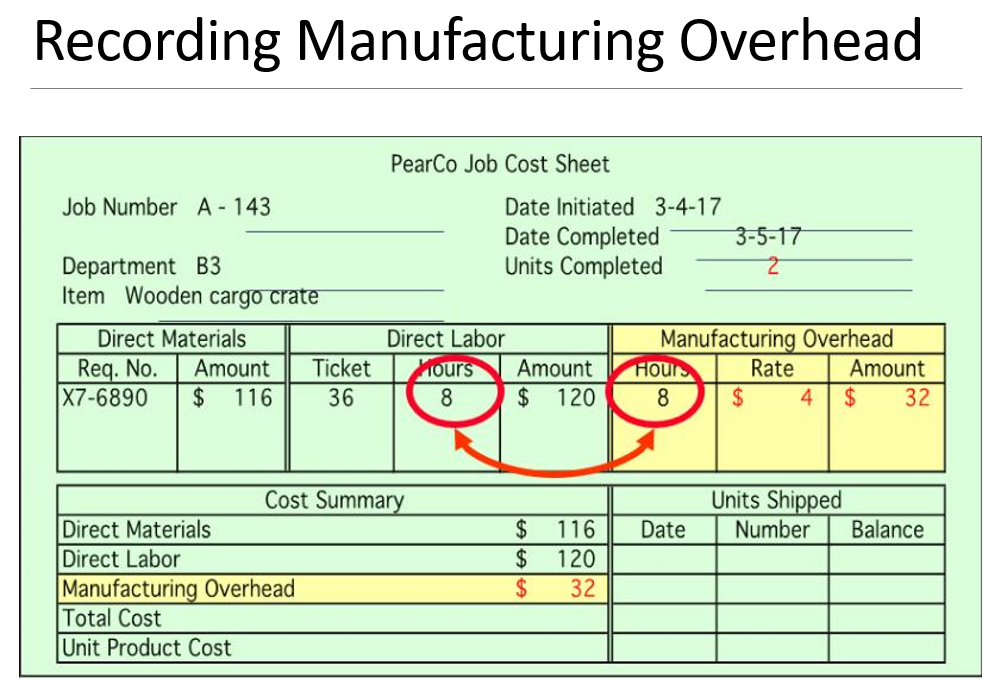

#### What can we use as the "hours" (allocation base)?

| If the factory is... | Use this base | Why? |
|:---|:---|:---|
| **Workers do most of the work** (labor-intensive) | **Direct Labor Hours (DLH)** | More workers = more overhead used |
| **Machines do most of the work** (automated) | **Machine Hours (MH)** | More machine time = more overhead used |

---

### Overhead Applied (= how much OH a specific job gets)

Now we have the rate (\$4/DLH). When a job is actually worked on, we **apply** overhead to it:

$$\colorbox{lightblue}{$\text{OH Applied to Job} = \text{POHR} \times \text{Actual Hours that job used}$}$$

**Example — PearCo Job A-143:**
- The worker spent **8 actual hours** on this job
- POHR = \$4/DLH

$$\text{OH Applied} = \$4 \times 8 = \$32$$

> **Think of it like a taxi meter:** The rate is \$4/hour. Your job "rode" the factory for 8 hours. So the fare is \$32.

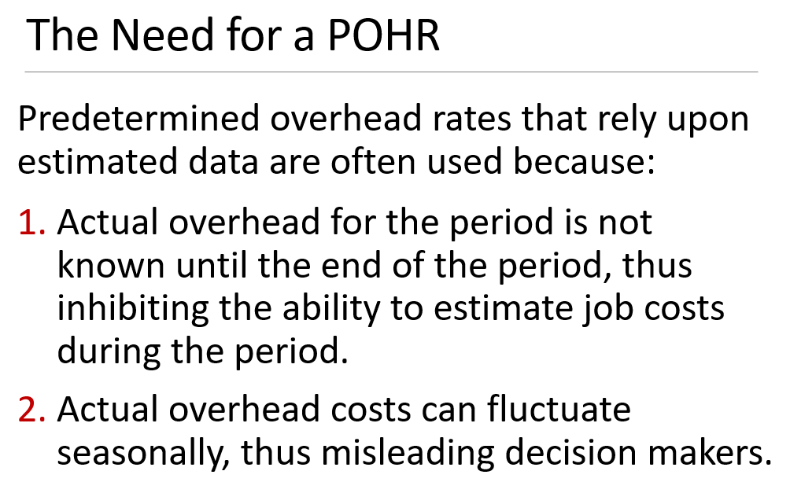

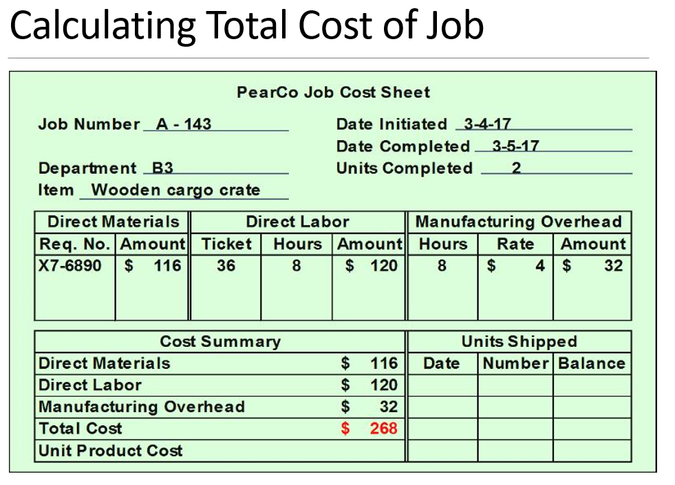

---

> [!IMPORTANT] Quick Check 1 — SOLVE THIS (Exam-style)
>
> **Job WR53** at NW Fab, Inc.:
> - Direct Materials = **\$200**
> - Direct Labor = **10 DLH × \$15/hr = \$150**
> - Estimated total OH for year = **\$760,000**
> - Estimated DLH for year = **20,000**
>
> **What is the total cost of Job WR53?**
>
> **Step 1 — Calculate POHR:**
>
> $$\text{POHR} = \dfrac{\$760{,}000}{20{,}000} = \$38 \text{ per DLH}$$
>
> **Step 2 — Apply OH to the job:**
>
> $$\text{OH Applied} = \$38 \times 10 = \$380$$
>
> **Step 3 — Total Job Cost:**
>
> | Item | Amount |
> |:---|---:|
> | Direct Materials | \$200 |
> | Direct Labor (10 × \$15) | \$150 |
> | Manufacturing OH (10 × \$38) | \$380 |
> | **Total Cost** | **\$730** |
>
> **Answer: d. \$730**

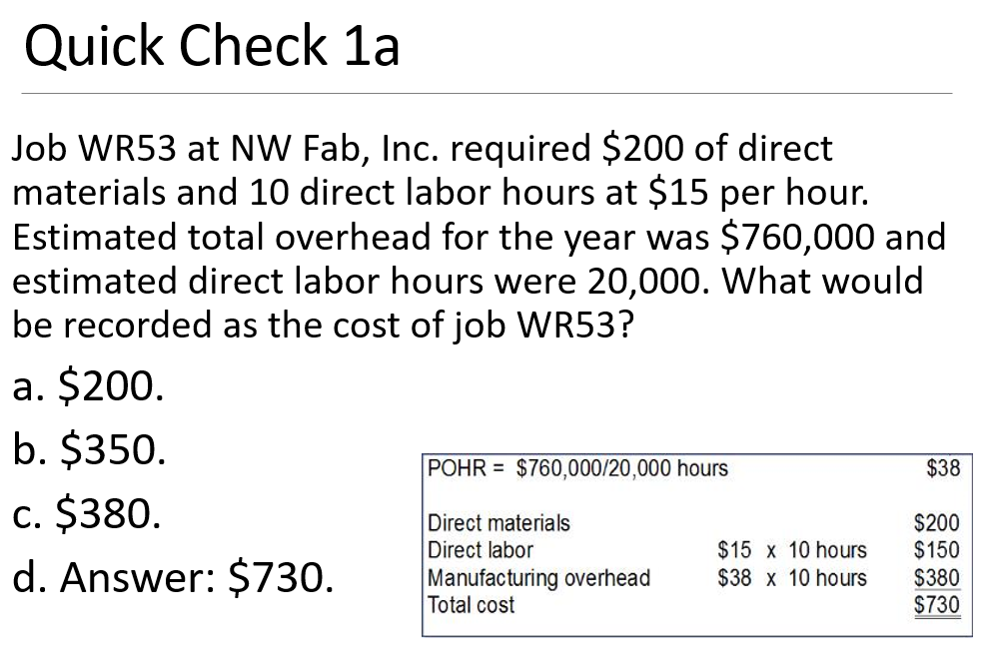

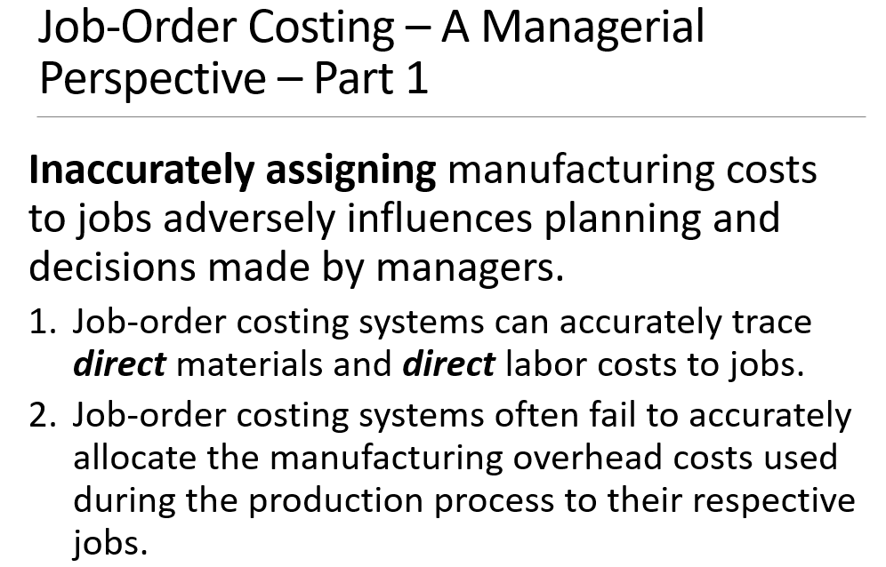

> **بالعربي:** معدل التحميل المحدد مسبقاً = التكاليف غير المباشرة المقدرة ÷ ساعات العمل المقدرة. بنحسبه أول السنة. بعد كده كل طلبية بنضربها في الساعات الفعلية اللي اشتغلتها × المعدل = ده التحميل بتاعها.

---

### Underapplied vs Overapplied Overhead

#### 🧠 Understanding the problem with a simple story

Remember: We set POHR at the **start** of the year using **guesses** (estimates). At the **end** of the year, we finally see the **real** overhead bill.

**Think of it like estimating your electricity bill:**
- In January, you guess: "I'll pay about \$200/month" → you budget \$200/month
- In December, the actual bill comes: you paid **\$220/month** on average
- You **underestimated** by \$20/month → you owe more than you planned

Same thing in manufacturing:

| What we did | Amount |
|:---|:---|
| We **estimated** OH would be \$640,000 and set POHR = \$4/DLH | (start of year) |
| During the year, we **applied** \$4 × actual hours to each job | Let's say total = **\$640,000** applied |
| At year-end, the **actual** OH bill came in | Maybe **\$650,000** actual |
| **Difference** | We applied \$640K but spent \$650K → **\$10K short!** |

#### The Two Scenarios

$$\colorbox{lightblue}{$\text{Difference} = \text{Actual OH} - \text{Applied OH}$}$$

**Scenario 1: Underapplied (you applied TOO LITTLE)**

> Actual \$650K > Applied \$640K → gap of \$10K
> You **undercharged** products. The products looked cheaper than they really were.
> **Fix:** Add the \$10K to COGS → COGS goes **UP** → Profit goes **DOWN**

**Scenario 2: Overapplied (you applied TOO MUCH)**

> Actual \$620K < Applied \$640K → gap of \$20K
> You **overcharged** products. The products looked more expensive than they really were.
> **Fix:** Subtract the \$20K from COGS → COGS goes **DOWN** → Profit goes **UP**

> [!IMPORTANT] Memory Trick
> - **Under**applied = under-charged = COGS too LOW → **ADD** to COGS → profit **decreases**
> - **Over**applied = over-charged = COGS too HIGH → **SUBTRACT** from COGS → profit **increases**
>
> **بالعربي:**
> - **Underapplied** = حملنا أقل من الحقيقي → المنتجات طلعت أرخص من الواقع → لازم نزود الـ COGS
> - **Overapplied** = حملنا أكتر من الحقيقي → المنتجات طلعت أغلى من الواقع → لازم ننقص الـ COGS

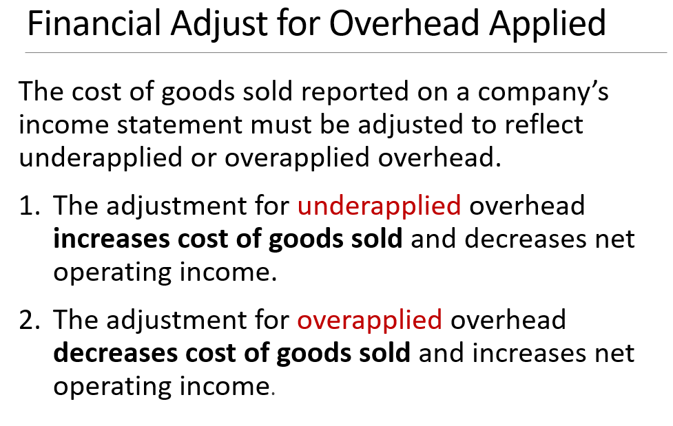

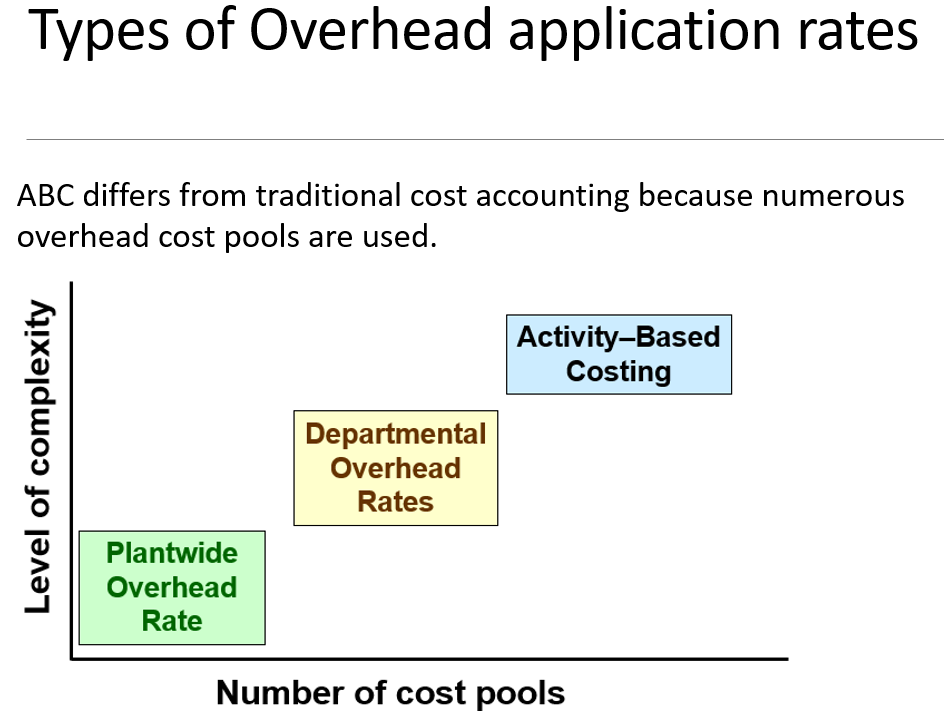

---

### Activity-Based Costing (ABC)

#### The Problem with One Single OH Rate

Using a **single plantwide POHR** (e.g., one rate based on DLH for the whole factory) is **overly simplistic**:

- It assumes DLH is the **only** thing that drives overhead costs
- A complex product that requires many design changes, special setups, and small batch sizes gets the **same** overhead rate per hour as a simple high-volume product
- This leads to **cost distortion**: simple high-volume products get **overcosted** and complex low-volume products get **undercosted**

#### The Solution: Activity-Based Costing

ABC uses **multiple overhead rates** — one for each major **activity** that causes overhead costs.

$$\colorbox{lightyellow}{$\text{ABC: Multiple Cost Pools} \rightarrow \text{Multiple Activity Rates} \rightarrow \text{More Accurate Product Costs}$}$$

**Three levels of complexity (from simple to most accurate):**

| Level | Method | # of OH Rates | Accuracy |
|:---|:---|:---:|:---:|
| 1 | **Plantwide OH Rate** | 1 rate for whole factory | Low |
| 2 | **Departmental OH Rates** | 1 rate per department | Medium |
| 3 | **Activity-Based Costing (ABC)** | 1 rate per activity | High |

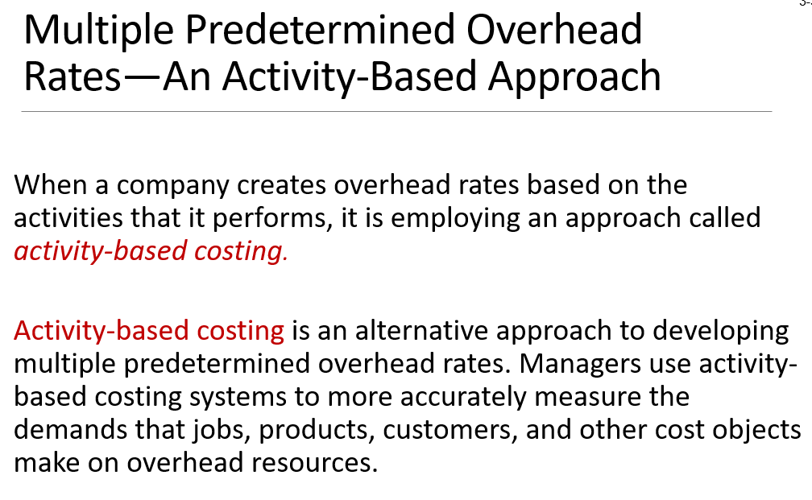

---

#### The Five Steps of ABC

**Step 1 — Define Activities and Activity Cost Pools**

Identify the major **activities** in the company and group related costs into **activity cost pools**:

| Activity Cost Pool | Activity Measure (Cost Driver) | What it captures |
|:---|:---|:---|
| Customer Orders | # of customer orders | Cost of processing orders |
| Design Changes | # of design changes | Cost of custom design work |
| Order Size | Machine-hours | Cost driven by production volume |
| Customer Relations | # of active customers | Cost of maintaining customer relationships |
| Other | Not applicable | Organization-sustaining costs (not assigned to products!) |

---

**Step 2 — Assign Overhead Costs to Activity Cost Pools (First-Stage Allocation)**

Take ALL overhead costs and distribute them across the activity cost pools using interviews, surveys, and analysis.

> **Key point:** DM, DL, and Shipping are **excluded** from ABC pools because they can already be **directly traced** to products.

---

**Step 3 — Calculate Activity Rates (for each cost pool)**

$$\colorbox{lightblue}{$\text{Activity Rate} = \dfrac{\text{Total Cost in the Pool}}{\text{Total Expected Activity}}$}$$

**Baxter Battery Example:**

| Activity Cost Pool | Total Cost (a) | Total Activity (b) | Activity Rate (a ÷ b) |
|:---|---:|:---|---:|
| Customer orders | \$4,520,000 | 10,000 orders | **\$452/order** |
| Design changes | \$3,040,000 | 4,000 changes | **\$760/change** |
| Order size | \$5,200,000 | 800,000 MH | **\$6.50/MH** |
| Customer relations | \$3,080,000 | 2,000 customers | **\$1,540/customer** |
| Other | \$6,160,000 | Not applicable | Not assigned |
| **Total** | **\$22,000,000** | | |

> **"Other" pool** = organization-sustaining costs (CEO salary, building lease, etc.) → these are **NOT assigned** to any product. They're just subtracted at the bottom.

---

**Step 4 — Assign Overhead to Products (Second-Stage Allocation)**

Multiply each product's **actual activity** by the **activity rate**:

$$\colorbox{lightblue}{$\text{ABC Cost for Product} = \text{Activity Rate} \times \text{Product's Actual Activity}$}$$

**Baxter Battery — SureStart vs LongLife:**

| | **SureStart** (standard) | **LongLife** (deluxe) |
|:---|:---|:---|
| Volume | 800,000 units | 400,000 units |
| Orders | 4,000 | 6,000 |
| Design changes | 0 (no custom designs) | 4,000 |
| Machine-hours | 480,000 MH (36 min/unit) | 320,000 MH (48 min/unit) |

**ABC Overhead Assigned:**

| Activity | Rate | SureStart Activity | SureStart Cost | LongLife Activity | LongLife Cost |
|:---|---:|---:|---:|---:|---:|
| Customer orders | \$452 | 4,000 | \$1,808,000 | 6,000 | \$2,712,000 |
| Design changes | \$760 | 0 | \$0 | 4,000 | \$3,040,000 |
| Order size | \$6.50 | 480,000 | \$3,120,000 | 320,000 | \$2,080,000 |
| **Total OH** | | | **\$4,928,000** | | **\$7,832,000** |

> Notice: LongLife gets **\$7.8M** of overhead vs SureStart's **\$4.9M** — even though SureStart has **2× the volume!** Why? Because LongLife has more orders (6K vs 4K) and ALL the design changes (4K vs 0).

---

**Step 5 — Compute Product Margins**

| | SureStart | LongLife |
|:---|---:|---:|
| Sales | \$31,300,000 | \$18,700,000 |
| Less: Direct Materials | (9,000,000) | (6,000,000) |
| Less: Direct Labor | (7,000,000) | (5,000,000) |
| Less: Shipping | (2,000,000) | (1,000,000) |
| Less: ABC OH assigned | (4,928,000) | (7,832,000) |
| **Product Margin** | **\$8,372,000** | **\$(1,132,000)** |

$$\colorbox{lightgreen}{$\text{SureStart is PROFITABLE (\$8.4M margin). LongLife is LOSING money (\$1.1M loss)!}$}$$

---

#### ABC vs Traditional — The Big Reveal

| | **Traditional (single rate)** | **ABC (multiple rates)** |
|:---|---:|---:|
| SureStart margin | \$6,900,000 | \$8,372,000 |
| LongLife margin | \$2,100,000 | \$(1,132,000) |

| Product | Traditional says... | ABC reveals... | What went wrong? |
|:---|:---|:---|:---|
| **SureStart** | Margin = \$6.9M | Margin = **\$8.4M** (higher!) | Traditional **overcosted** it — gave it too much OH |
| **LongLife** | Margin = \$2.1M (looks profitable) | Margin = **−\$1.1M** (actually losing money!) | Traditional **undercosted** it — hid its true costs |

> **Why does this happen?** The traditional system uses only machine-hours to allocate. SureStart uses 60% of MH → gets 60% of OH. But ABC reveals that LongLife is the one causing most of the customer orders and ALL the design changes — activities that cost money but MH don't capture!

> **بالعربي:** النظام التقليدي بيستخدم معدل واحد (مثلاً ساعات آلة) لتوزيع كل التكاليف غير المباشرة. ده بيخلي المنتج البسيط (SureStart) يتحمل تكاليف أكتر من حقه، والمنتج المعقد (LongLife) يتحمل أقل. ABC بيكشف الحقيقة: LongLife هو اللي بيسبب التكاليف بسبب طلبات كتير وتعديلات تصميم → لما نحسبها صح نلاقيه خسران!

---

### 📋 Lec-9 Quiz Cheat Sheet — All Formulas & Rules

---

#### 1. Total Product Cost

$$\colorbox{lightblue}{$\text{Total Product Cost} = \text{DM} + \text{DL} + \text{MOH Applied}$}$$

$$\text{Unit Product Cost} = \dfrac{\text{Total Product Cost}}{\text{Units Produced}}$$

---

#### 2. Predetermined Overhead Rate (POHR)

$$\colorbox{lightblue}{$\text{POHR} = \dfrac{\text{Estimated Total MOH}}{\text{Estimated Total Allocation Base (DLH or MH)}}$}$$

- Calculated at **beginning** of year using **estimates**
- Common bases: Direct Labor Hours (DLH), Machine Hours (MH)

---

#### 3. Overhead Applied to a Job

$$\colorbox{lightblue}{$\text{OH Applied} = \text{POHR} \times \text{Actual Hours (DLH or MH) used by the job}$}$$

---

#### 4. Under/Overapplied Overhead

$$\colorbox{lightblue}{$\text{Difference} = \text{Actual MOH} - \text{Total OH Applied}$}$$

| If... | It means... | Adjust COGS by... | Effect on NOI |
|:---|:---|:---|:---|
| Actual > Applied | **Underapplied** (charged too little) | **ADD** to COGS | NOI **decreases** |
| Actual < Applied | **Overapplied** (charged too much) | **SUBTRACT** from COGS | NOI **increases** |

---

#### 5. ABC Activity Rate

$$\colorbox{lightblue}{$\text{Activity Rate} = \dfrac{\text{Total Cost in Activity Pool}}{\text{Total Activity (orders, MH, changes, etc.)}}$}$$

$$\text{ABC Cost for Product} = \sum (\text{Activity Rate} \times \text{Product's Actual Activity})$$

---

#### 6. ABC vs Traditional — What to Remember

| Traditional | ABC |
|:---|:---|
| 1 single plantwide rate | Multiple rates (1 per activity) |
| Uses only volume-based drivers (DLH, MH) | Uses volume AND non-volume drivers |
| Only allocates **manufacturing** OH | Can include non-manufacturing costs too |
| **Overcosts** high-volume simple products | Assigns costs based on what **actually drives** them |
| **Undercosts** low-volume complex products | More accurate product margins |

> **Quiz tip:** If the exam asks "which system gives more accurate product costs?" → **ABC**. If it asks "which is simpler?" → **Traditional plantwide rate**.

---

#### 7. Quick Problem-Solving Steps

**Type 1: "What is the total cost of Job X?"**
1. Calculate POHR = Est. OH ÷ Est. Activity Base
2. OH Applied = POHR × Actual hours for Job X
3. Total Cost = DM + DL + OH Applied

**Type 2: "Is overhead under or overapplied?"**
1. Calculate total OH applied = POHR × Total actual hours for ALL jobs
2. Compare with Actual OH incurred
3. If Actual > Applied → Underapplied → Add to COGS
4. If Actual < Applied → Overapplied → Subtract from COGS

**Type 3: "Calculate ABC product cost"**
1. Find activity rate for each pool = Pool cost ÷ Total activity
2. Multiply each rate × product's actual activity
3. Sum all pools = Total ABC overhead for product
4. Product Margin = Sales − DM − DL − Shipping − ABC OH

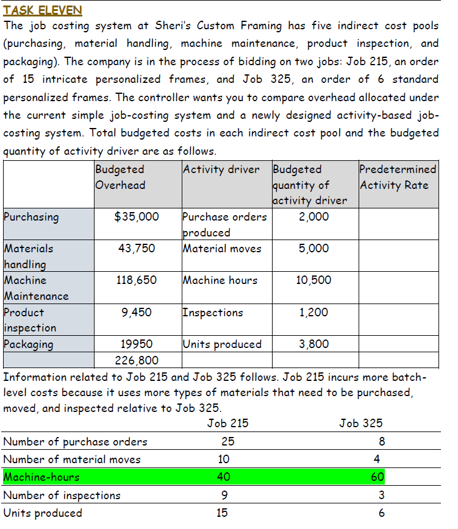

* There are some Customers who shall pay less because they are consuming resources less than other for their orders.
* Becuase those who are paying more (over priced), or the company itself has a problem in pricing.