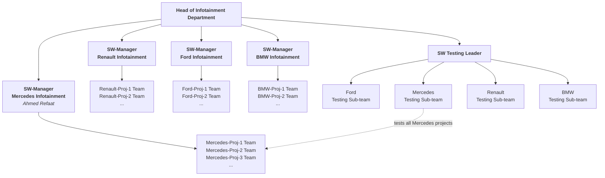
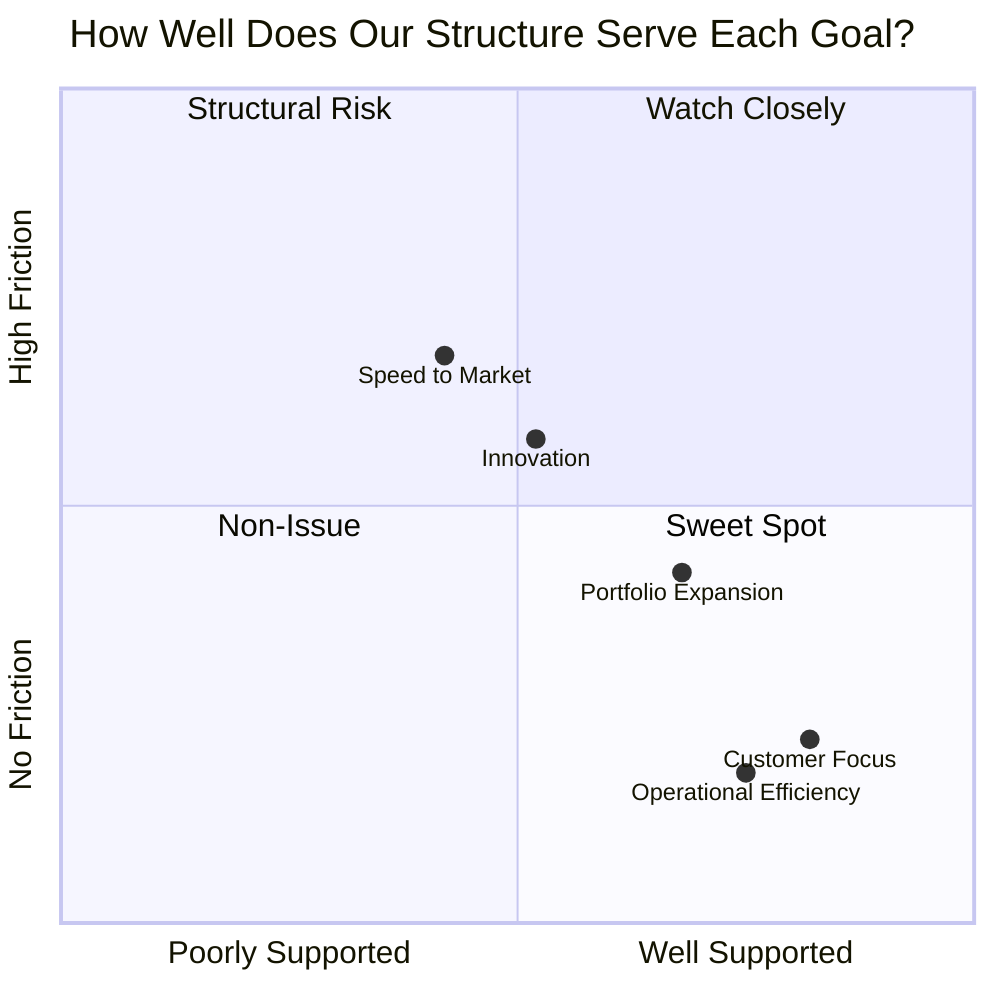
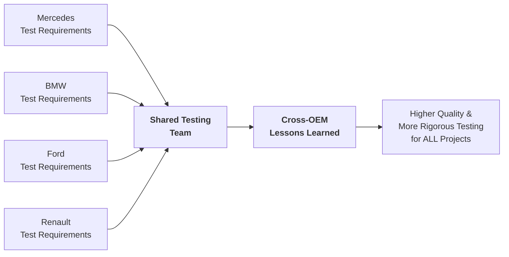
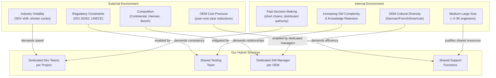
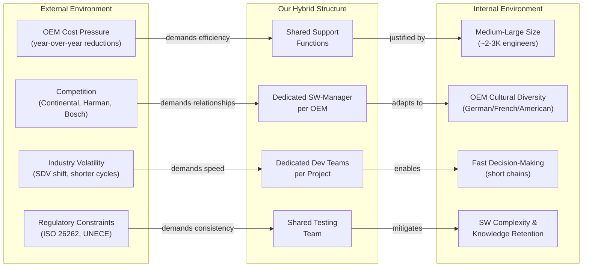
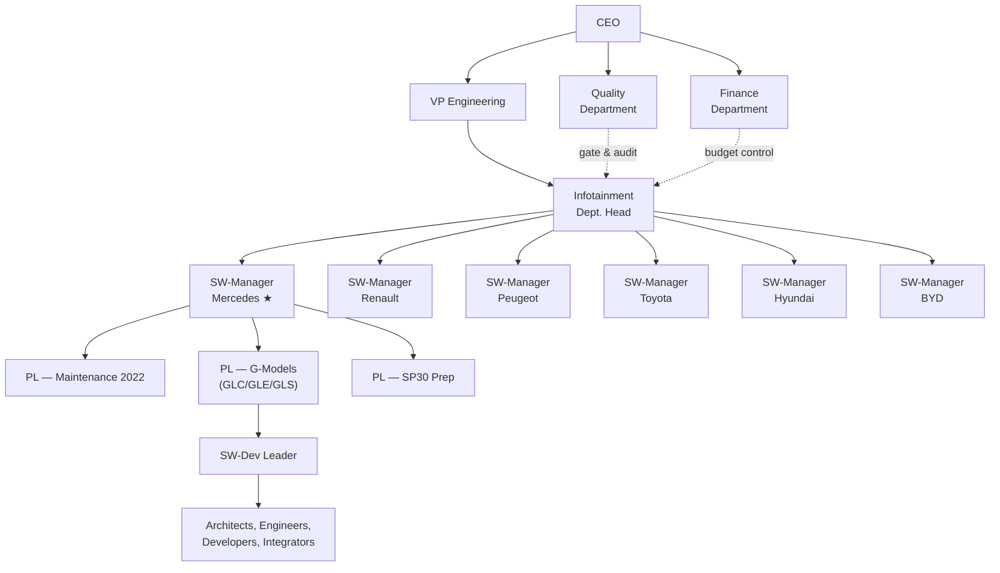
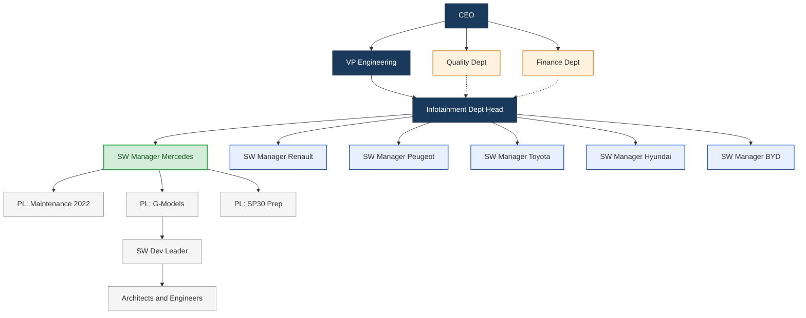

```mermaid

graph TD
    HEAD["<b>Head of Infotainment Department</b>"]

    HEAD --> CM1["<b>SW-Manager<br/>Renault Infotainment</b>"]
    HEAD --> CM2["<b>SW-Manager<br/>Ford Infotainment</b>"]
    HEAD --> CM3["<b>SW-Manager<br/>Mercedes Infotainment</b><br/><i>Ahmed Refaat</i>"]
    HEAD --> CM4["<b>SW-Manager<br/>BMW Infotainment</b>"]

    CM1 --> CM1T["Renault-Proj-1 Team<br/>Renault-Proj-2 Team<br/>..."]
    CM2 --> CM2T["Ford-Proj-1 Team<br/>Ford-Proj-2 Team<br/>..."]
    CM3 --> CM3T["Mercedes-Proj-1 Team<br/>Mercedes-Proj-2 Team<br/>Mercedes-Proj-3 Team<br/>..."]
    CM4 --> CM4T["BMW-Proj-1 Team<br/>BMW-Proj-2 Team<br/>..."]

    HEAD --> VT["<b>SW Testing Leader</b>"]

    VT --> VF["Ford<br/>Testing Sub-team"]
    VT --> VM["Mercedes<br/>Testing Sub-team"]
    VT --> VR["Renault<br/>Testing Sub-team"]
    VT --> VB["BMW<br/>Testing Sub-team"]

    VM -.->|tests all Mercedes projects| CM3T
```

```mermaid
quadrantChart
    title How Well Does Our Structure Serve Each Goal?
    x-axis "Poorly Supported" --> "Well Supported"
    y-axis "No Friction" --> "High Friction"
    quadrant-1 "Watch Closely"
    quadrant-2 "Structural Risk"
    quadrant-3 "Non-Issue"
    quadrant-4 "Sweet Spot"
    "Customer Focus": [0.82, 0.22]
    "Operational Efficiency": [0.75, 0.18]
    "Innovation": [0.52, 0.58]
    "Speed to Market": [0.42, 0.68]
    "Portfolio Expansion": [0.68, 0.42]
```

```mermaid
graph LR
    OEM1["Mercedes<br/>Test Requirements"] --> SHARED["<b>Shared Testing<br/>Team</b>"]
    OEM2["BMW<br/>Test Requirements"] --> SHARED
    OEM3["Ford<br/>Test Requirements"] --> SHARED
    OEM4["Renault<br/>Test Requirements"] --> SHARED

    SHARED --> LL["<b>Cross-OEM<br/>Lessons Learned</b>"]
    LL --> Q["Higher Quality &<br/>More Rigorous Testing<br/>for ALL Projects"]
```

```mermaid
graph TD
    subgraph EXTERNAL["External Environment"]
        direction TB
        E1["Industry Volatility<br/>(SDV shift, shorter cycles)"]
        E2["Regulatory Constraints<br/>(ISO 26262, UNECE)"]
        E3["Competition<br/>(Continental, Harman, Bosch)"]
        E4["OEM Cost Pressure<br/>(year-over-year reductions)"]
    end

    subgraph STRUCTURE["Our Hybrid Structure"]
        direction TB
        ST1["Dedicated Dev Teams<br/>per Project"]
        ST2["Shared Testing<br/>Team"]
        ST3["Dedicated SW-Manager<br/>per OEM"]
        ST4["Shared Support<br/>Functions"]
    end

    subgraph INTERNAL["Internal Environment"]
        direction TB
        I1["Medium-Large Size<br/>(~2-3K engineers)"]
        I2["OEM Cultural Diversity<br/>(German/French/American)"]
        I3["Fast Decision-Making<br/>(short chains, distributed authority)"]
        I4["Increasing SW Complexity<br/>& Knowledge Retention"]
    end

    E1 -->|"demands speed"| ST1
    E2 -->|"demands consistency"| ST2
    E3 -->|"demands relationships"| ST3
    E4 -->|"demands efficiency"| ST4

    I1 -->|"justifies shared resources"| ST4
    I2 -->|"enabled by dedicated managers"| ST3
    I3 -->|"enabled by"| ST1
    I4 -->|"mitigated by"| ST2
```

```mermaid
graph LR
    subgraph EXTERNAL["External Environment"]
        direction TB
        E1["Industry Volatility<br/>(SDV shift, shorter cycles)"]
        E2["Regulatory Constraints<br/>(ISO 26262, UNECE)"]
        E3["Competition<br/>(Continental, Harman, Bosch)"]
        E4["OEM Cost Pressure<br/>(year-over-year reductions)"]
    end

    subgraph STRUCTURE["Our Hybrid Structure"]
        direction TB
        ST1["Dedicated Dev Teams<br/>per Project"]
        ST2["Shared Testing<br/>Team"]
        ST3["Dedicated SW-Manager<br/>per OEM"]
        ST4["Shared Support<br/>Functions"]
    end

    subgraph INTERNAL["Internal Environment"]
        direction TB
        I1["Medium-Large Size<br/>(~2-3K engineers)"]
        I2["OEM Cultural Diversity<br/>(German/French/American)"]
        I3["Fast Decision-Making<br/>(short chains)"]
        I4["SW Complexity &<br/>Knowledge Retention"]
    end

    E1 -->|"demands speed"| ST1
    E2 -->|"demands consistency"| ST2
    E3 -->|"demands relationships"| ST3
    E4 -->|"demands efficiency"| ST4

    ST1 -->|"enables"| I3
    ST3 -->|"adapts to"| I2
    ST4 -->|"justified by"| I1
    ST2 -->|"mitigates"| I4
```

```mermaid
graph TB
    CEO --> VP["VP Engineering"]
    VP --> HEAD["Infotainment<br/>Dept. Head"]
    HEAD --> ME["SW-Manager<br/>Mercedes ★"]
    HEAD --> M2["SW-Manager<br/>Renault"]
    HEAD --> M3["SW-Manager<br/>Peugeot"]
    HEAD --> M4["SW-Manager<br/>Toyota"]
    HEAD --> M5["SW-Manager<br/>Hyundai"]
    HEAD --> M6["SW-Manager<br/>BYD"]

    ME --> PL1["PL — Maintenance 2022"]
    ME --> PL2["PL — G-Models<br/>(GLC/GLE/GLS)"]
    ME --> PL3["PL — SP30 Prep"]

    PL2 --> DEV["SW-Dev Leader"]
    DEV --> ENG["Architects, Engineers,<br/>Developers, Integrators"]

    %% Horizontal oversight
    CEO --> QD["Quality<br/>Department"]
    CEO --> FIN["Finance<br/>Department"]
    QD -.->|"gate & audit"| HEAD
    FIN -.->|"budget control"| HEAD
```

```mermaid
graph TD
    CEO["CEO"] --> VP["VP Engineering"]
    CEO --> QD["Quality Dept"]
    CEO --> FIN["Finance Dept"]
    VP --> HEAD["Infotainment Dept Head"]
    HEAD --> ME["SW Manager Mercedes"]
    HEAD --> M2["SW Manager Renault"]
    HEAD --> M3["SW Manager Peugeot"]
    HEAD --> M4["SW Manager Toyota"]
    HEAD --> M5["SW Manager Hyundai"]
    HEAD --> M6["SW Manager BYD"]
    ME --> PL1["PL: Maintenance 2022"]
    ME --> PL2["PL: G-Models"]
    ME --> PL3["PL: SP30 Prep"]
    PL2 --> DEV["SW Dev Leader"]
    DEV --> ENG["Architects and Engineers"]
    QD -.-> HEAD
    FIN -.-> HEAD
    classDef me fill:#d4edda,stroke:#28a745,stroke-width:2px,color:#155724
    classDef mgr fill:#e8f0fe,stroke:#1a56db,stroke-width:1.5px
    classDef head fill:#1a3a5c,stroke:#0f2740,color:#fff
    classDef oversight fill:#fff3e0,stroke:#e67e22,stroke-width:1.5px
    classDef dev fill:#f5f5f5,stroke:#999
    class ME me
    class M2,M3,M4,M5,M6 mgr
    class HEAD,VP,CEO head
    class QD,FIN oversight
    class PL1,PL2,PL3,DEV,ENG dev
```