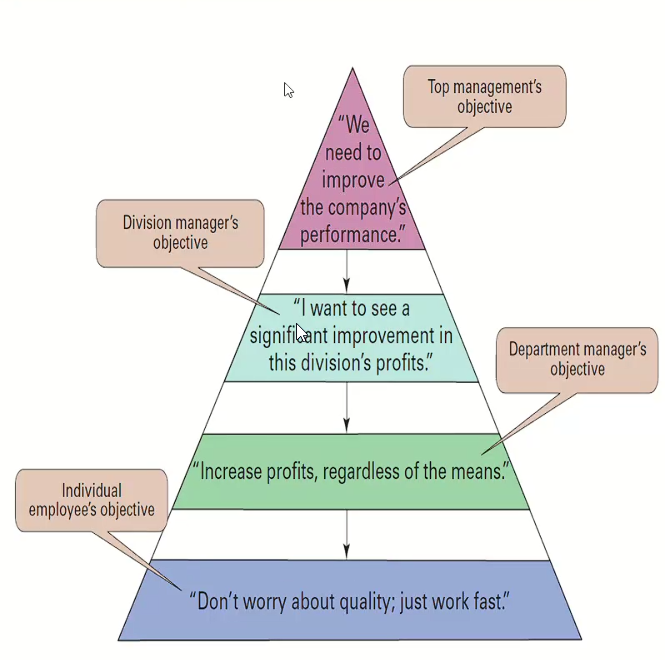
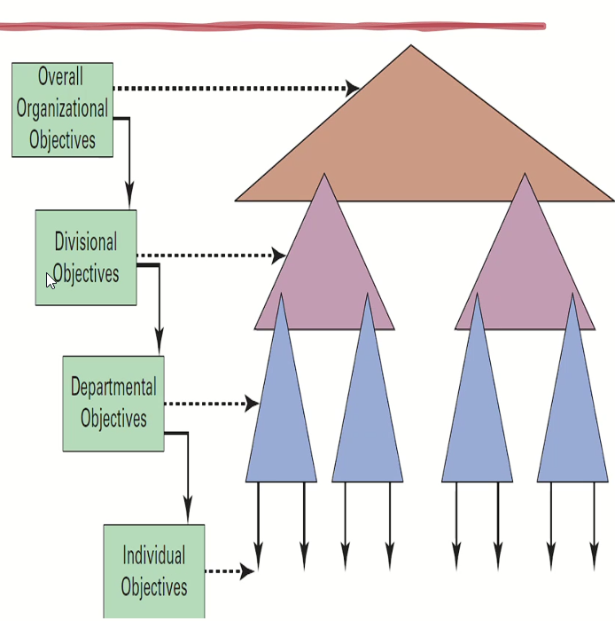
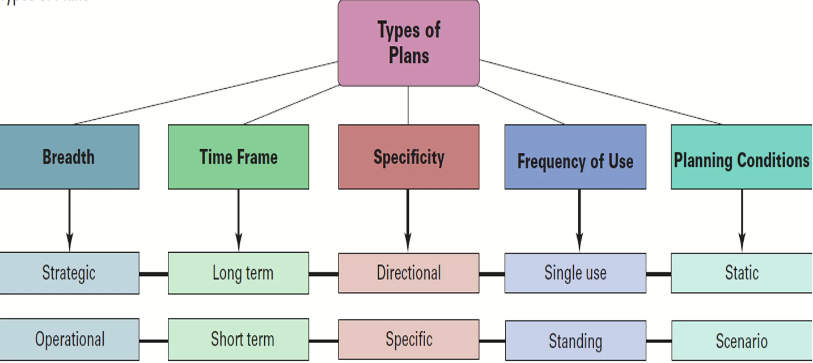
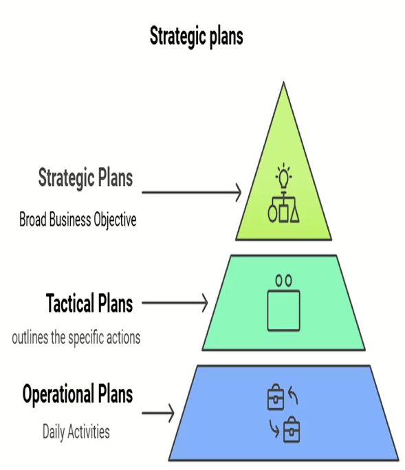
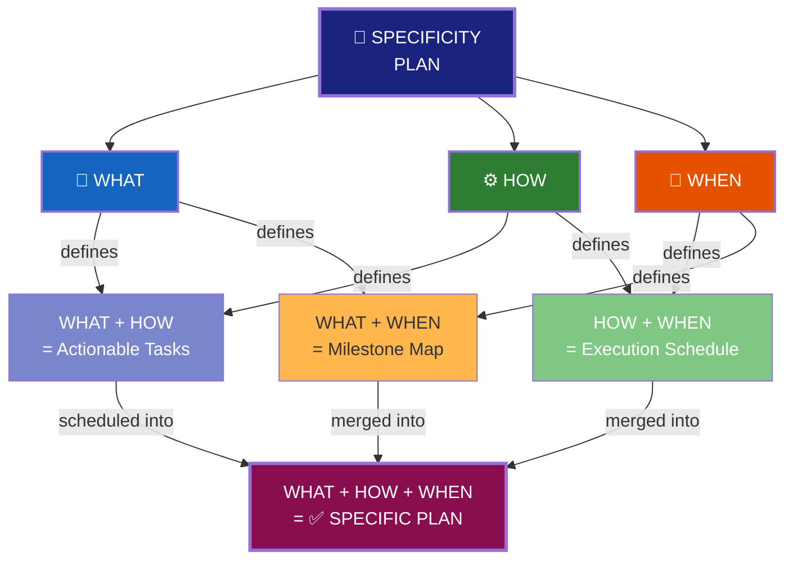
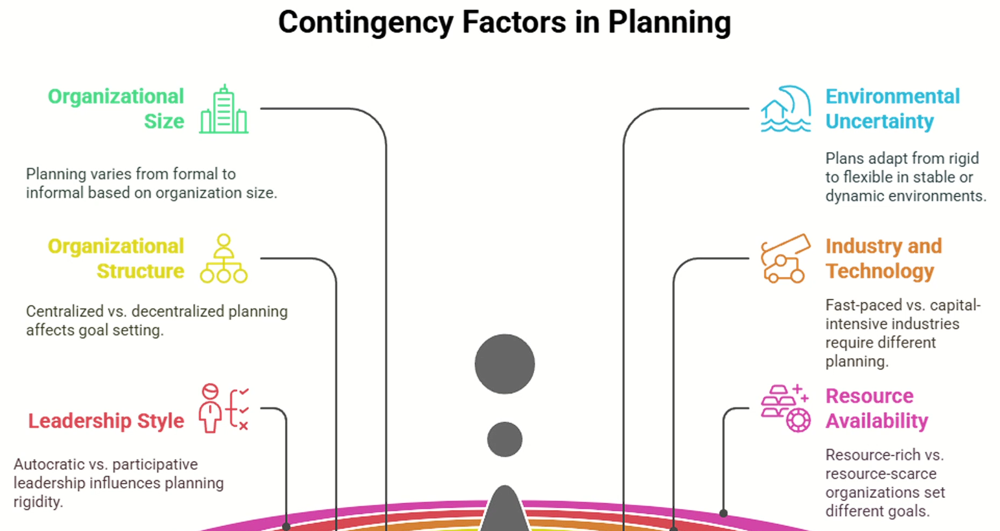

# Lecture #2: Foundation of Planning

* Joint-Venture: Means that I penetrate a market with a new name.

### What is a Planning

* Planning ➡️ Achieve Startegy ➡️ Reach goal
* Planning consider the goal and tell how to go there
* Formal vs Informal
  * Formal: focus for the whole org
  * Informal: Focus mainly in department or dynamic based on a surprised situation
* Purpose of PLanning
  * Provides Direction: {Goal Setting, **Strategic-Alignment**}
  * Reducing Uncertainty
  * Minimizing Waste and Redundancy
  * Setting Standards for controlling: {Performance Metrics, Quality Assurance}
    * This is the most important that we shall use for Later evaluation
* What is the flexibility of the management to change the Strategy ?
  * this is shall be flexibly based on the market condition.
* **Elements of Planning**
  * Goal ➡️ Top part
  * Strategy ➡️ Middle
  * Plans ➡️Base
* **Goal vs Objectives**
  * Scope:
    * Goal: Broad, outline, overall, uncountified ❌ Objective: Specific, countified
    * To fix this issue with Goal there is something called **Smart Goals/Objective**
      * Specific, Measurable, Achievable, Relevant, Time-bound ➡️ With these critieria, it is Objective or *Smart-Goal*
      * *Smart-Goal*:
        * Specific: Who, what, how, where, when & why. ➡️ so it is measurable
        * Achievable: it shall be aligned with market state and our performance
        * Time-bound: it shall have deadline
      * Ex: Is "Increase Customer Adoption of Apple Pay in Egy" *Smart-Goal*?
        * Specific: ✅
        * Measurable: ❌
        * Achievable: ✅ one use Apple-pay then it is achieved
        * Relevant: ✅ because it is ok with Apple-Eco-System
        * Time-bound: ❌
* **Type of Goals**
  * *Financial-Goals* ➡️ Whatever related to Finance
  * *Strategic-Goals* ➡️ Whatever related to Strategy (ex. Increase the brand awareness)
* *Stated-Goals* vs *Real-Goals*
  * Stated-Goal: Ex: remove Apple charger to be env friendly
  * Real-Goal: Ex: Apple wants to increase the profits
* **Goal-Settings Approaches**
  * *Traditional Goal Settings*
    * This is cascaded down from top-management without discussion
    * Disadvantage:
      * 
  * *Management by Objective (MBO)*
    * here the teams and departments are involved into the goal-settings 🥳
    * The same Department start the discussion with teams to identify the goals per team to reach the overall goal
    * Advantage of MBO and how to split
      * 
  * Then when use which of them ?
    * Based on the teams managements skills and competence ➡️ So good-management skills then go to MBO, else use Traditional (Ex. for logistics, then this is usually Traditional)
  
      ```mermaid

      graph TD
          A["1. 🎯 Define Organizational\nObjectives"] --> B["2. 🏢 Cascade to\nDepts / Teams"]
          B --> C["3. 🤝 Collaborative\nGoal Setting"]
          C --> D["4. 📋 Develop\nAction Plans"]
          D --> E["5. 📊 Monitor\nProgress"]

          E -->|"⚡ Operational\nFeedback Loop\n(Short Cycle)"| D

          E --> F["6. 📝 Evaluate\nPerformance & Feedback"]
          F --> G["7. 🏆 Reward &\nAdjust Objectives"]

          G -->|"🔄 Strategic\nFeedback Loop\n(Annual / Quarterly)"| A

          F -->|"🔁 Tactical\nRe-alignment"| C

          style A fill:#0d47a1,color:#fff,stroke-width:3px
          style B fill:#1565c0,color:#fff
          style C fill:#00695c,color:#fff
          style D fill:#2e7d32,color:#fff
          style E fill:#f57f17,color:#fff
          style F fill:#e65100,color:#fff
          style G fill:#880e4f,color:#fff

          linkStyle 4 stroke:#43a047,stroke-width:3px,stroke-dasharray:5
          linkStyle 6 stroke:#1565c0,stroke-width:3px
          linkStyle 7 stroke:#e65100,stroke-width:2px,stroke-dasharray:5

      ```
      ---
      ```mermaid

      graph LR
          subgraph PLAN ["📐 PLAN Phase"]
              direction TB
              A["1. Define Organizational\nObjectives"] --> B["2. Cascade to\nDepts / Teams"]
              B --> C["3. Collaborative\nGoal Setting"]
          end

          subgraph DO ["⚙️ DO Phase"]
              direction TB
              D["4. Develop\nAction Plans"] --> E["5. Monitor\nProgress"]
          end

          subgraph CHECK_ACT ["🔄 CHECK & ACT Phase"]
              direction TB
              F["6. Evaluate Performance\n& Feedback"] --> G["7. Reward & Adjust\nObjectives"]
          end

          PLAN -->|"Goals Locked"| DO
          DO -->|"Data Collected"| CHECK_ACT
          CHECK_ACT -->|"♻️ Revised Objectives\nFeed Next Cycle"| PLAN

          style A fill:#1565c0,color:#fff
          style B fill:#1976d2,color:#fff
          style C fill:#1e88e5,color:#fff
          style D fill:#2e7d32,color:#fff
          style E fill:#43a047,color:#fff
          style F fill:#e65100,color:#fff
          style G fill:#bf360c,color:#fff
          style PLAN fill:#e3f2fd,stroke:#1565c0,stroke-width:2px
          style DO fill:#e8f5e9,stroke:#2e7d32,stroke-width:2px
          style CHECK_ACT fill:#fbe9e7,stroke:#bf360c,stroke-width:2px

      ```


### Types of Plans



* *Time Frame*: {LongTerm:3~5 Years, ShortTerm: less< 1-Year, MidTerm:}
  * CyberSecurity Co: LongTerm ~ 1-Year
* *Specificity*
* *Freq-of-Use*: {Single-use: Respond to specific situation (Opening in KSA 😃), Standing: daily-Operation plan}
* *Planning-Condition*: {Static: , Scenario: it is conditional-based plan (Plan-A, Plan-A-1, Plan-A-2, Plan-B..etc (ex. Gold prices, War situation..etc.))}

#### Breath



* Exmaples: Koffee-Kulture operates in Egy ➡️ Gulf-Area (All of the following will be part of the env-Analysis)
  * After study: Env-Analysis, Overall-Objective, Positioning
  * Strategic-Plan
    * *Market-Entry* ➡️ This will be translated into Tactical-Plan, Operational-Plan, then define the KPIs
      * Tactical-Plan: Opening in Riyadh, Dubai, Jeddah, Doha
      * Operational-Plan: {Market Research, Entry Mode Selection, Location Acquisition}: Each has timeline and Estimated Budget 😉
      * KPIs: are defined from the *Tactical-Plan*
        * Market Research: {Competition Rate of Market Research Reports, Consumer Preference Analysis, Competitor Coverage (local, International, Egyptian)}: Each has Target and Measurement for evaluation ➡️ ***consider in ur assignment***
        * Entry Mode Decision & Alignment with Research Findings
    * *Branding & Marketing*
    * *Supply-chain*
    * *Human-Resources*
      * Example: in KSA they forces Co to have around 20% of the labour from KSA

#### Time Frame

* Short-Term
* Mid-Term
* Long-Termn

#### Specificity

> Answer what to be done and how to be done and when it will be done



#### Frequency of Use

> SOP: Standard Operating Procedure is defined for the Standing Plans

* Single-Use PLans: used for specific Scenario
* Standing Plan: Where we have SOP

#### Planning Conditions

* Static PLans: Usually done in stable condition and market
* Scenario PLans

### Key Contingency Factors in Planning - عوامل الطوارئ في التخطيط



* Organizational Structure: {Centralized, decentralized}
  * In case of Centralized: Then *Traditional-Goal_Settings*
* Leadership  Style
  * In case of Autocratic: Then
* Env Uncertainty: Plan adapt rigid to flexible in stable or dynamic env
  * Then it consider the: Scenario Based plan.
* Industry and Technology: {Fast-paced, Capital-intensive-industries}
* Resource Availability: {Resource-rich, resource-scarce}

### Practical Implications for Managers

* Assess the Context First
* Balance Flexibility and Structure
  * for ex suppliers issues, then what shall we do
* Align with Capabilities
  * Align all plan with respects to the resources that you have
* Engage Stakeholders
  * Engage everyone, teams ..etc., so ensure alignment and ensure the commitment of the teams to reach the goals.
