# Lec3 - Strategy & Strategic Management Process

### What is the *Business Model*

* You shall answer the following questions: 
  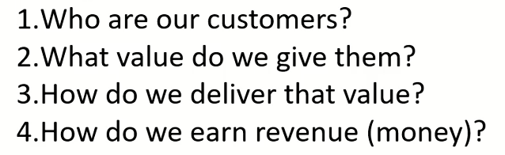

    ```mermaid

    graph TD
        TITLE["💰 BUSINESS MODEL BLUEPRINT\nHow a Company Makes Money"]
        TITLE --> Q1["👥 WHO <br> are our customers?"]
        TITLE --> Q2["💎 WHAT VALUE <br> do we give them?"]
        TITLE --> Q3["🚚 HOW <br> do we deliver that value?"]
        TITLE --> Q4["💵 HOW <br> do we earn revenue?"]

        Q1 --> Q2
        Q2 --> Q3
        Q3 --> Q4
        Q4 -->|"♻️ Reinvest to <br> atract & retain"| Q1

        subgraph NETFLIX ["🎬 Netflix Example"]
            direction TB
            N1["👥 People wanting <br> unlimited entertainment <br> at home"]
            N2["💎 On-demand streaming <br> of movies & series <br> anytime, anywhere"]
            N3["🚚 Streaming platform <br> (app, smart TV, web)"]
            N4["💵 Monthly / Annual <br> subscription fees"]
            N1 --> N2 --> N3 --> N4
        end

        Q1 -.- N1
        Q2 -.- N2
        Q3 -.- N3
        Q4 -.- N4

        style TITLE fill:#1a237e,color:#fff,stroke-width:3px
        style Q1 fill:#1565c0,color:#fff,stroke-width:2px
        style Q2 fill:#00695c,color:#fff,stroke-width:2px
        style Q3 fill:#e65100,color:#fff,stroke-width:2px
        style Q4 fill:#880e4f,color:#fff,stroke-width:2px
        style N1 fill:#bbdefb,color:#333
        style N2 fill:#b2dfdb,color:#333
        style N3 fill:#ffe0b2,color:#333
        style N4 fill:#f8bbd0,color:#333
        style NETFLIX fill:#fafafa,stroke:#9e9e9e,stroke-width:2px,stroke-dasharray:5

    ```
    ---
    ```mermaid

    graph TD
        C["👥 CUSTOMERS <br> 'Who pays us?'"]
        V["💎 VALUE PROPOSITION <br> 'Why do they pay?'"]
        D["🚚 DELIVERY MECHANISM <br> 'How do they get it?'"]
        R["💵 REVENUE MODEL <br> 'How does money flow in?'"]

        C -->|"attracted by"| V
        V -->|"delivered through"| D
        D -->|"generates"| R
        R -->|"funds growth →\nmore customers"| C

        C --- NC["🎬 Netflix: <br> Entertainment seekers <br> at home"]
        V --- NV["🎬 Netflix: <br> Unlimited movies & series <br> on-demand, anywhere"]
        D --- ND["🎬 Netflix: <br> Streaming platform <br> + recommendation engine"]
        R --- NR["🎬 Netflix: <br> Monthly & annual <br> subscription tiers"]

        style C fill:#1565c0,color:#fff,stroke-width:3px
        style V fill:#2e7d32,color:#fff,stroke-width:3px
        style D fill:#e65100,color:#fff,stroke-width:3px
        style R fill:#880e4f,color:#fff,stroke-width:3px

        style NC fill:#e3f2fd,color:#1565c0,stroke:#1565c0
        style NV fill:#e8f5e9,color:#2e7d32,stroke:#2e7d32
        style ND fill:#fff3e0,color:#e65100,stroke:#e65100
        style NR fill:#fce4ec,color:#880e4f,stroke:#880e4f

    ```

  * 2 exmaples are provided for (Netflix & Apple)
    
    | Netflix | Apple |
    | --- | --- |
    | 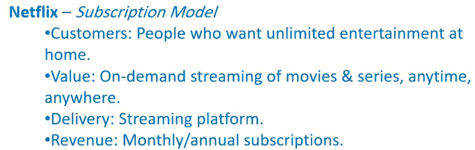 | 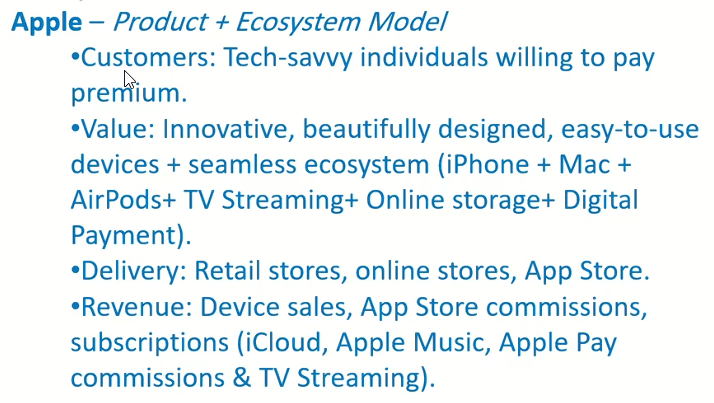|

  * The best case scenario is to increase the Number of Profit streams ➡️ Apple example
* Business Model **Types**
  * B2B, B2C, C2c, C2B, D2C, Subscription Model, Freemium Model, Marketplace Model, Retail Model, Franchise Model, Manufacturing Model, Dropshipping Model, Ad-Based Model, Licensing Model, Razor and blade Model, Addiliate Model, Brokerage Model, On-Demand Model, Hybrid Model

| Business model Type | Definition and explanation | Examples | Graph (simple) |
|---|---|---|---|
| B2B (Business-to-Business) | A company sells products/services to other companies (often longer sales cycles, contracts, recurring accounts). | SAP, Salesforce, industrial suppliers | `Business → Business` <br> 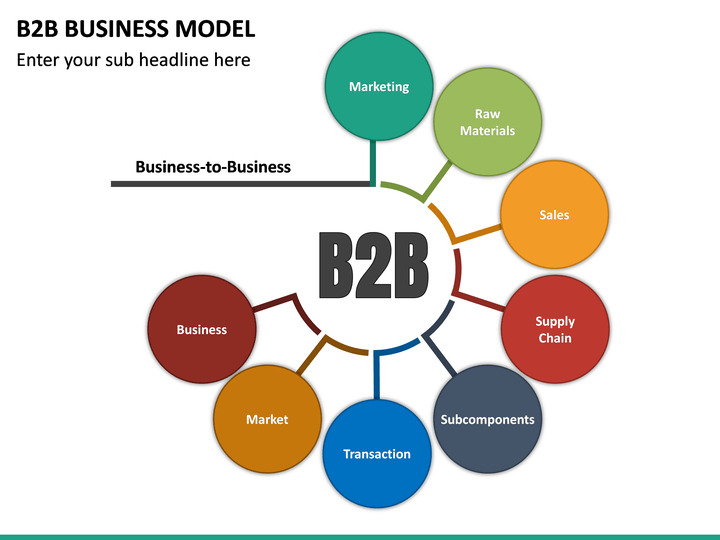 |
| B2C (Business-to-Consumer) | A company sells directly to end consumers (often higher volume, lower ticket, marketing-driven). | Nike.com, Coca‑Cola, Spotify | `Business → Consumer` <br> 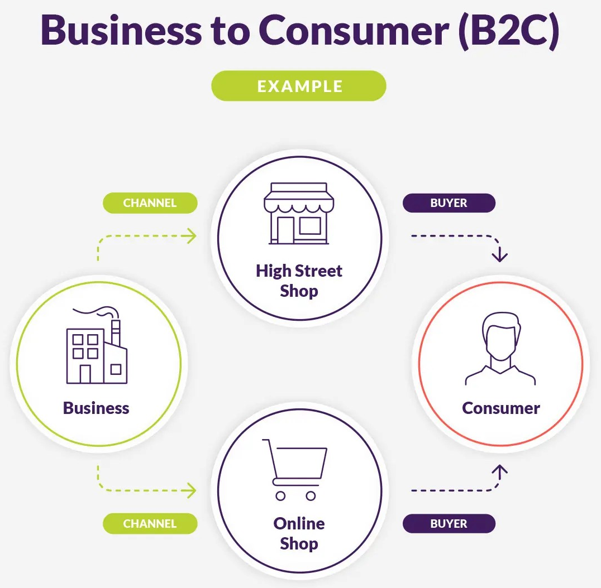 |
| C2C (Consumer-to-Consumer) | Individuals sell to other individuals, usually via a platform that enables trust, listings, and payments. | eBay (used goods), Facebook Marketplace, OLX | `Consumer → Consumer (via Platform ex. FB Marketpalce)` <br> 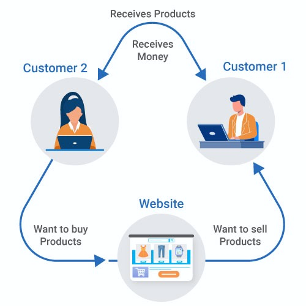 |
| C2B (Consumer-to-Business) | Individuals provide value to businesses (content, labor, data, influence) and get paid/compensated. | Upwork freelancers, Shutterstock contributors, influencers | `Consumer → Business` |
| D2C (Direct-to-Consumer) | A brand sells directly to consumers without traditional intermediaries (distributors/retail chains). | Warby Parker, Dollar Shave Club, Gymshark | `Brand → Consumer` |
| Subscription Model | Customers pay a recurring fee (monthly/annual) for ongoing access to a product/service; reduces one-time purchase dependency. | Netflix, Microsoft 365, Adobe Creative Cloud | `Customer ⇄ (recurring fee) ⇄ Service` |
| Freemium Model | A free base offering with paid upgrades (features, capacity, removal of limits/ads). Converts a subset of users to paid. | Spotify (Free vs Premium), Zoom, Dropbox | `Free Users → (upgrade %) → Paid Users` |
| Marketplace Model | A platform matches buyers and sellers; earns via commission, listing fees, or services (payments, logistics). | Amazon Marketplace, Airbnb, Uber Eats | `Sellers ⇄ Platform ⇄ Buyers` |
| Retail Model | Buying finished goods and reselling to consumers at a markup; value comes from assortment, location, experience, convenience. | Walmart, Carrefour, local stores | `Brands → Retailer → Consumers` |
| Franchise Model | A franchisor licenses a complete business format (brand + playbook) to franchisees for fees/royalties. | McDonald’s, Subway, Anytime Fitness | `Franchisor → Franchisee → Customers` |
| Manufacturing Model | Producing goods (raw materials → finished products) and selling via wholesale/retail/direct channels; margins come from production efficiency and scale. | Toyota, Samsung Electronics, Unilever factories | `Inputs → Factory → Products → Market` |
| Dropshipping Model | Seller markets and sells, but does not hold inventory; a third party ships directly to the customer after purchase. | Many Shopify stores using suppliers; print-on-demand (variant) | `Customer → Store → Supplier → Customer` |
| Ad-Based Model | Users get content/service free or low-cost; revenue comes from advertisers paying for attention/targeting. | Google Search, YouTube, Meta (Facebook/Instagram) | `Users → Attention → Ads Revenue` |
| Licensing Model | A company allows others to use its IP (software, patents, characters, brand) for a fee or royalty. | Microsoft Windows OEM, Disney character licensing, patented tech | `IP Owner → Licensee → End Users` |
| Razor-and-Blade Model | Core product sold cheaply (or at cost) while consumables/refills generate ongoing profit. | Gillette razors & blades, Nespresso machines & pods, printers & ink | `Low-cost Base → Repeat Consumables` |
| Affiliate Model (often misspelled “Addiliate”) | Partners drive traffic/sales to a merchant and earn a commission per sale/lead/action. | Amazon Associates, booking affiliates, coupon sites | `Affiliate → Merchant → Customer (commission back)` |
| Brokerage Model | An intermediary facilitates transactions and charges a fee/commission (may represent buyer, seller, or both). | Real estate brokers, stock brokers, insurance brokers | `Buyer ⇄ Broker ⇄ Seller` |
| On-Demand Model | Services delivered when needed (near real-time), typically via app-based matching and dynamic supply. | Uber, DoorDash, TaskRabbit | `Request → Match → Fulfillment` |
| Hybrid Model | Combines multiple models to diversify revenue (e.g., subscription + ads + marketplace + licensing). | Amazon (retail + marketplace + subscriptions), Apple (hardware + services) | `Model A + Model B (+ Model C) → One Business` |

  * B2B is the biggest umbrella 
  * If Company-1 sells HyperOne ➡️ what is this BM ? 
    * if Company-1 sells Brand-name to HyperOne with our Brand-name ➡️ This is B2B
    * Consumer : the last item in the Chain (End User)
    * Any other parts in the middle of the chain then you need to check (in case it is *distributer* then it is B2B)
  * *Franchise Model* is kind of copy-paste business model (ex. MAC)
  * 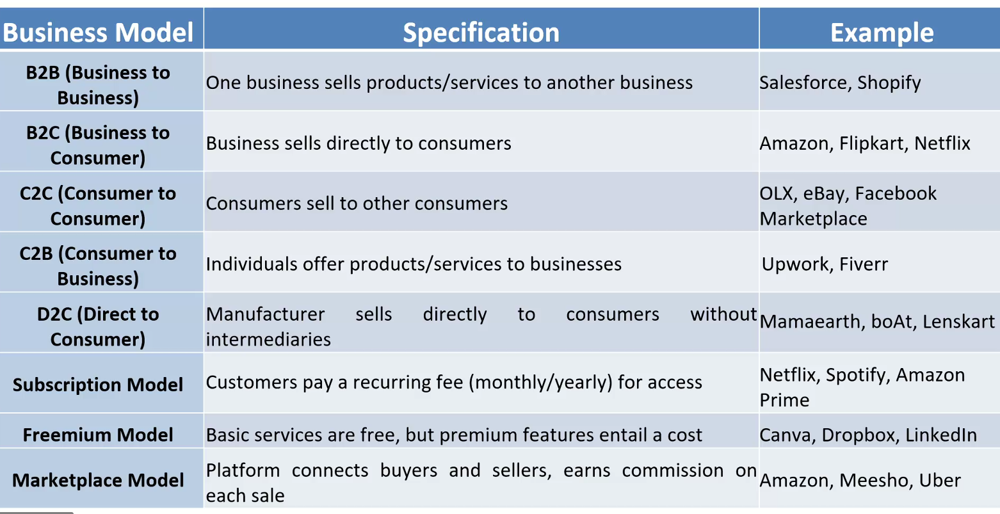
  * Examples

| Person | Business Model | Customers | Value | Delivery | Revenue |
| --- |--- | --- | --- | --- | --- | 
| R2ia | - | - | - | - | * Rental Commerial <br>* Rental model <br>* Transportation |
| Jone - Aman Holding | Hybrid model (Commission-Based + Customer handling) | *Companies <br> * Individuals | * Instant installments <br> * Easiest Loans <br> * Easy channels for payment | * Deliver Micro Finance (Customer loans)<br>* E-commerce<br> * Retail Stores <br> * e-Payment <br> *BS marchent | *Interest from loans |
| Samah | Hybrid Businss model (Financial Services) | * Retail customers <br> * Cooperate | * Customized sol for cooperates <br> * Financial advices <br> * Consultant Financial <br> * Instant Services <br> * Global Overview for other markets <br> * diverse branches across EGY <br> * Online Banking |  - | * Fees (Individual + Cooperates) <br> * Banking services fees <br> * Global Market investments returns |
| El auther - HR Services | B2B (IT, Constructions ...etc. Big Cooperate) | IT, Constructions ...etc. Big Cooperate with large num of employees (Online Based) | * Get the Employees hassel from Customer Shoulders | * Delivery based on service: <br> * One-time delivery <br> * Multiples Delivery | * Consultancy Services (OneTime service) <br> * HR-Virtual Services (Monthly Payment)  |
| Amira - HyperOne | Hybrid (Retails + )  | - | * High Foot-Traffic Rentals  | * Home delivery services <br> * Shops ..etc. | * Rentals <br> * Groceries <br> * Shelf-space rental |

### Strategy
 
* This is the highlevel Plan to reach a goal; Plan to answer 3 questions: 
  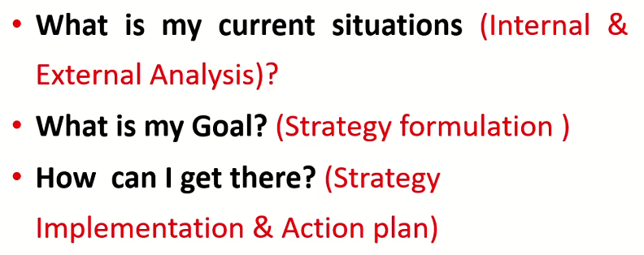
  * Set goals after understanding your "Internal & External" situation
* **Strategic Management**

    ```mermaid

    graph TD
        A["1️⃣ 🔍 ANALYSIS <br> Internal & External Environment <br> (PESTEL, Five Forces, SWOT)"]
        -->|"Insights"| B["2️⃣ 📐 FORMULATION <br> Corporate · Business · Functional <br> Strategies"]
        -->|"Strategic Plan"| C["3️⃣ ⚙️ IMPLEMENTATION <br> Align Resources, Structure <br> Culture & Controls"]
        -->|"Results"| D["4️⃣ 📊 EVALUATION <br> Measure Performance <br> vs  <br> Objectives"]

        D -->|"♻️ Feedback Loop\nRevise & Adapt"| A

        style A fill:#1565c0,color:#fff,stroke-width:2px
        style B fill:#2e7d32,color:#fff,stroke-width:2px
        style C fill:#e65100,color:#fff,stroke-width:2px
        style D fill:#880e4f,color:#fff,stroke-width:2px

    ```

  * Analysis: Internal & External management
  * Formulation: Layers ➡️ [Copperate Strategy, Business, Functional levels ]
  * Implementation and evaluation
* **Importance of Strategic Management**

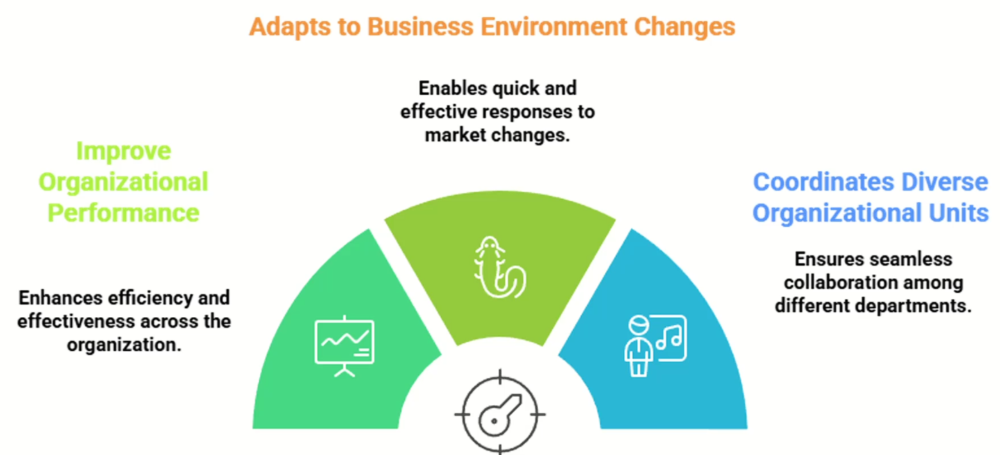

* **Strategic Management Process Model**


* if we start the process from "Internal & External" Analysis ➡️ implement full process 
* If we start with "Formulate Strategies" ➡️ This is Audit to ensure the correctness

    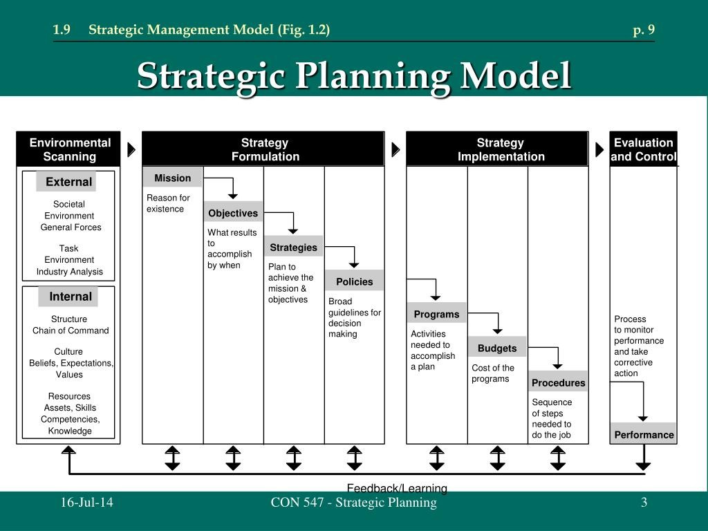

```mermaid

graph TD
    %% ===== STEP 1 =====
    S1["1️⃣ IDENTIFY MISSION,\nGOALS & STRATEGIES"]

    S1 --> V["🔭 VISION\n'What do we want to become?'"]
    S1 --> M["🎯 MISSION\n'What is our business?\nWhat makes us unique?'"]

    M --> MC["📋 Mission Components"]
    MC --> MC1["👥 Customers"]
    MC --> MC2["📦 Products / Services"]
    MC --> MC3["🌍 Markets"]
    MC --> MC4["💻 Technology"]
    MC --> MC5["📈 Growth & Profitability"]
    MC --> MC6["💡 Philosophy"]
    MC --> MC7["⭐ Distinctive Competence"]
    MC --> MC8["🏛️ Public Image"]
    MC --> MC9["🧑‍💼 Employees"]

    %% ===== STEP 2 =====
    V & M -->|"Foundation set"| S2["2️⃣ SWOT ANALYSIS"]

    S2 --> EXT["🌍 EXTERNAL ANALYSIS\n'What are the Opportunities\n& Threats?'"]
    S2 --> INT["🏢 INTERNAL ANALYSIS\n'What are our Strengths\n& Weaknesses?'"]

    EXT --> MICRO["🔬 Micro-Environment"]
    MICRO --> MI1["Customers"]
    MICRO --> MI2["Distributors"]
    MICRO --> MI3["Suppliers"]
    MICRO --> MI4["Competitors"]

    EXT --> MACRO["🔭 Macro-Environment"]
    MACRO --> MA1["Political"]
    MACRO --> MA2["Economic"]
    MACRO --> MA3["Social"]
    MACRO --> MA4["Technological"]
    MACRO --> MA5["Legal"]
    MACRO --> MA6["Environmental"]

    INT --> INTD["Analyze Resources,\nCapabilities & Activities"]

    %% ===== STEP 3 =====
    EXT & INT -->|"SWOT insights"| S3["3️⃣ FORMULATE STRATEGIES\n'What must we do to\nreach our objectives?'"]

    S3 --> CL["🏢 Corporate Level\n'What businesses should\nwe be in?'"]
    S3 --> BL["📊 Business Level\n'How do we beat\ncompetitors?'"]
    S3 --> FL["🔧 Functional Level\n'How does each dept\nsupport the strategy?'"]

    %% ===== STEP 4 =====
    CL & BL & FL -->|"Strategy defined"| S4["4️⃣ IMPLEMENT STRATEGIES"]

    S4 --> I1["👤 Who does the work?"]
    S4 --> I2["📦 What resources are needed?"]
    S4 --> I3["📅 When do actions start?"]
    S4 --> I4["📏 How is performance monitored?"]

    %% ===== STEP 5 =====
    I1 & I2 & I3 & I4 -->|"Execution underway"| S5["5️⃣ EVALUATE RESULTS"]

    S5 --> E1["📊 Monitor\nOrg Performance"]
    S5 --> E2["🎯 Compare Actuals\nvs Strategic Objectives"]
    S5 --> E3["🔧 Take Corrective\nActions"]

    E1 & E2 & E3 -->|"♻️ FEEDBACK LOOP\nRevise & Realign"| S1

    %% ===== STYLES =====
    style S1 fill:#1a237e,color:#fff,stroke-width:3px
    style S2 fill:#1565c0,color:#fff,stroke-width:3px
    style S3 fill:#2e7d32,color:#fff,stroke-width:3px
    style S4 fill:#e65100,color:#fff,stroke-width:3px
    style S5 fill:#880e4f,color:#fff,stroke-width:3px

    style V fill:#3949ab,color:#fff
    style M fill:#3949ab,color:#fff
    style MC fill:#7986cb,color:#fff
    style MC1 fill:#c5cae9,color:#333
    style MC2 fill:#c5cae9,color:#333
    style MC3 fill:#c5cae9,color:#333
    style MC4 fill:#c5cae9,color:#333
    style MC5 fill:#c5cae9,color:#333
    style MC6 fill:#c5cae9,color:#333
    style MC7 fill:#c5cae9,color:#333
    style MC8 fill:#c5cae9,color:#333
    style MC9 fill:#c5cae9,color:#333

    style EXT fill:#1e88e5,color:#fff
    style INT fill:#1e88e5,color:#fff
    style MICRO fill:#64b5f6,color:#333
    style MACRO fill:#64b5f6,color:#333
    style MI1 fill:#bbdefb,color:#333
    style MI2 fill:#bbdefb,color:#333
    style MI3 fill:#bbdefb,color:#333
    style MI4 fill:#bbdefb,color:#333
    style MA1 fill:#bbdefb,color:#333
    style MA2 fill:#bbdefb,color:#333
    style MA3 fill:#bbdefb,color:#333
    style MA4 fill:#bbdefb,color:#333
    style MA5 fill:#bbdefb,color:#333
    style MA6 fill:#bbdefb,color:#333
    style INTD fill:#bbdefb,color:#333

    style CL fill:#43a047,color:#fff
    style BL fill:#43a047,color:#fff
    style FL fill:#43a047,color:#fff

    style I1 fill:#ff8a65,color:#333
    style I2 fill:#ff8a65,color:#333
    style I3 fill:#ff8a65,color:#333
    style I4 fill:#ff8a65,color:#333

    style E1 fill:#ce93d8,color:#333
    style E2 fill:#ce93d8,color:#333
    style E3 fill:#ce93d8,color:#333

```

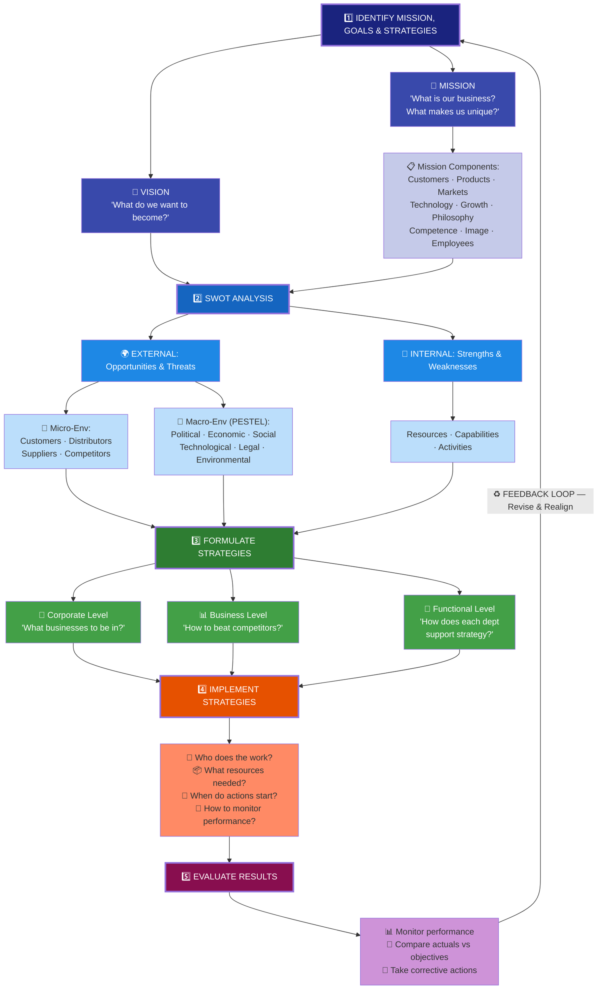

  * ***Step-1***: shall answer the following questions
    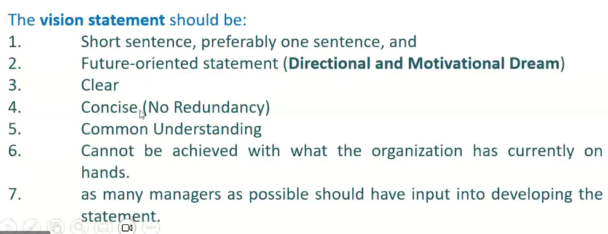
    * Examples: 
        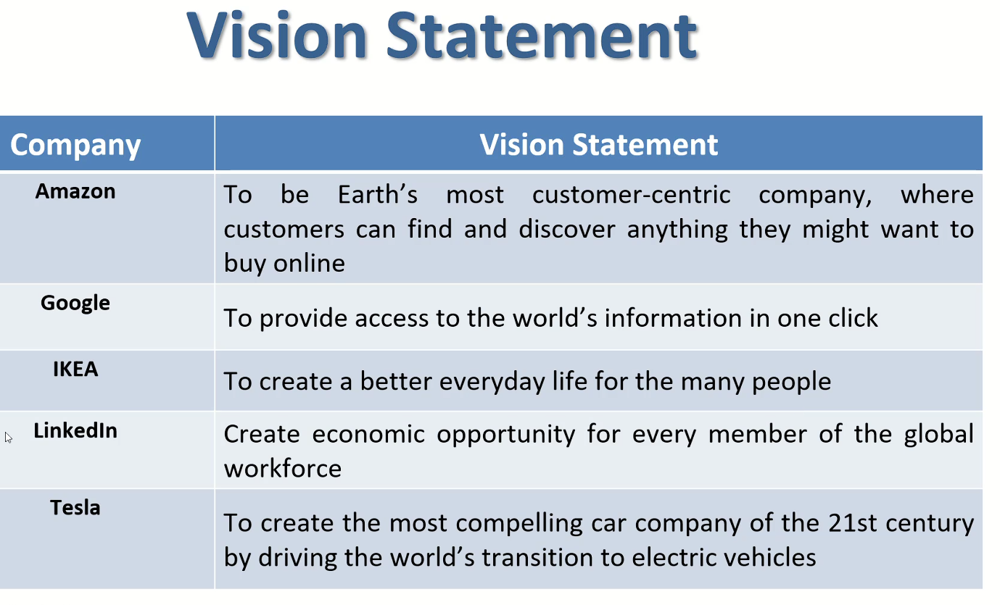
    *   Mission: Reason for Being 
        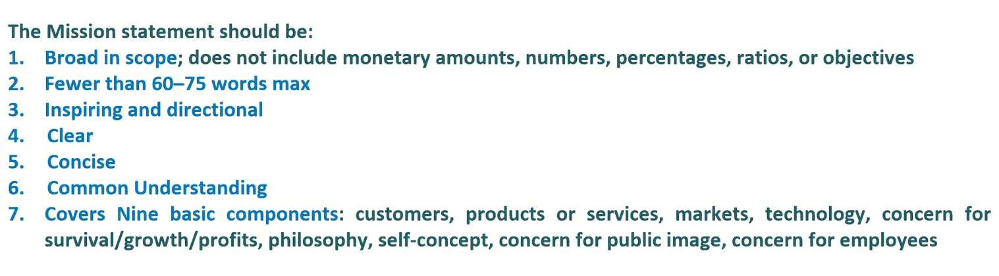
        * *Mission Components*
          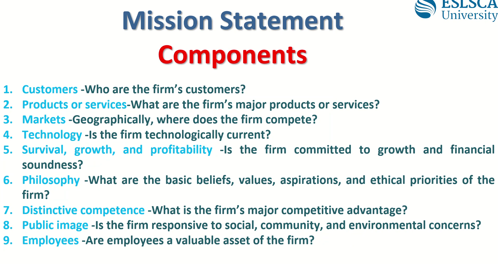
  * ***Step-2: External Analysis***
    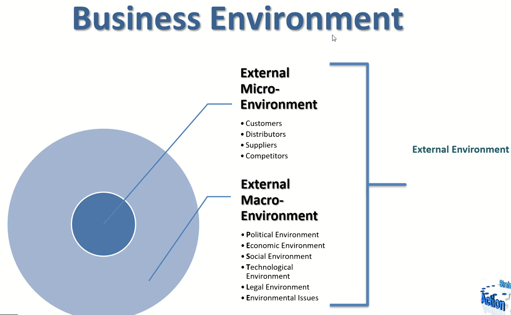
    * Ex: One Steel Supplier: Thread (Price control)
    * Ex: Just after enter a market and new big company entered: Thread
    * Ex: Giza has only one company in this market: Opportunity 
    * Ex: Current Iran War: Thread but Also Opportunity (Edge) because we are the safest now.
    * Macro-Env: [Political Env, Economic Env, Social Env, Tech Env, Legal Env]
      * Technological Env: *Thread* because it can replace human.
    * Internal Factors for Business Env: 
    
    * if you already knew all the Internal Factors, then you can have your Apple SWOT (Strengths, Wealnesses, Opportunities, Threats)
    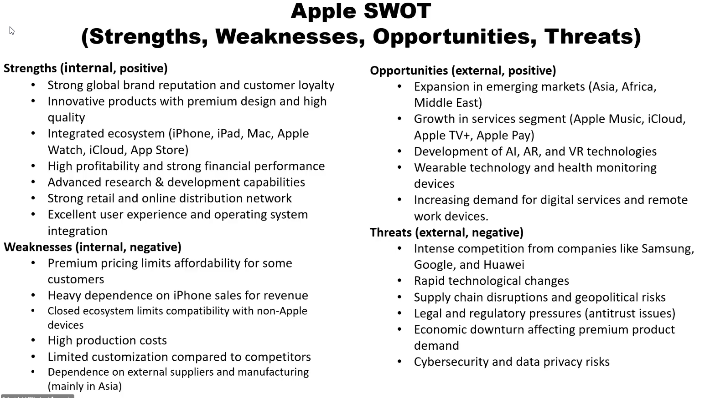
      * Ex: Current Iran war introduces *Supply chain disruption* to Apple
      * Ex: *Economic downturn* it is a must after every unstablitiy situation.
  * Step-4: Formatting Strategy ➡️ basically define your goals/Objectives
   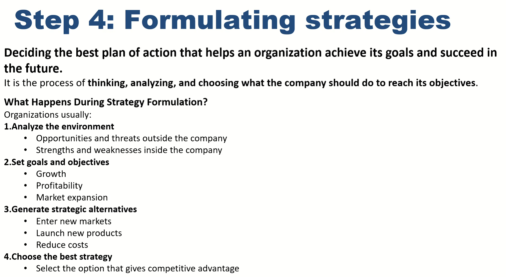
    * After analysis, then you are able to define the goals/Objectives
    * Generate Strategic Alternatives ➡️ create goals to reach the strategy 
    * After define all the goals and Strategies: then make a matrix based on countative analysis
    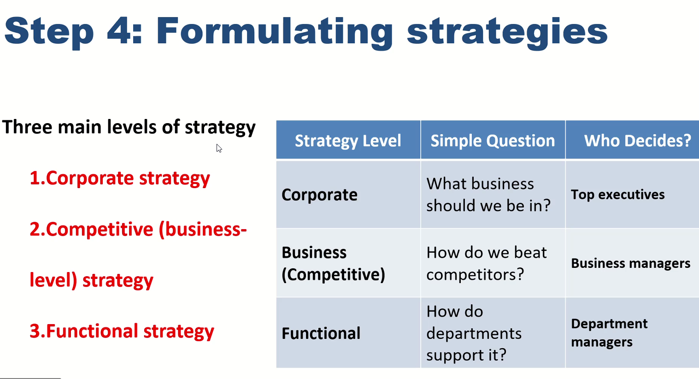
    
    * Each Func-Lvl strategy shall follow Business-Lvl Strategy which shall also in the direction to satisfy the Cooperate Strategy
    * *Cooperate Strategy*
      * Expand, Shrink, Increase Profit from current
    * *Competitive (Business-Lvl) Strategy*
      * Lower Cost (Mass Production) 
      * High Quality
      * Innovation (Focus Strategy)
      * Customer Experience (Low Fair Airlines style)
    * *Functional Strategy*
  * *Step-5: Implementing Strategies*
    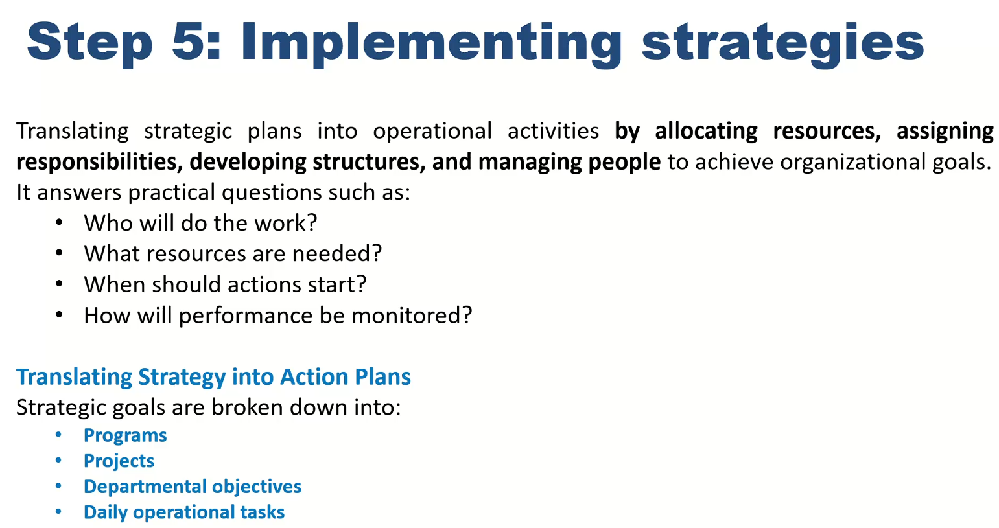
  * *Step-6: Evaluate Stratgies*
    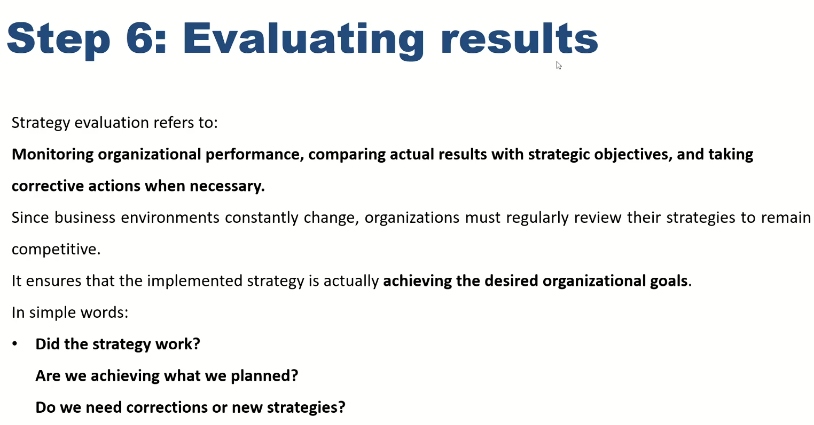
    * Don't mix-up between *Scenario-Based Plan* and Strategy ➡️ There is **No** *Scenario-Based Strategy*


