# Organization


### Departmentalization

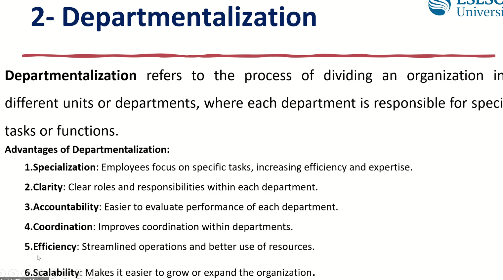

* Advantages of Departmentalization:
  * Specialization 
  * Clarity
  * Accountability
  * Coordination
  * Efficiency
  * Scalability
* How to do Departmentalization (category)
  * Functional Departmentalization
    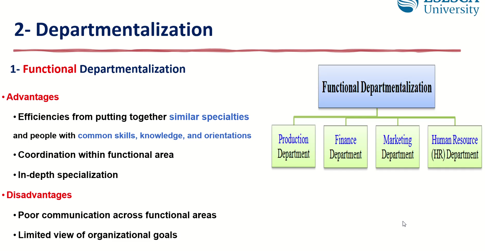
    * *Disadvantage*: 
      * Technical cross comm is not very good
      * Limited View of Org goals
    * *Advantages*
      * Efficienies from Puttiong together Similar Specialties
      * Coordination Within Func area
      * In-Depth Specialization
  * Geo-Departmentalization
    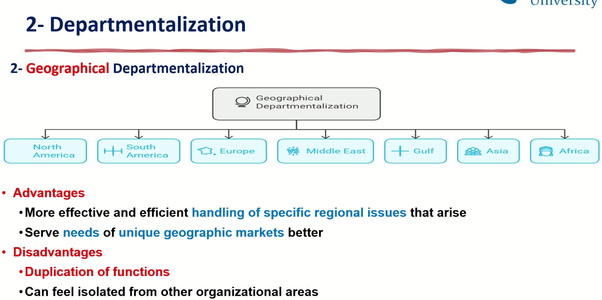
    * Each Region has it own complete team
    * *Advantages*
      * More Eff and eff handling of specific regional issues.
      * Serve needs of unique geo market better
    * *Disadvantage*
      * Duplication of func
      * Can feel isolated from other org-areas
  * Product Departmentalization
    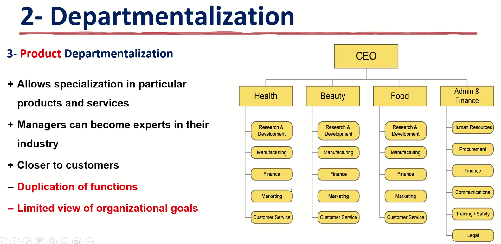
    * This is different than having a holding company which is holding all the other companies. But here it is CEO of all daughter companies
    * it is seen as Product or Service
    * *Advantages*
      * Aloows Specialization in particular Products and services
      * Managers can become experts in their industry
      * Closer to customers
    * *Disadvantages*
      * Duplication of functions 
      * Limited view of organization goals
  * Customer Departmentalization
    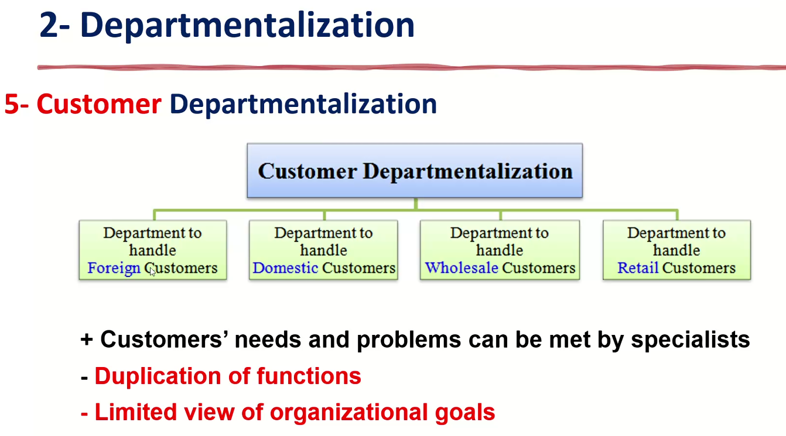
  * Process Departmentalization
    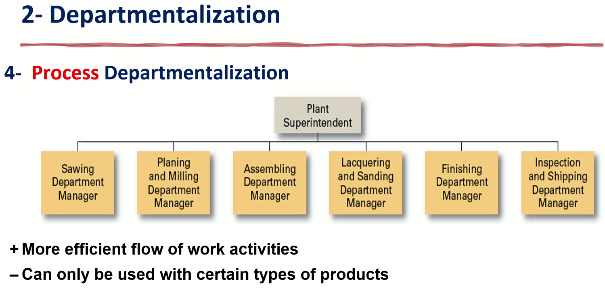
  * it depends on the work flow
    * For exmaple the **Car-washing** companies they are more into *Process-Department*.
  * *Advantages*
    * More eff flow of work Activities
  * *Disadvantages*
    * Can only be used with certain types of products
  * Exercise
    * Which Departmentalization is your company?
      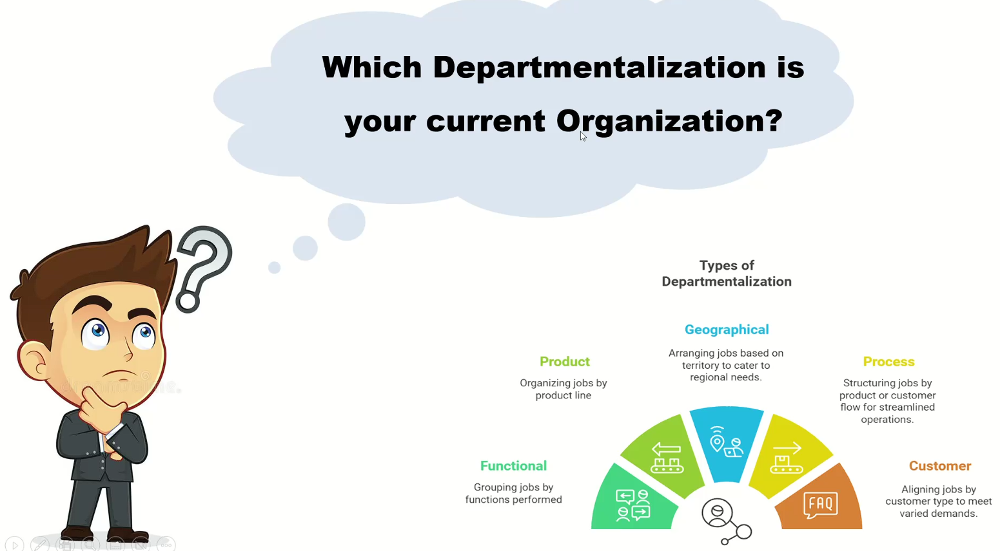
    * There is a chance that a company is kind *Hybrid-Model*.
    * Abdelrahman works in Mercedes: 
      * He claimed that his company is : Geo + Process
      * Dr claimed that it shall be: Geo + Product
      * But also they have Car-Assembly (GLE & GLS) -> so it could be Func as well. but it is Sister-company
      * so only his company is: Geo (Mercedes EGY) + Func (Maintenance, Finance , Sales..etc.)
    * Osama El Hout: Works in Valeo
      * Valeo: Product + Geo
    * Amira: works as Hospital Manager
      * Each thing works in Hospital as SOP
      * so it is: Func Departments + Product (each department is consider as service)
    * Fatma: Construction Company
      * the company is: functional 
      * But it is presented as Functional in Matrix format
    * Joen: Amaan Holding company
      * he is Product line
      * becuase the basic and main right-handside (Admin & Finance) is the main supporter for the other product lines 
    * Hybrid models

        ```mermaid
        graph TD
            H["🏥 Hospital Management"]

            H --> P["Patient Care / Service Departments<br>(Process-Oriented)"]
            H --> F["Shared Support Departments<br>(Functional-Oriented)"]

            P --> W["Women / Maternity Department"]
            P --> O["Operations / Surgery Department"]
            P --> E["Emergency Department"]
            P --> I["Inpatient / ICU Department"]
            P --> OP["Outpatient Department"]

            F --> HR["HR"]
            F --> FIN["Finance"]
            F --> IT["IT"]
            F --> PR["Procurement"]
            F --> Q["Quality / Compliance"]

            HR -. "supports" .-> W
            HR -. "supports" .-> O
            HR -. "supports" .-> E
            HR -. "supports" .-> I
            HR -. "supports" .-> OP

            FIN -. "supports" .-> W
            FIN -. "supports" .-> O
            FIN -. "supports" .-> E
            FIN -. "supports" .-> I
            FIN -. "supports" .-> OP

            IT -. "supports" .-> W
            IT -. "supports" .-> O
            IT -. "supports" .-> E
            IT -. "supports" .-> I
            IT -. "supports" .-> OP

            PR -. "supports" .-> W
            PR -. "supports" .-> O
            PR -. "supports" .-> E
            PR -. "supports" .-> I
            PR -. "supports" .-> OP

            Q -. "supports" .-> W
            Q -. "supports" .-> O
            Q -. "supports" .-> E
            Q -. "supports" .-> I
            Q -. "supports" .-> OP

            style H fill:#1a237e,color:#fff,stroke:#0d1642,stroke-width:3px
            style P fill:#2e7d32,color:#fff,stroke:#1b5e20,stroke-width:2px
            style F fill:#6a1b9a,color:#fff,stroke:#4a148c,stroke-width:2px

            style W fill:#c8e6c9,color:#1b5e20
            style O fill:#c8e6c9,color:#1b5e20
            style E fill:#c8e6c9,color:#1b5e20
            style I fill:#c8e6c9,color:#1b5e20
            style OP fill:#c8e6c9,color:#1b5e20

            style HR fill:#e1bee7,color:#4a148c
            style FIN fill:#e1bee7,color:#4a148c
            style IT fill:#e1bee7,color:#4a148c
            style PR fill:#e1bee7,color:#4a148c
            style Q fill:#e1bee7,color:#4a148c
        ```

        ``` mermaid
        graph LR
            H["🏥 Hospital Management"]

            H --> P["Patient Care / Service Departments<br>(Process-Oriented)"]
            H --> F["Shared Support Departments<br>(Functional-Oriented)"]

            P --> W["Women / Maternity"]
            P --> O["Operations / Surgery"]
            P --> E["Emergency"]
            P --> I["Inpatient / ICU"]
            P --> OP["Outpatient"]

            F --> HR["HR"]
            HR --> FIN["Finance"]
            FIN --> IT["IT"]
            IT --> PR["Procurement"]
            PR --> Q["Quality / Compliance"]

            HR -. "supports" .-> W
            HR -. "supports" .-> O
            HR -. "supports" .-> E
            HR -. "supports" .-> I
            HR -. "supports" .-> OP

            FIN -. "supports" .-> W
            FIN -. "supports" .-> O
            FIN -. "supports" .-> E
            FIN -. "supports" .-> I
            FIN -. "supports" .-> OP

            IT -. "supports" .-> W
            IT -. "supports" .-> O
            IT -. "supports" .-> E
            IT -. "supports" .-> I
            IT -. "supports" .-> OP

            PR -. "supports" .-> W
            PR -. "supports" .-> O
            PR -. "supports" .-> E
            PR -. "supports" .-> I
            PR -. "supports" .-> OP

            Q -. "supports" .-> W
            Q -. "supports" .-> O
            Q -. "supports" .-> E
            Q -. "supports" .-> I
            Q -. "supports" .-> OP

            style H fill:#1a237e,color:#fff,stroke:#0d1642,stroke-width:3px
            style P fill:#2e7d32,color:#fff,stroke:#1b5e20,stroke-width:2px
            style F fill:#6a1b9a,color:#fff,stroke:#4a148c,stroke-width:2px

            style W fill:#c8e6c9,color:#1b5e20
            style O fill:#c8e6c9,color:#1b5e20
            style E fill:#c8e6c9,color:#1b5e20
            style I fill:#c8e6c9,color:#1b5e20
            style OP fill:#c8e6c9,color:#1b5e20

            style HR fill:#e1bee7,color:#4a148c
            style FIN fill:#e1bee7,color:#4a148c
            style IT fill:#e1bee7,color:#4a148c
            style PR fill:#e1bee7,color:#4a148c
            style Q fill:#e1bee7,color:#4a148c
        ```
        ``` mermaid
        graph TD
            SVC["🎯 <b>PATIENT CARE</b><br><i>The Overall Service</i>"]

            SVC --> PATHWAY

            subgraph PATHWAY["🔄 CARE PATHWAY — The Process"]
                direction LR
                P1["📋 Admission<br>& Triage"] --> P2["🔍 Diagnosis<br>& Testing"] --> P3["💊 Treatment<br>& Intervention"] --> P4["🩹 Recovery<br>& Monitoring"] --> P5["🚪 Discharge<br>& Follow-up"]
            end

            P1 -.-> D1
            P2 -.-> D2
            P2 -.-> D3
            P3 -.-> D4
            P3 -.-> D5
            P4 -.-> D6

            subgraph DEPTS["🏢 HOSPITAL DEPARTMENTS — The Organizational Units"]
                direction LR
                D1["🚑 Emergency<br>Dept"] ~~~ D2["📡 Radiology<br>Dept"] ~~~ D3["🔬 Laboratory"] ~~~ D4["🏥 Surgery<br>Dept"] ~~~ D5["💊 Pharmacy"] ~~~ D6["👩‍⚕️ Nursing<br>Ward"]
            end

            style SVC fill:#27ae60,color:#fff,stroke:#1e8449,stroke-width:3px
            style PATHWAY fill:#ebf5fb,stroke:#2980b9,stroke-width:2px
            style DEPTS fill:#fdf2e9,stroke:#e67e22,stroke-width:5px
            style P1 fill:#3498db,color:#fff
            style P2 fill:#3498db,color:#fff
            style P3 fill:#3498db,color:#fff
            style P4 fill:#3498db,color:#fff
            style P5 fill:#3498db,color:#fff
            style D1 fill:#e67e22,color:#fff
            style D2 fill:#e67e22,color:#fff
            style D3 fill:#e67e22,color:#fff
            style D4 fill:#e67e22,color:#fff
            style D5 fill:#e67e22,color:#fff
            style D6 fill:#e67e22,color:#fff
        ```

### Chain of Command

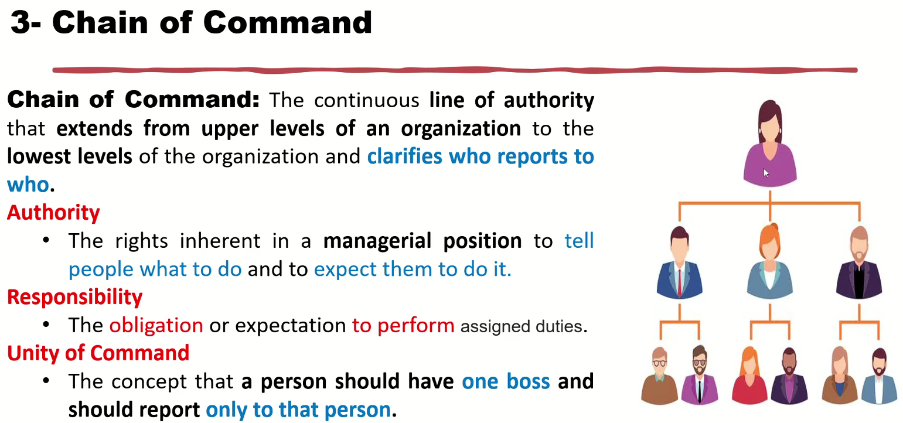

* Each employ shall follow and do the orders form his managers
* CEO can ask anyone in the company to do anything
* Each manager shall order only his employees not other manager employees
* In case of need to ask an empolyee from other domain, then I ask his manager in order to do alignment
  * However it could be some exception
  * 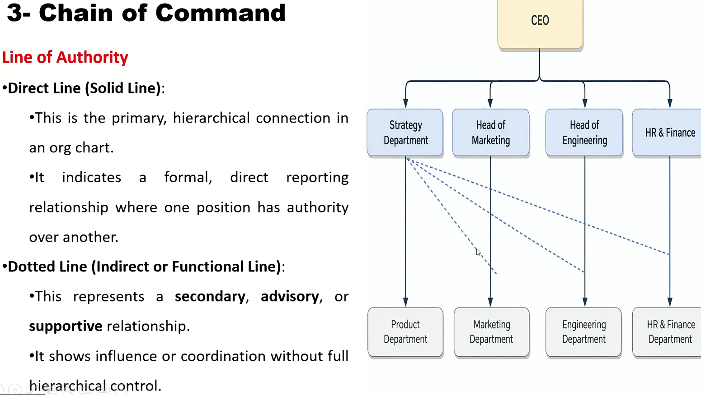
  * The dot-line is a kind of secondary support lines (indirect reporting relationship)
    * So it is kind of supporting func to other department or advice.

### Span of Control

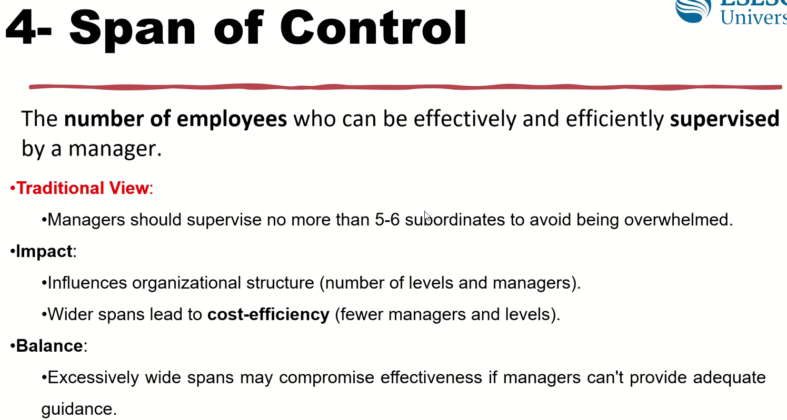
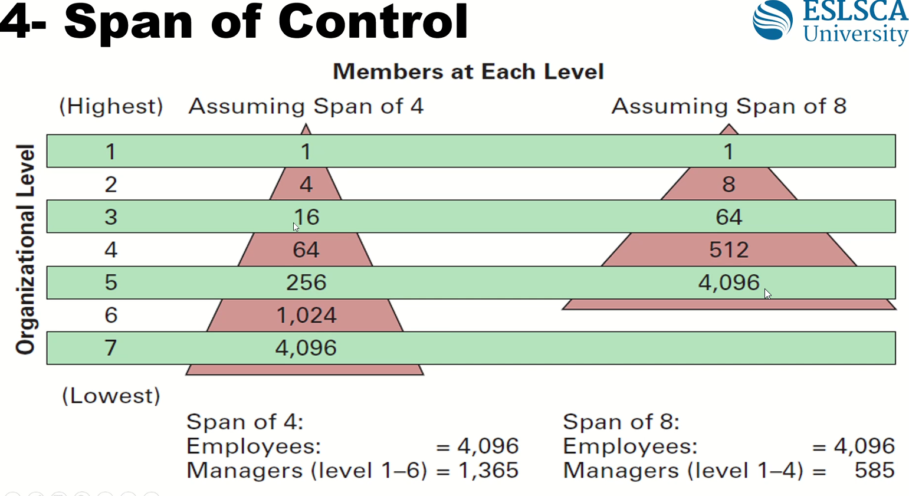
  * This difference save around 100M per year
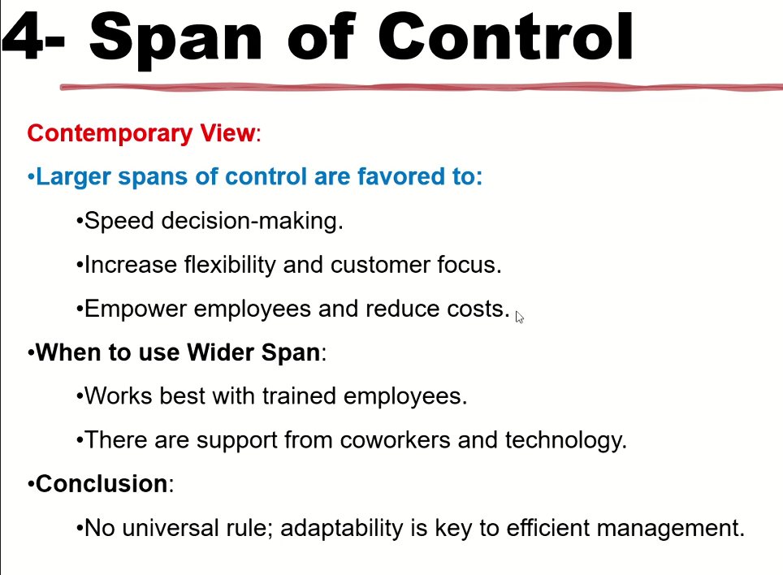
  * u can use the flat when the employees are well trained
  * Big companies hire only well-trained empolyees
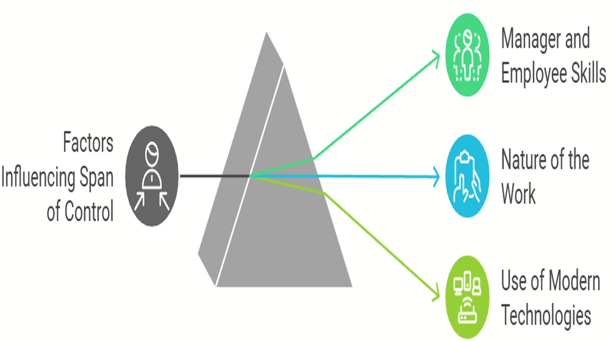
  * New tech support us (Jira and dashbaords) to control more employees

### Centralization vs Decentralization

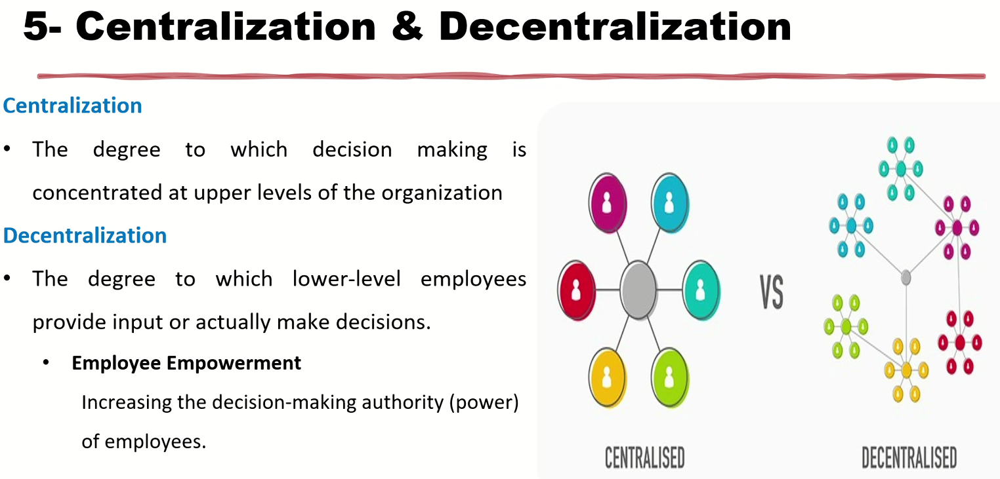

  * Quality is applied on all ➡️ centralization
  * New-tech (ex. AI), different Geo-locations, enforce talents and impower employees ➡️ Decentralization

### Formalization

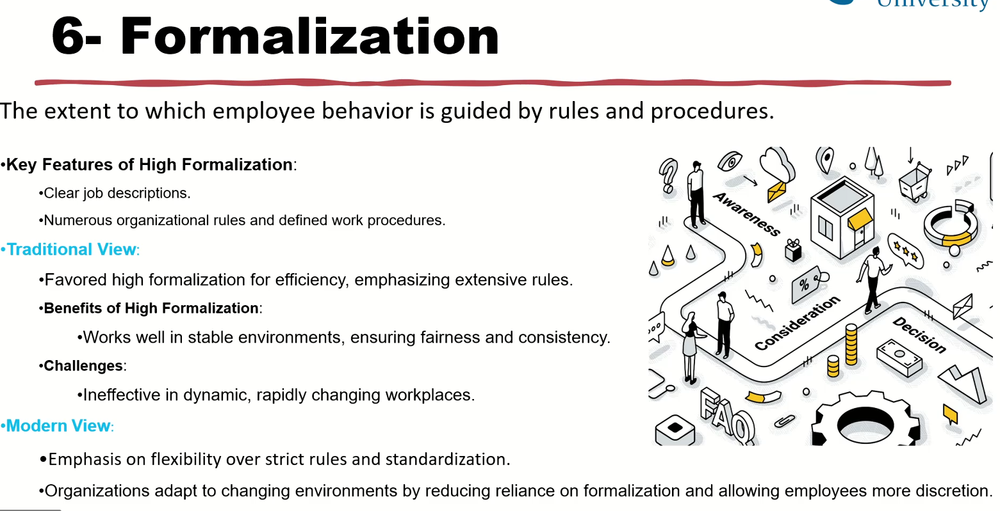

* if business is stable: then u can do this 
* if it is startup and u need to accelerate more, then don't do Formalization (use deformalization)
  * Formalization kill talents and innovations