# Lec-5 Groups and Managing Teamwork

## Stages og Group Development 

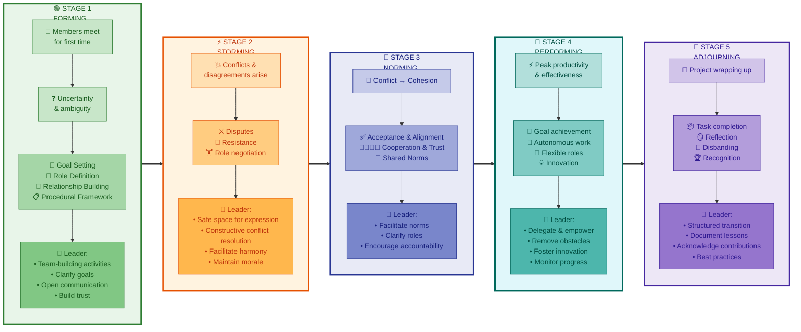

### Stage-1 Forming

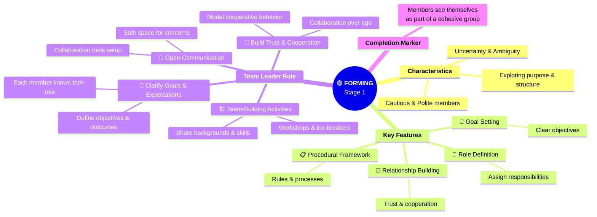

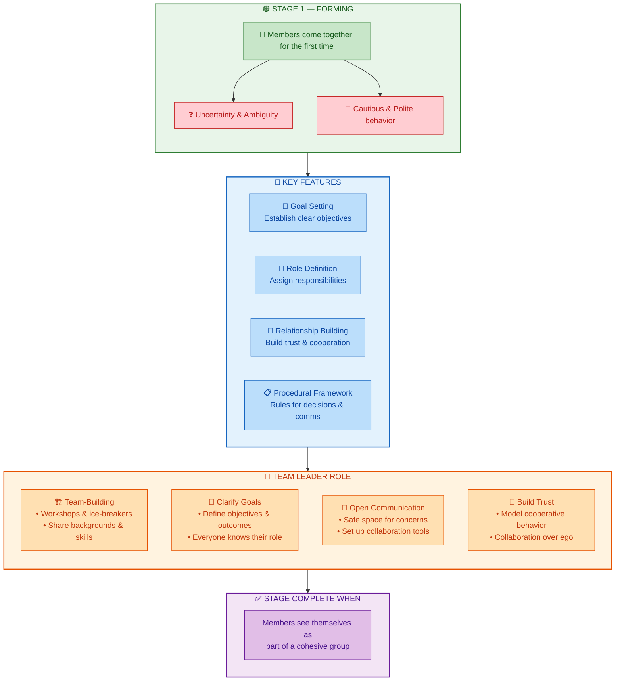

### Stage-2 Storming

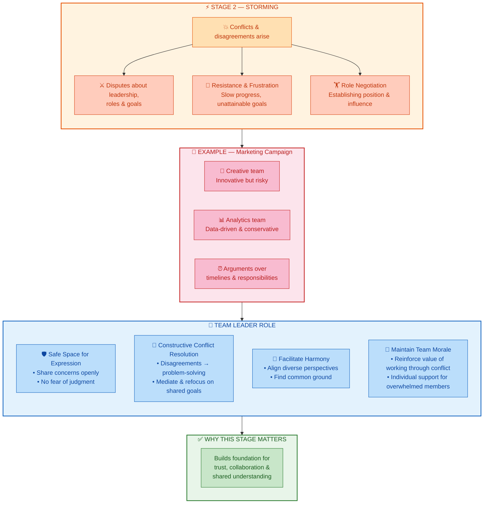

### Stage-3 Norming

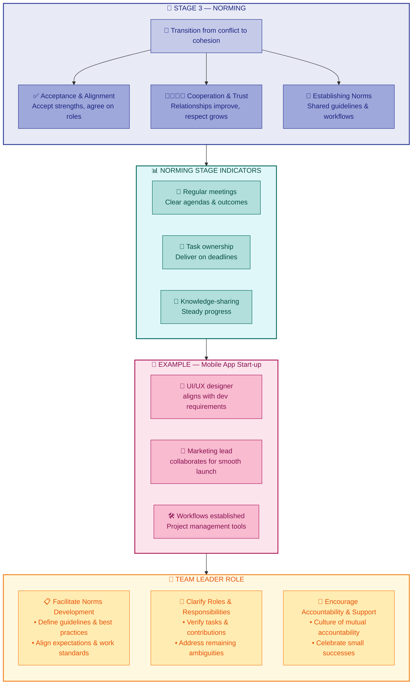

### Stage-4 Performing

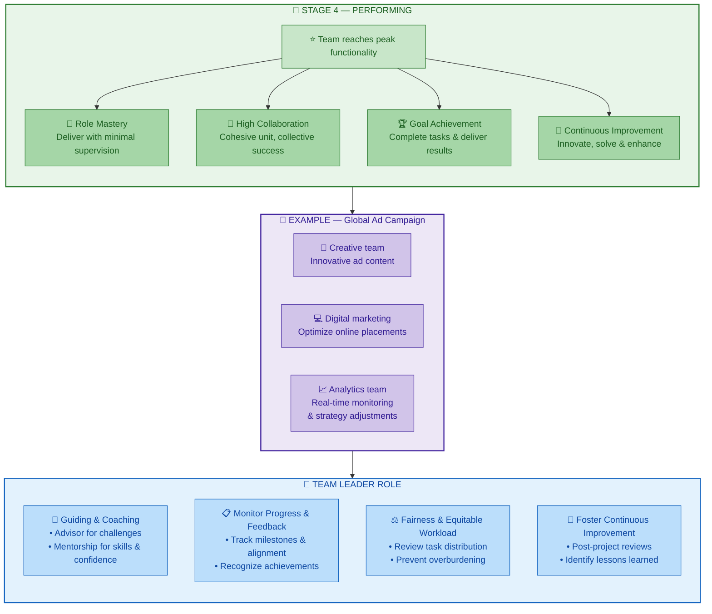

### Stage-5 Adjourning

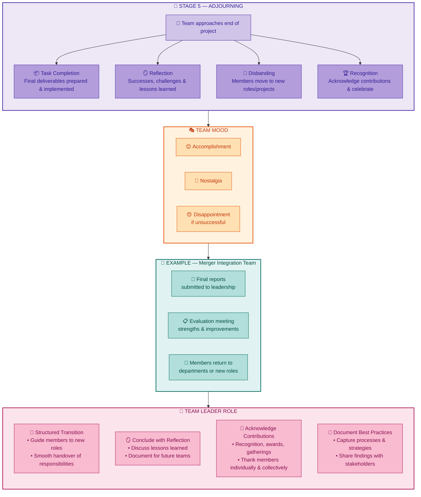

#### RACI Chart

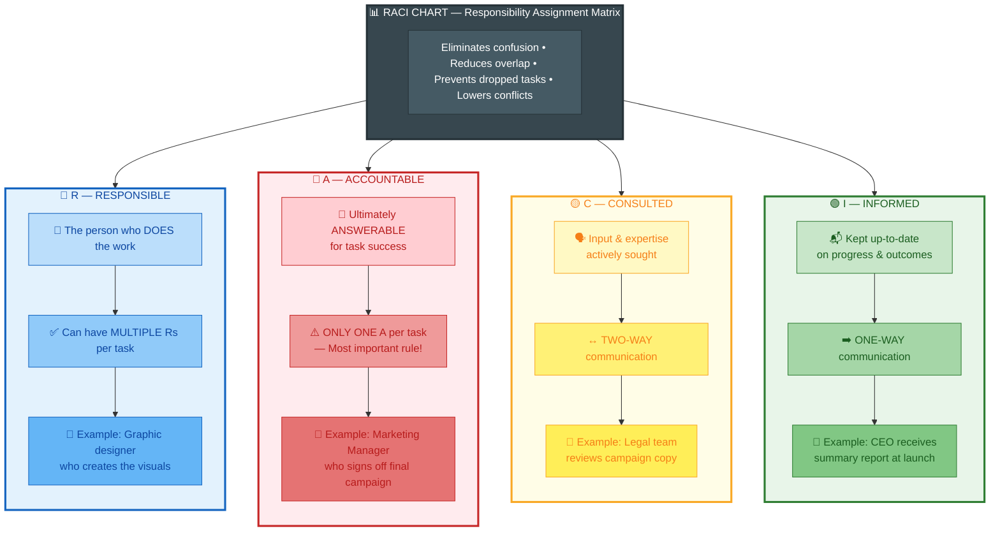

## Conflict Types

### Quick Memory Rule

- Task conflict = WHAT
- Relationship conflict = WHO
- Process conflict = HOW

If I remember What / Who / How, I can rebuild the answer quickly in the exam.

### Task Conflict

Task conflict is about the content of the work itself: what should be done first, what the priorities are, and what goal the team should focus on.

In an automotive software environment, this can happen when one engineer wants to prioritize an ADAS warning function, while another wants to focus first on ECU diagnostic logging before the release.

- Usually idea-based, not personal
- Can be healthy if it stays professional
- Main question: What should we build or prioritize first?

#### How to Deal With Task Conflict

- Encourage structured debate based on safety impact, customer value, release risk, and technical feasibility.
- Clarify the real objective early by asking: What problem are we solving first?
- Stay neutral as a leader, summarize both views, and guide the team toward a data-driven decision.
- Outcome goal: turn disagreement into better prioritization and innovation.

#### Task Conflict Exam Version

Task conflict in automotive software development occurs when team members disagree about what should be done first or which feature should have higher priority. For example, one engineer may want to prioritize an ADAS warning function, while another pushes for ECU diagnostic logging before release. This type of conflict is usually cognitive and can be healthy if handled professionally. The leader should encourage structured discussion, clarify the main objective, and guide the team toward a fact-based decision.

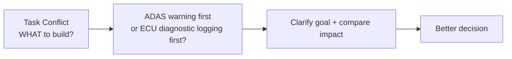

### Relationship Conflict

Relationship conflict is based on interpersonal tension, differences in communication style, personality clashes, or ego issues.

In an automotive software environment, this may happen between a software integrator and a test engineer during defect triage meetings, where one speaks very directly and the other feels blamed for repeated delays.

- Emotional in nature
- Usually the most damaging if ignored
- Main question: Who is clashing?

#### How to Deal With Relationship Conflict

- Address the issue early through private one-to-one discussions.
- Focus on observable behavior, not personality.
- Mediate only after understanding both sides separately.
- Build psychological safety through respectful communication and trust-building.
- If the conflict becomes severe, temporarily separate responsibilities or reassign roles.

#### Relationship Conflict Exam Version

Relationship conflict in automotive software development arises from personal tension, communication style, or ego differences between team members. For example, a software integrator and a test engineer may repeatedly clash during defect discussions because of sharp communication and mutual frustration. This type of conflict is emotional and can damage teamwork if not addressed early. The leader should handle it privately, focus on behavior rather than personality, and mediate with empathy to rebuild trust and cooperation.

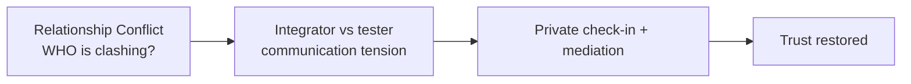

### Process Conflict

Process conflict is about how the work should be executed, including methods, responsibilities, approvals, timelines, and resource ownership.

In an automotive software environment, this may happen when the team disagrees on who owns final ECU release approval, or whether a change should follow a formal review path or a faster sprint workflow.

- Procedural and logistical at first
- Can become personal if roles are unclear
- Main question: How should the work be done?

#### How to Deal With Process Conflict

- Map the workflow visually using a RACI matrix or a simple process diagram.
- Define who is responsible, who approves, and who must be consulted.
- Agree on process rules and sign-off points.
- Revisit the process regularly before major releases, sprints, or audits.
- Outcome goal: remove ambiguity so the team can focus on delivery.

#### Process Conflict Exam Version

Process conflict in automotive software development occurs when team members disagree on how the work should be carried out. For example, the team may argue about who has final sign-off authority for an ECU release or whether the change should follow a formal review process or a sprint-based workflow. This conflict is mainly procedural, but it can become personal if roles are unclear. The leader should clarify the workflow, define responsibilities, and create agreement on the process so that confusion is reduced and execution becomes smoother.

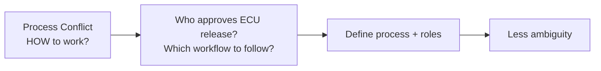
