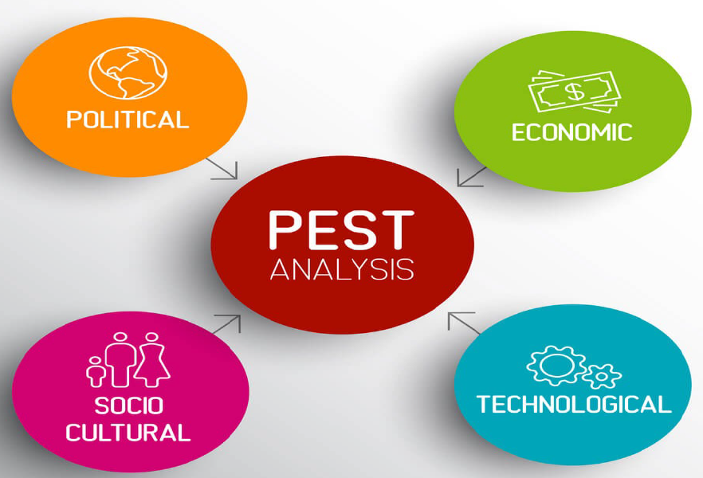
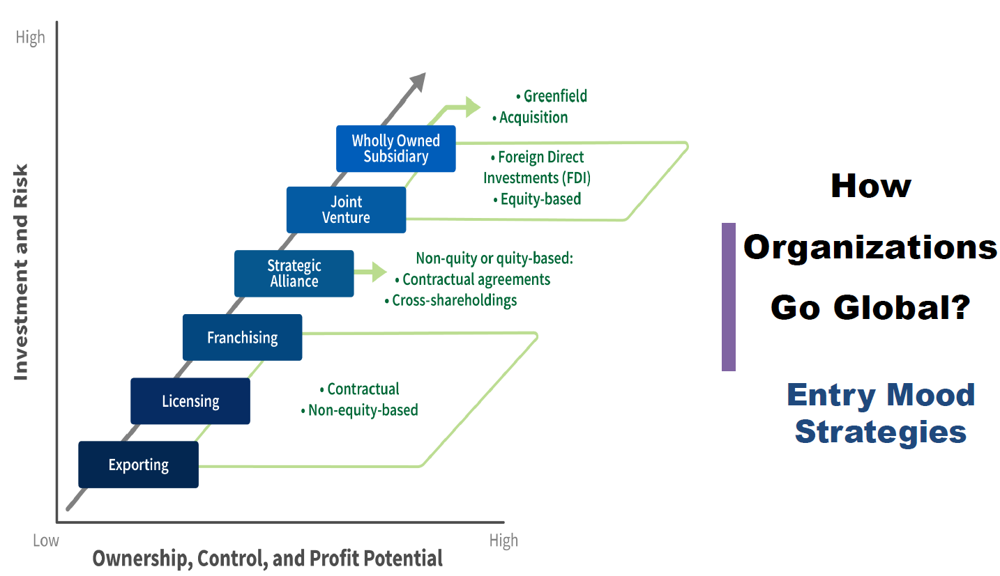
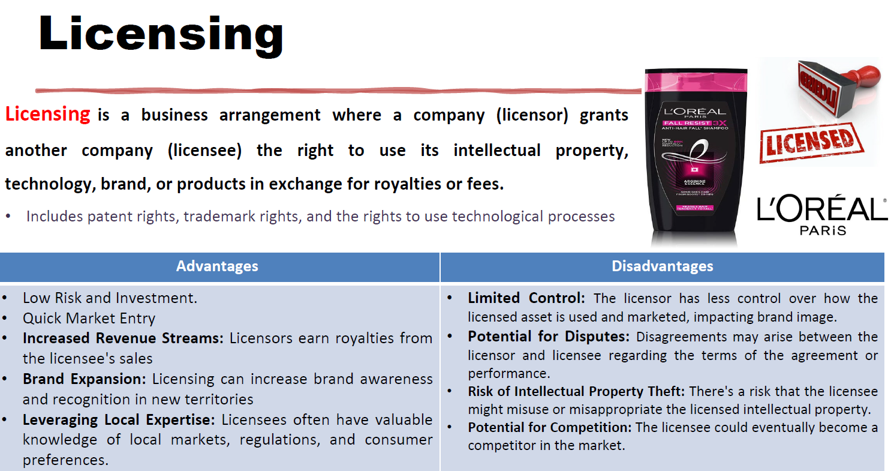
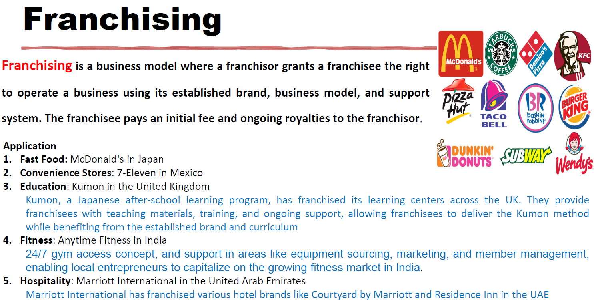
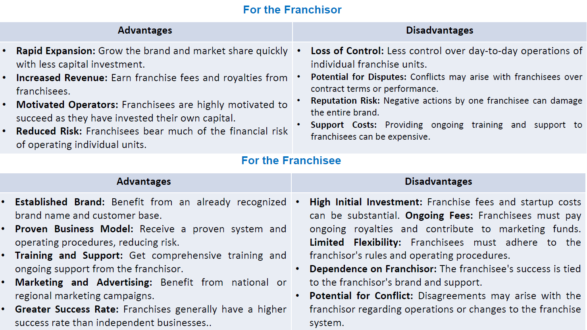
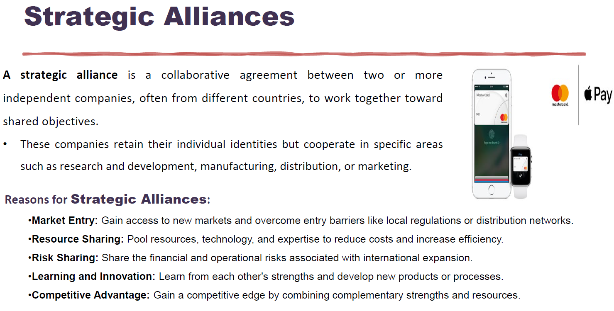
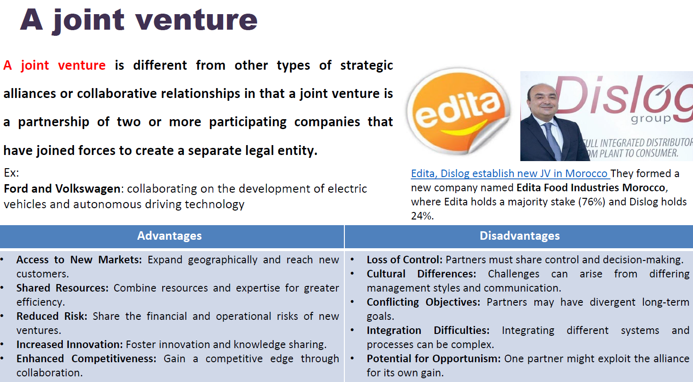

# Ch-8 : Managing in a Global Env

### PEST Process

* in case you decide to open ur business, then you need to go through this PEST way.

#### Export

* It has alot of rules that you need to study and follow
* Between the Export and License -> there is something called "Car Dealer": this would be the one who is maintaining the business to another big Co. in another location.

#### Licensing

* This awesome for the main company, because it is for free profit.
* The main issue is the controlling of those people who take such license.
* One more issue is: Main co. after giving the main business secrets, then the small co. leave me and do their own product which is kind of the same product itself.

#### Franchising 

* The is done with well-know and well-established Business.
* This small-Co. is totally under-control of the main Co. (QUality, purchasing, infrastructure...etc.) ➡️ this leads to identical product everywhere.
  * There is something called "Co-Branding" not Joint-venture, so ex: The Mobil+OnTheRun ➡️ so OnTheRun agreed with Mobil to open only on their Gas-Station only.

* License vs Franchising 
* 

#### Strategic Alliances

* This is a couple of Business that joined together to have a new market (new segment) penetration that I can't penetrate alone.

##### Joint Venture

* This is the daughter of the Strategic Alliance, however the difference is: a new Co. will be created as result of this Alliance.
  * The great example is Edita, they want to open in EU, but this is not possible because the Backs freshness is limitation, so they open in Morocco to be near to EU 😉.

##### Strategic Alliance vs Joint Venture 

